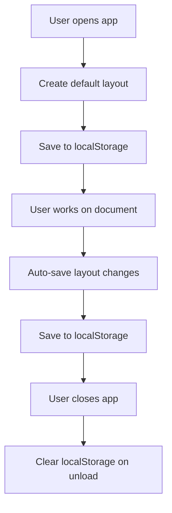
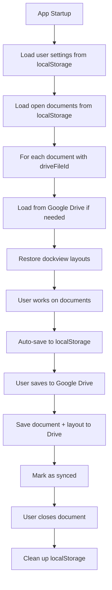
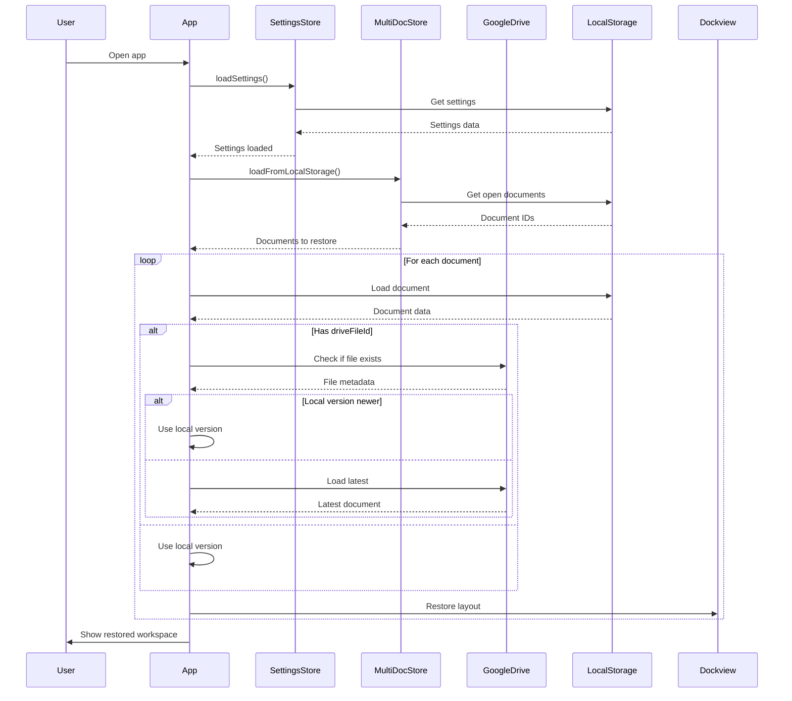
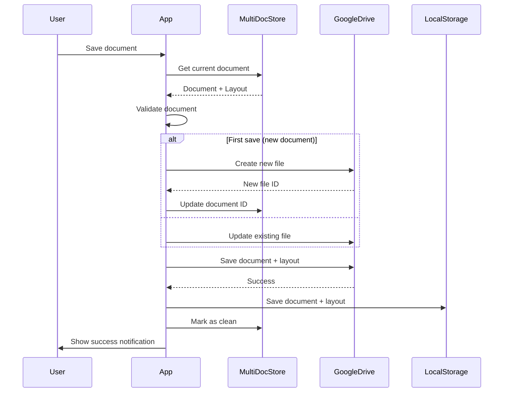
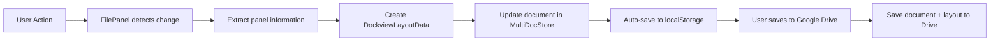
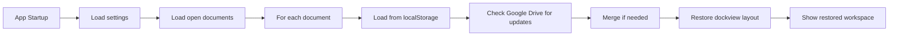

# MindPad Layout Saving Architecture

## Overview

This document outlines the architecture for saving and restoring dockview layouts with view information in MindPad. The system needs to handle:

1. **User Preferences**: Default layout settings that persist across sessions
2. **Document Layouts**: Layout information saved with each document
3. **Persistence Strategy**: Integration between localStorage and Google Drive
4. **Multi-View Support**: Handling different view types (mindmap, outline, writer, concept map, etc.)

## Current Architecture Analysis

### Existing Components

1. **MultiDocumentStore**: Manages multiple open documents and their child dockview layouts
2. **DocumentStore**: Contains document data including layout settings
3. **FilePanel**: Manages child dockview instances for each file
4. **DockviewLayout**: Manages parent dockview (file tabs)

### Current Flow



### Current Issues

1. **Layout not persisted**: Child dockview layouts are cleared on page reload
2. **No user preferences**: Users cannot customize default layout
3. **No Google Drive sync**: Layouts not saved with documents
4. **View information lost**: Which views are in which panels is not tracked

## Proposed Architecture

### 1. Enhanced Document Structure

```typescript
interface MindpadDocument {
  version: string;
  metadata: DocumentMetadata;
  nodes: MindpadNode[];
  edges: MindpadEdge[];
  interMapLinks: InterMapLink[];
  layout: LayoutSettings;
  dockviewLayout?: DockviewLayoutData; // NEW: Save dockview layout with document
}

interface DockviewLayoutData {
  version: '1.0';
  panels: DockviewPanelData[];
  activePanelId?: string;
  lastModified: string;
}

interface DockviewPanelData {
  id: string;
  component: string; // 'mindmap-panel', 'writer-panel', etc.
  title: string;
  position?: PanelPosition; // 'left', 'center', 'right' or dockview coordinates
  size?: { width: number; height: number };
  isActive?: boolean;
  viewState?: Record<string, unknown>; // View-specific state
}
```

### 2. Settings Store for User Preferences

```typescript
// New: SettingsStore.ts
interface UserSettings {
  defaultLayout: {
    panels: DefaultPanelConfig[];
    showWelcomeOnStartup: boolean;
    autoSaveInterval: number;
  };
  uiPreferences: {
    theme: 'light' | 'dark' | 'system';
    density: 'compact' | 'comfortable' | 'spacious';
  };
  featureFlags: {
    experimentalViews: boolean;
    aiSuggestions: boolean;
  };
}

interface DefaultPanelConfig {
  component: string;
  position: 'left' | 'center' | 'right';
  isEnabled: boolean;
  defaultSize?: number; // percentage or pixels
}
```

### 3. Enhanced MultiDocumentStore

```typescript
interface DocumentInstance {
  filePanelId: string;
  document: MindpadDocument;
  driveFile: DriveFileMetadata | null;
  childLayoutState: DockviewLayoutData; // Enhanced with view info
  isDirty: boolean;
  lastModified: Date;
  isSavedToDrive: boolean; // NEW: Track sync status
}
```

### 4. Persistence Strategy



## Implementation Plan

### Phase 1: Core Infrastructure

#### 1.1. Create Settings Store

```typescript
// src/core/stores/settingsStore.ts
import { defineStore } from 'pinia'
import { ref, computed } from 'vue'

export const useSettingsStore = defineStore('settings', () => {
  const settings = ref<UserSettings>({
    defaultLayout: {
      panels: [
        { component: 'outline-panel', position: 'left', isEnabled: true },
        { component: 'mindmap-panel', position: 'center', isEnabled: true },
        { component: 'writer-panel', position: 'right', isEnabled: true }
      ],
      showWelcomeOnStartup: true,
      autoSaveInterval: 300 // 5 minutes
    },
    uiPreferences: {
      theme: 'system',
      density: 'comfortable'
    },
    featureFlags: {
      experimentalViews: false,
      aiSuggestions: true
    }
  })

  // Load from localStorage
  function loadSettings() {
    const saved = localStorage.getItem('mindpad-settings')
    if (saved) {
      try {
        const parsed = JSON.parse(saved)
        settings.value = { ...settings.value, ...parsed }
      } catch (e) {
        console.error('Failed to load settings:', e)
      }
    }
  }

  // Save to localStorage
  function saveSettings() {
    localStorage.setItem('mindpad-settings', JSON.stringify(settings.value))
  }

  // Save to Google Drive (for logged-in users)
  async function syncSettingsToDrive() {
    // Implementation with Google Drive API
  }

  return { settings, loadSettings, saveSettings, syncSettingsToDrive }
})
```

#### 1.2. Enhance Document Types

```typescript
// src/core/types/document.ts
export interface DockviewLayoutData {
  version: '1.0';
  panels: DockviewPanelData[];
  activePanelId?: string;
  lastModified: string;
}

export interface DockviewPanelData {
  id: string;
  component: string;
  title: string;
  position?: PanelPosition;
  size?: { width: number; height: number };
  isActive?: boolean;
  viewState?: Record<string, unknown>;
}

// Update MindpadDocument interface
export interface MindpadDocument {
  // ... existing fields
  dockviewLayout?: DockviewLayoutData;
}
```

### Phase 2: Layout Management

#### 2.1. Enhance FilePanel Layout Functions

```typescript
// In FilePanel.vue

/**
 * Save dockview layout with view information to document
 */
function saveLayoutToDocument() {
  if (!childDockviewApi.value) return

  const layout = childDockviewApi.value.toJSON()
  const panels: DockviewPanelData[] = []

  // Extract panel information with view types
  childDockviewApi.value.panels.forEach(panel => {
    panels.push({
      id: panel.api.id,
      component: panel.api.component,
      title: panel.api.title,
      position: getPanelPosition(panel),
      size: getPanelSize(panel),
      isActive: panel.api.isActive,
      viewState: getViewState(panel.api.component)
    })
  })

  const dockviewLayout: DockviewLayoutData = {
    version: '1.0',
    panels: panels,
    activePanelId: childDockviewApi.value.activePanel?.id,
    lastModified: new Date().toISOString()
  }

  // Update document in multi-doc store
  const docInstance = multiDocStore.getDocument(filePanelId.value)
  if (docInstance) {
    docInstance.document.dockviewLayout = dockviewLayout
    multiDocStore.updateDocument(filePanelId.value, docInstance.document)
  }
}

/**
 * Load dockview layout from document
 */
function loadLayoutFromDocument() {
  const docInstance = multiDocStore.getDocument(filePanelId.value)
  if (!docInstance || !docInstance.document.dockviewLayout) {
    return false
  }

  try {
    const layoutData = docInstance.document.dockviewLayout
    
    // Convert DockviewLayoutData to dockview JSON format
    const dockviewJson = convertToDockviewJson(layoutData)
    
    childDockviewApi.value?.fromJSON(dockviewJson)
    return true
  } catch (error) {
    console.error('Failed to load layout from document:', error)
    return false
  }
}
```

#### 2.2. Update MultiDocumentStore

```typescript
// In multiDocumentStore.ts

function updateDocumentLayout(
  filePanelId: string,
  layoutData: DockviewLayoutData
): void {
  const instance = documents.value.get(filePanelId)
  if (instance) {
    instance.document.dockviewLayout = layoutData
    instance.isDirty = true
    instance.lastModified = new Date()
    saveToLocalStorage()
  }
}
```

### Phase 3: Persistence Integration

#### 3.1. LocalStorage Strategy

```typescript
// Save strategy
function saveDocumentWithLayout(doc: MindpadDocument) {
  // Save to localStorage
  const storageKey = `mindpad-doc-${doc.metadata.id}`
  localStorage.setItem(storageKey, JSON.stringify(doc))
  
  // Also save layout separately for quick access
  if (doc.dockviewLayout) {
    const layoutKey = `dockview-layout-${doc.metadata.id}`
    localStorage.setItem(layoutKey, JSON.stringify(doc.dockviewLayout))
  }
}

// Load strategy
function loadDocumentFromLocalStorage(docId: string): MindpadDocument | null {
  const storageKey = `mindpad-doc-${docId}`
  const saved = localStorage.getItem(storageKey)
  
  if (saved) {
    try {
      const doc = JSON.parse(saved)
      
      // Load layout if available
      const layoutKey = `dockview-layout-${docId}`
      const layoutSaved = localStorage.getItem(layoutKey)
      if (layoutSaved) {
        doc.dockviewLayout = JSON.parse(layoutSaved)
      }
      
      return doc
    } catch (e) {
      console.error('Failed to load document:', e)
      return null
    }
  }
  
  return null
}
```

#### 3.2. Google Drive Integration

```typescript
// In googleDriveService.ts

async function saveDocumentWithLayout(
  fileId: string,
  document: MindpadDocument,
  layout: DockviewLayoutData
) {
  // Ensure document has layout
  document.dockviewLayout = layout
  
  // Convert to JSON and save
  const content = JSON.stringify(document, null, 2)
  const blob = new Blob([content], { type: 'application/json' })
  
  // Update existing file or create new one
  await updateFileContent(fileId, blob)
}

async function loadDocumentWithLayout(fileId: string): Promise<MindpadDocument> {
  const content = await downloadFileContent(fileId)
  const document = JSON.parse(content) as MindpadDocument
  
  // Ensure layout exists
  if (!document.dockviewLayout) {
    // Create default layout for backward compatibility
    document.dockviewLayout = createDefaultLayoutForDocument(document)
  }
  
  return document
}
```

### Phase 4: User Experience Flow

#### 4.1. App Startup Flow



#### 4.2. Document Save Flow



### Phase 5: Settings UI Integration

#### 5.1. Settings Panel Component

```vue
<template>
  <div class="settings-panel">
    <h3>Default Layout Settings</h3>
    
    <div class="layout-preview">
      <div class="panel-slot left">
        <select v-model="leftPanel">
          <option value="outline-panel">Outline</option>
          <option value="mindmap-panel">Mind Map</option>
          <option value="writer-panel">Writer</option>
          <option value="concept-map-panel">Concept Map</option>
          <option value="none">None</option>
        </select>
      </div>
      
      <div class="panel-slot center">
        <select v-model="centerPanel">
          <option value="mindmap-panel">Mind Map</option>
          <option value="writer-panel">Writer</option>
          <option value="outline-panel">Outline</option>
          <option value="concept-map-panel">Concept Map</option>
        </select>
      </div>
      
      <div class="panel-slot right">
        <select v-model="rightPanel">
          <option value="writer-panel">Writer</option>
          <option value="outline-panel">Outline</option>
          <option value="mindmap-panel">Mind Map</option>
          <option value="concept-map-panel">Concept Map</option>
          <option value="none">None</option>
        </select>
      </div>
    </div>
    
    <button @click="saveSettings">Save Settings</button>
    <button @click="resetToDefault">Reset to Default</button>
  </div>
</template>

<script setup>
import { useSettingsStore } from 'src/core/stores/settingsStore'
import { ref, computed, watch } from 'vue'

const settingsStore = useSettingsStore()

const leftPanel = computed({
  get: () => settingsStore.settings.defaultLayout.panels.find(p => p.position === 'left')?.component || 'none',
  set: (value) => updatePanel('left', value)
})

const centerPanel = computed({
  get: () => settingsStore.settings.defaultLayout.panels.find(p => p.position === 'center')?.component || 'mindmap-panel',
  set: (value) => updatePanel('center', value)
})

const rightPanel = computed({
  get: () => settingsStore.settings.defaultLayout.panels.find(p => p.position === 'right')?.component || 'none',
  set: (value) => updatePanel('right', value)
})

function updatePanel(position, component) {
  const panels = [...settingsStore.settings.defaultLayout.panels]
  const index = panels.findIndex(p => p.position === position)
  
  if (index >= 0) {
    panels[index].component = component
    panels[index].isEnabled = component !== 'none'
  } else {
    panels.push({
      component,
      position,
      isEnabled: component !== 'none'
    })
  }
  
  settingsStore.settings.defaultLayout.panels = panels
}

function saveSettings() {
  settingsStore.saveSettings()
  // Also sync to Google Drive if logged in
  if (authStore.isLoggedIn) {
    settingsStore.syncSettingsToDrive()
  }
}

function resetToDefault() {
  settingsStore.settings.defaultLayout = {
    panels: [
      { component: 'outline-panel', position: 'left', isEnabled: true },
      { component: 'mindmap-panel', position: 'center', isEnabled: true },
      { component: 'writer-panel', position: 'right', isEnabled: true }
    ],
    showWelcomeOnStartup: true,
    autoSaveInterval: 300
  }
  settingsStore.saveSettings()
}
</script>
```

### Phase 6: Implementation Roadmap

#### 6.1. Priority Order

1. **Core Infrastructure** (High Priority)
   - Create SettingsStore
   - Enhance document types with layout data
   - Update MultiDocumentStore

2. **Layout Management** (High Priority)
   - Enhance FilePanel layout functions
   - Create layout conversion utilities
   - Implement layout validation

3. **Persistence Layer** (Medium Priority)
   - LocalStorage strategy
   - Google Drive integration
   - Conflict resolution

4. **User Interface** (Medium Priority)
   - Settings panel
   - Layout preview
   - Save/restore UI

5. **Advanced Features** (Low Priority)
   - Layout templates
   - Layout sharing
   - Multi-monitor support

#### 6.2. Estimated Implementation Time

- **Phase 1-2**: 2-3 days (Core functionality)
- **Phase 3**: 1-2 days (Persistence)
- **Phase 4**: 1 day (UI Integration)
- **Phase 5**: 1 day (Testing & Bug fixes)

### Phase 7: Data Flow Diagrams

#### 7.1. Layout Save Flow



#### 7.2. Layout Load Flow



### Phase 8: Backward Compatibility

#### 8.1. Migration Strategy

```typescript
// Migration function for existing documents
function migrateDocumentToNewFormat(oldDoc: any): MindpadDocument {
  // Copy existing fields
  const newDoc: MindpadDocument = {
    version: oldDoc.version || '1.0',
    metadata: oldDoc.metadata,
    nodes: oldDoc.nodes || [],
    edges: oldDoc.edges || [],
    interMapLinks: oldDoc.interMapLinks || [],
    layout: oldDoc.layout || DEFAULT_LAYOUT
  }

  // Add default dockview layout if not present
  if (!newDoc.dockviewLayout) {
    newDoc.dockviewLayout = {
      version: '1.0',
      panels: [
        {
          id: `outline-${Date.now()}`,
          component: 'outline-panel',
          title: '📋 Outline',
          position: 'left',
          size: { width: 250, height: 0 },
          isActive: false
        },
        {
          id: `mindmap-${Date.now()}`,
          component: 'mindmap-panel',
          title: '🧠 Mind Map',
          position: 'center',
          size: { width: 0, height: 0 },
          isActive: true
        },
        {
          id: `writer-${Date.now()}`,
          component: 'writer-panel',
          title: '📝 Writer',
          position: 'right',
          size: { width: 350, height: 0 },
          isActive: false
        }
      ],
      activePanelId: `mindmap-${Date.now()}`,
      lastModified: new Date().toISOString()
    }
  }

  return newDoc
}
```

#### 8.2. Version Handling

```typescript
// Version compatibility checker
function isLayoutCompatible(layout: DockviewLayoutData): boolean {
  return layout.version === '1.0'
}

// Layout migration
function migrateLayout(layout: any): DockviewLayoutData {
  if (!layout.version || layout.version === '1.0') {
    // Current version, no migration needed
    return layout
  }
  
  // Future migrations would go here
  console.warn(`Layout version ${layout.version} not supported, using default`)
  return createDefaultLayout()
}
```

## Technical Considerations

### 1. Performance Optimization

- **Debounce auto-save**: Don't save on every tiny layout change
- **Throttle layout updates**: Batch multiple rapid changes
- **Use efficient serialization**: Avoid circular references
- **Compress large layouts**: For documents with many panels

### 2. Error Handling

- **Layout validation**: Ensure layout data is valid before loading
- **Fallback mechanisms**: Use default layout if loading fails
- **Conflict resolution**: Handle version conflicts gracefully
- **User notifications**: Inform user when layout can't be restored

### 3. Security

- **Input validation**: Validate all layout data before processing
- **Size limits**: Prevent excessively large layouts
- **Rate limiting**: Prevent rapid successive saves
- **Data sanitization**: Clean layout data before saving

### 4. Testing Strategy

- **Unit tests**: Layout serialization/deserialization
- **Integration tests**: Full save/load cycles
- **Performance tests**: Large complex layouts
- **Compatibility tests**: Different browser environments
- **User testing**: Real-world usage scenarios

## Conclusion

This architecture provides a comprehensive solution for saving and restoring dockview layouts with view information in MindPad. The design:

1. **Preserves user preferences** through settings store
2. **Maintains document-specific layouts** with proper persistence
3. **Supports multi-device sync** via Google Drive integration
4. **Ensures backward compatibility** with migration strategies
5. **Provides robust error handling** for real-world scenarios

The phased implementation approach allows for incremental delivery of functionality while maintaining system stability throughout the development process.