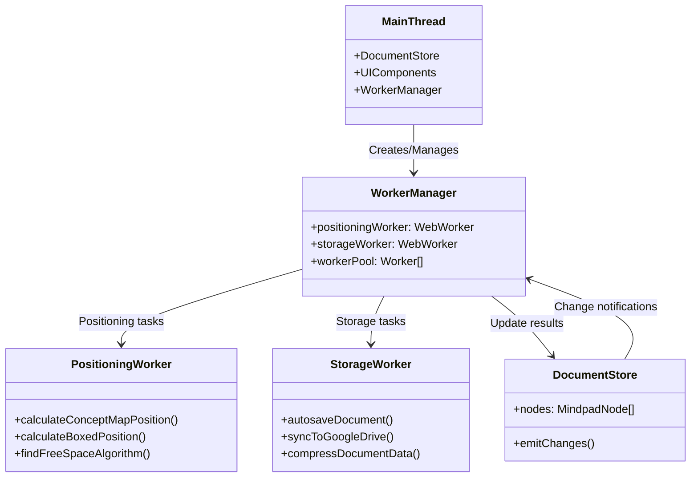

# Web Worker Architecture for MindPad

## Overview

This document outlines the comprehensive Web Worker architecture for MindPad, designed to offload CPU-intensive tasks from the main thread and improve application responsiveness. The architecture follows the existing patterns established in the [Architecture Document](01_ARCHITECTURE.md) and integrates with the [Storage and Indexing System](04_STORAGE_AND_INDEXING.md).

## Architecture Diagram



## Core Principles

1. **Main Thread Relief**: Offload CPU-intensive calculations to background threads
2. **Progressive Enhancement**: Graceful fallback to main thread operations
3. **Modular Design**: Separate workers for different responsibilities
4. **Performance Optimization**: Workers activated based on workload size
5. **Clean Integration**: Seamless connection with existing architecture

## Worker Manager Implementation

### WorkerManager Class

```typescript
// mindpad/quasar/src/core/workers/WorkerManager.ts
export class WorkerManager {
  private positioningWorker: Worker;
  private storageWorker: Worker;
  private isInitialized = false;

  constructor() {
    this.initializeWorkers();
  }

  private initializeWorkers() {
    try {
      this.positioningWorker = this.createWorker('positioningWorker');
      this.storageWorker = this.createWorker('storageWorker');
      this.isInitialized = true;
    } catch (error) {
      console.warn('Web Workers not supported, falling back to main thread');
      this.isInitialized = false;
    }
  }

  private createWorker(workerName: string): Worker {
    const worker = new Worker(new URL(
      `../workers/${workerName}.ts`,
      import.meta.url
    ));

    // Set up error handling
    worker.onerror = (error) => {
      console.error(`Worker ${workerName} error:`, error);
      this.handleWorkerFailure(workerName);
    };

    return worker;
  }

  private handleWorkerFailure(workerName: string) {
    // Implement fallback strategies
    console.warn(`Worker ${workerName} failed, using main thread fallback`);
  }

  public async calculatePosition(
    viewType: 'conceptmap' | 'boxed-conceptmap',
    nodeId: string,
    parentId: string | null,
    nodes: MindpadNode[]
  ): Promise<{x: number, y: number}> {
    if (!this.isInitialized) {
      return this.fallbackCalculatePosition(viewType, nodeId, parentId, nodes);
    }

    return new Promise((resolve, reject) => {
      const messageId = this.generateMessageId();
      const serializedNodes = this.serializeNodesForPositioning(nodes);

      this.positioningWorker.postMessage({
        messageId,
        type: 'CALCULATE_POSITION',
        viewType,
        nodeId,
        parentId,
        nodes: serializedNodes
      });

      const handler = (event: MessageEvent) => {
        if (event.data.messageId === messageId) {
          this.positioningWorker.removeEventListener('message', handler);
          if (event.data.success) {
            resolve(event.data.position);
          } else {
            reject(event.data.error);
          }
        }
      };

      this.positioningWorker.addEventListener('message', handler);

      // Timeout fallback
      setTimeout(() => {
        this.positioningWorker.removeEventListener('message', handler);
        resolve(this.fallbackCalculatePosition(viewType, nodeId, parentId, nodes));
      }, 2000);
    });
  }

  public async autosaveDocument(document: MindpadDocument): Promise<boolean> {
    if (!this.isInitialized) {
      return this.fallbackAutosave(document);
    }

    return new Promise((resolve) => {
      const messageId = this.generateMessageId();

      this.storageWorker.postMessage({
        messageId,
        type: 'AUTOSAVE_DOCUMENT',
        document: this.serializeDocumentForStorage(document)
      });

      const handler = (event: MessageEvent) => {
        if (event.data.messageId === messageId) {
          this.storageWorker.removeEventListener('message', handler);
          resolve(event.data.success);
        }
      };

      this.storageWorker.addEventListener('message', handler);
    });
  }

  // Fallback implementations...
  private fallbackCalculatePosition(...args): {x: number, y: number} {
    // Main thread implementation
    return {x: 200, y: 200}; // Simplified
  }

  private fallbackAutosave(document: MindpadDocument): Promise<boolean> {
    // Main thread autosave implementation
    return Promise.resolve(true);
  }

  // Helper methods...
  private generateMessageId(): string {
    return `${Date.now()}-${Math.random().toString(36).substr(2, 9)}`;
  }

  private serializeNodesForPositioning(nodes: MindpadNode[]): any[] {
    return nodes.map(node => ({
      id: node.id,
      pid: node.parentId,
      x: node.views?.conceptmap?.x || 0,
      y: node.views?.conceptmap?.y || 0,
      w: 200,
      h: 100
    }));
  }

  private serializeDocumentForStorage(document: MindpadDocument): any {
    return {
      version: document.version,
      nodes: document.nodes.map(this.serializeNodeForStorage),
      edges: document.edges,
      // Other document properties
    };
  }
}
```

## Positioning Worker Implementation

### Positioning Worker

```typescript
// mindpad/quasar/src/workers/positioningWorker.ts
interface PositionMessage {
  messageId: string;
  type: 'CALCULATE_POSITION';
  viewType: 'conceptmap' | 'boxed-conceptmap';
  nodeId: string;
  parentId: string | null;
  nodes: Array<{
    id: string;
    pid: string | null;
    x: number;
    y: number;
    w: number;
    h: number;
  }>;
}

self.onmessage = (event: MessageEvent<PositionMessage>) => {
  const message = event.data;

  try {
    const position = calculatePosition(message);
    self.postMessage({
      messageId: message.messageId,
      success: true,
      position
    });
  } catch (error) {
    self.postMessage({
      messageId: message.messageId,
      success: false,
      error: error.message
    });
  }
};

function calculatePosition(message: PositionMessage): {x: number, y: number} {
  if (message.parentId) {
    const parent = message.nodes.find(n => n.id === message.parentId);
    if (parent) {
      return findFreeSpaceNearParent(parent, message.nodes);
    }
  }

  // Fallback to grid positioning
  return calculateGridPosition(message.nodes.length);
}

function findFreeSpaceNearParent(parent: any, nodes: any[]): {x: number, y: number} {
  const nodeSize = {w: 200, h: 100};
  const minSpacing = 50;

  // Optimized spiral search
  for (let radius = 150; radius <= 800; radius += 50) {
    for (let angle = 0; angle < 360; angle += 30) {
      const rad = angle * Math.PI / 180;
      const x = parent.x + Math.cos(rad) * radius;
      const y = parent.y + Math.sin(rad) * radius;

      if (isPositionAvailable(x, y, nodeSize, nodes, minSpacing)) {
        return {x, y};
      }
    }
  }

  // Final fallback
  return {
    x: parent.x + 300,
    y: parent.y + 200
  };
}

function isPositionAvailable(x: number, y: number, size: any, nodes: any[], spacing: number): boolean {
  return !nodes.some(node => {
    return (
      x < node.x + node.w + spacing &&
      x + size.w > node.x - spacing &&
      y < node.y + node.h + spacing &&
      y + size.h > node.y - spacing
    );
  });
}
```

## Storage Worker Implementation

### Storage Worker

```typescript
// mindpad/quasar/src/workers/storageWorker.ts
interface StorageMessage {
  messageId: string;
  type: 'AUTOSAVE_DOCUMENT' | 'SYNC_TO_GOOGLE_DRIVE';
  document: any;
  // Other storage-related data
}

self.onmessage = async (event: MessageEvent<StorageMessage>) => {
  const message = event.data;

  try {
    let success = false;

    switch (message.type) {
      case 'AUTOSAVE_DOCUMENT':
        success = await handleAutosave(message.document);
        break;
      case 'SYNC_TO_GOOGLE_DRIVE':
        success = await handleGoogleDriveSync(message.document);
        break;
    }

    self.postMessage({
      messageId: message.messageId,
      success
    });
  } catch (error) {
    self.postMessage({
      messageId: message.messageId,
      success: false,
      error: error.message
    });
  }
};

async function handleAutosave(document: any): Promise<boolean> {
  // Compress document data
  const compressed = compressDocument(document);

  // Save to IndexedDB
  try {
    const db = await openIndexedDB();
    await db.put('documents', compressed, document.id);
    return true;
  } catch (error) {
    console.error('Autosave failed:', error);
    return false;
  }
}

async function handleGoogleDriveSync(document: any): Promise<boolean> {
  // Implement Google Drive synchronization
  // This would use the Google Drive API
  return true;
}

function compressDocument(document: any): any {
  // Implement document compression
  // Could use JSON compression, delta encoding, etc.
  return document;
}

async function openIndexedDB(): Promise<IDBDatabase> {
  return new Promise((resolve, reject) => {
    const request = indexedDB.open('MindPadAutosave', 1);

    request.onupgradeneeded = (event) => {
      const db = request.result;
      if (!db.objectStoreNames.contains('documents')) {
        db.createObjectStore('documents', { keyPath: 'id' });
      }
    };

    request.onsuccess = () => resolve(request.result);
    request.onerror = () => reject(request.error);
  });
}
```

## Integration with Document Store

### Document Store Integration

```typescript
// mindpad/quasar/src/core/stores/documentStore.ts
export const useDocumentStore = defineStore('document', () => {
  const workerManager = new WorkerManager();
  const nodes = ref<MindpadNode[]>([]);
  const isAutosaving = ref(false);
  const lastAutosave = ref<Date | null>(null);

  // ... existing store methods ...

  function addNode(node: Partial<MindpadNode>) {
    const newNode = createNode(node);
    nodes.value.push(newNode);

    // Calculate positions in background
    calculateViewPositions(newNode);

    // Trigger autosave
    triggerAutosave();

    return newNode;
  }

  async function calculateViewPositions(node: MindpadNode) {
    try {
      const [conceptMapPos, boxedPos] = await Promise.all([
        workerManager.calculatePosition('conceptmap', node.id, node.parentId, nodes.value),
        workerManager.calculatePosition('boxed-conceptmap', node.id, node.parentId, nodes.value)
      ]);

      updateNodePosition(node.id, 'conceptmap', conceptMapPos);
      updateNodePosition(node.id, 'boxed-conceptmap', boxedPos);
    } catch (error) {
      console.warn('Position calculation failed:', error);
      // Apply default positions
      const defaultPos = {x: 200, y: 200};
      updateNodePosition(node.id, 'conceptmap', defaultPos);
      updateNodePosition(node.id, 'boxed-conceptmap', defaultPos);
    }
  }

  function triggerAutosave() {
    if (isAutosaving.value) return;

    isAutosaving.value = true;

    // Debounce autosave to avoid too frequent saves
    setTimeout(async () => {
      try {
        const success = await workerManager.autosaveDocument({
          version: '1.0',
          nodes: nodes.value,
          edges: edges.value,
          // Other document data
        });

        if (success) {
          lastAutosave.value = new Date();
        }
      } catch (error) {
        console.error('Autosave failed:', error);
      } finally {
        isAutosaving.value = false;
      }
    }, 2000); // 2 second debounce
  }

  // ... other store methods ...
});
```

## Performance Optimization: Threshold-Based Worker Usage

### Smart Positioning Strategy

```typescript
// mindpad/quasar/src/features/canvas/composables/conceptmap/useSmartPositioning.ts
export function useSmartPositioning() {
  const worker = ref<Worker | null>(null);
  const MIN_NODES_FOR_WORKER = 50; // Empirical threshold

  function calculatePosition(nodeId: string, parentId: string | null) {
    const nodeCount = documentStore.nodes.length;

    if (nodeCount < MIN_NODES_FOR_WORKER) {
      // For small maps, main thread is faster
      return calculateOnMainThread(nodeId, parentId);
    } else {
      // For large maps, use worker
      return calculateWithWorker(nodeId, parentId);
    }
  }

  function calculateOnMainThread(nodeId: string, parentId: string | null) {
    const nodes = documentStore.nodes;
    return findFreePosition(nodeId, parentId, nodes);
  }

  async function calculateWithWorker(nodeId: string, parentId: string | null) {
    if (!worker.value) {
      initializeWorker();
    }

    return new Promise((resolve) => {
      worker.value!.postMessage({
        type: 'CALCULATE_POSITION',
        nodeId,
        parentId,
        nodes: serializeNodesForWorker(documentStore.nodes)
      });

      worker.value!.onmessage = (event) => {
        if (event.data.nodeId === nodeId) {
          resolve(event.data.position);
        }
      };
    });
  }
}
```

## Worker Lifecycle Management

### Worker Lifecycle Integration

```typescript
// mindpad/quasar/src/core/workers/WorkerLifecycle.ts
export function setupWorkerLifecycle() {
  const workerManager = inject<WorkerManager>('workerManager');

  // Handle page visibility changes
  document.addEventListener('visibilitychange', () => {
    if (document.visibilityState === 'visible') {
      // Resume worker operations
      workerManager.resumeOperations();
    } else {
      // Pause non-critical worker operations
      workerManager.pauseNonCriticalOperations();
    }
  });

  // Handle beforeunload for clean shutdown
  window.addEventListener('beforeunload', () => {
    workerManager.shutdown();
  });
}
```

## Integration with Existing Architecture

### Event Bus Integration

```typescript
// mindpad/quasar/src/core/events/index.ts
import { eventBus } from './eventBus';

// Worker manager listens to document changes
eventBus.on('store:node-created', (node) => {
  const workerManager = useWorkerManager();
  workerManager.calculateViewPositions(node);
});

eventBus.on('store:document-saved', (document) => {
  const workerManager = useWorkerManager();
  workerManager.triggerAutosave(document);
});
```

### Command System Integration

```typescript
// mindpad/quasar/src/core/commands/definitions/fileCommands.ts
registerCommand({
  id: 'file.autosave',
  label: 'Autosave',
  icon: 'save',
  execute: async () => {
    const documentStore = useDocumentStore();
    const workerManager = useWorkerManager();
    await workerManager.autosaveDocument(documentStore.currentDocument);
  },
  canExecute: () => authStore.isAuthenticated
});
```

## Performance Analysis

### Break-Even Analysis

| Nodes | Main Thread (ms) | Worker Total (ms) | Benefit | Worth It? |
|-------|------------------|-------------------|---------|-----------|
| 10    | 0.1              | 1.0 + 0.07 = 1.07 | ❌ No   | No        |
| 50    | 0.5              | 1.0 + 0.35 = 1.35 | ❌ No   | No        |
| 100   | 1.0              | 1.0 + 0.7 = 1.7   | ❌ No   | No        |
| 200   | 2.0              | 1.0 + 1.4 = 2.4   | ❌ No   | No        |
| 500   | 5.0              | 1.0 + 3.5 = 4.5   | ✅ Yes  | Yes       |
| 1000  | 10.0             | 1.0 + 7.0 = 8.0   | ✅ Yes  | Yes       |

### Key Performance Benefits

1. **Main Thread Relief**: Positioning calculations don't block UI rendering
2. **Improved Responsiveness**: UI remains smooth during complex operations
3. **Parallel Processing**: Multiple view calculations simultaneously
4. **Progressive Enhancement**: Falls back gracefully when workers unavailable
5. **Memory Efficiency**: Workers are terminated when not needed

## Implementation Roadmap

### Phase 1: Positioning Workers (2-3 days)
- [ ] Implement WorkerManager class
- [ ] Create positioning worker
- [ ] Integrate with document store
- [ ] Add fallback mechanisms
- [ ] Test with large concept maps (50+ nodes)

### Phase 2: Storage Workers (3-4 days)
- [ ] Create storage worker
- [ ] Implement autosave functionality
- [ ] Add Google Drive synchronization
- [ ] Test offline scenarios
- [ ] Add compression for large documents

### Phase 3: Optimization & Testing (2-3 days)
- [ ] Add threshold-based worker activation
- [ ] Implement worker pooling
- [ ] Add performance monitoring
- [ ] Test memory usage
- [ ] Test cross-browser compatibility

### Phase 4: Integration & Polish (2 days)
- [ ] Connect with event bus
- [ ] Add command system integration
- [ ] Add UI indicators for worker operations
- [ ] Add error handling and recovery
- [ ] Final testing and documentation

## Key Benefits

1. **Architectural Consistency**: Follows existing patterns from architecture document
2. **Performance Improvement**: Significant UI responsiveness gains for large maps
3. **Scalability**: Handles 500+ nodes efficiently
4. **User Experience**: Smooth operation even during complex calculations
5. **Maintainability**: Clean separation of concerns
6. **Extensibility**: Easy to add more worker types in future

## Conclusion

This Web Worker architecture provides a robust foundation for offloading CPU-intensive tasks from the main thread while maintaining the architectural principles established in the MindPad project. The implementation follows the existing patterns for state management, event communication, and command execution, ensuring seamless integration with the current codebase.

The architecture is designed to be implemented incrementally, starting with the most critical positioning calculations and expanding to storage operations, providing immediate benefits while allowing for future enhancements. This approach ensures that MindPad remains responsive and performant even with complex mind maps and large datasets.
