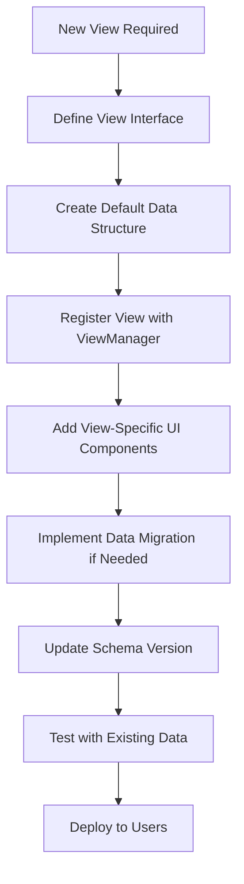

# Future-Proof IndexedDB Schema Design for MindPad

## 🎯 Core Problem & Solution

**Problem:** We need an IndexedDB schema that can:
1. Support current views (mindmap, concept map, writer, outline)
2. Allow adding new views in the future without breaking changes
3. Handle schema migrations for existing users
4. Support view-specific data extensions
5. Maintain performance with evolving data structures

**Solution:** Use a **versioned, extensible schema** with **view-specific extensions** and **automatic migration system**.

## 🏗️ Core Schema Design Principles

### 1. Versioned Database Structure

```typescript
interface MindPadDB {
  version: number;                    // Current schema version
  created: number;                    // Database creation timestamp
  lastMigrated: number;              // Last migration timestamp
  userId?: string;                    // User identifier
  settings: {                         // Global settings
    compressionLevel: 'none' | 'balanced' | 'aggressive';
    searchableContentLength: number;
  };
}
```

### 2. Extensible Node Structure

```typescript
interface BaseNode {
  id: string;                        // Primary key
  mapId: string;                     // Which map this node belongs to
  vaultId: string;                   // Which vault this node belongs to
  type: 'node';                      // Discriminator for future types
  version: number;                   // Node schema version
  
  // Core properties (always present)
  title: string;
  created: number;
  modified: number;
  
  // View-agnostic content
  content?: string;                  // Rich text content (HTML)
  contentCompressed?: Uint8Array;    // Compressed content
  contentLength: number;             // Original content length
  
  // View-specific data container
  viewData: Record<string, ViewSpecificData>;  // Key: viewType, Value: view-specific data
  
  // Relationships
  links?: Link[];                    // Outgoing links
  
  // Metadata
  metadata?: Record<string, any>;    // Extensible metadata
}

interface ViewSpecificData {
  version: number;                   // View-specific data version
  data: Record<string, any>;        // View-specific properties
  modified: number;                 // When this view data was last modified
}
```

### 3. View-Specific Data Examples

```typescript
// Mindmap View Data
interface MindmapViewData {
  position: { x: number; y: number };
  width?: number;
  height?: number;
  color?: string;
  shape?: 'rectangle' | 'ellipse' | 'rounded';
  collapsed?: boolean;
  childrenLayout?: 'horizontal' | 'vertical' | 'mindmap';
}

// Concept Map View Data
interface ConceptMapViewData {
  containerId?: string;              // Parent container ID
  positionInContainer?: { x: number; y: number };
  containerPosition?: { x: number; y: number; width: number; height: number };
  isContainer?: boolean;
  containerChildren?: string[];      // Child node IDs
}

// Writer View Data
interface WriterViewData {
  outlineLevel: number;              // Heading level (1-6)
  outlineOrder: number;              // Position in outline
  outlinePath: string[];             // Hierarchical path
  wordCount: number;
  readingTime: number;
}

// Timeline View Data (future)
interface TimelineViewData {
  startDate?: string;                // ISO date string
  endDate?: string;                  // ISO date string
  duration?: number;                 // Duration in minutes
  timelinePosition?: number;         // Position on timeline
}

// Kanban View Data (future)
interface KanbanViewData {
  columnId?: string;                 // Which column this belongs to
  columnOrder?: number;              // Position in column
  status?: 'todo' | 'in-progress' | 'done' | 'blocked';
  priority?: 'low' | 'medium' | 'high' | 'critical';
  assignee?: string;                 // User ID
  dueDate?: string;                  // ISO date string
}
```

## 🔄 Schema Migration System

### Migration Architecture

```typescript
class SchemaMigrator {
  private currentMigrations: Migration[] = [
    // List of all known migrations
    new V1ToV2Migration(),
    new V2ToV3Migration(),
    // ... future migrations
  ];

  async migrateDatabase(db: IDBDatabase): Promise<void> {
    const currentVersion = await this.getCurrentVersion(db);
    const latestVersion = this.getLatestVersion();

    if (currentVersion >= latestVersion) {
      console.log('Database is up to date');
      return;
    }

    console.log(`Migrating from v${currentVersion} to v${latestVersion}`);

    // Apply migrations sequentially
    for (let v = currentVersion; v < latestVersion; v++) {
      const migration = this.currentMigrations.find(m => m.fromVersion === v);
      
      if (!migration) {
        throw new Error(`Migration from v${v} not found`);
      }

      console.log(`Applying migration: ${migration.name}`);
      await migration.apply(db);
      await this.updateVersion(db, v + 1);
    }

    console.log('Migration complete');
  }
}
```

### Example Migration

```typescript
class V1ToV2Migration implements Migration {
  name = 'V1 to V2: Add view-specific data support';
  fromVersion = 1;
  toVersion = 2;

  async apply(db: IDBDatabase): Promise<void> {
    const transaction = db.transaction(['nodes'], 'readwrite');
    const nodeStore = transaction.objectStore('nodes');
    const cursor = await nodeStore.openCursor();

    while (cursor) {
      const node = cursor.value;
      
      // Add viewData property if it doesn't exist
      if (!node.viewData) {
        node.viewData = {
          mindmap: {
            version: 1,
            data: {
              position: node.position || { x: 0, y: 0 },
              // Move other view-specific properties
            },
            modified: Date.now()
          }
          // Initialize other views
        };

        // Clean up old properties
        delete node.position;
        delete node.width;
        delete node.height;
        
        await cursor.update(node);
      }

      cursor = await cursor.continue();
    }

    await transaction.complete;
  }
}
```

## 📦 View Registration System

### Dynamic View Registration

```typescript
class ViewManager {
  private registeredViews: Record<string, ViewDefinition> = {};
  
  registerView(viewType: string, definition: ViewDefinition): void {
    if (this.registeredViews[viewType]) {
      console.warn(`View ${viewType} already registered, overwriting`);
    }
    this.registeredViews[viewType] = definition;
  }

  getViewDefinition(viewType: string): ViewDefinition | undefined {
    return this.registeredViews[viewType];
  }

  getDefaultViewData(viewType: string): any {
    const definition = this.getViewDefinition(viewType);
    return definition?.getDefaultData() || {};
  }
}

interface ViewDefinition {
  version: number;
  getDefaultData: () => any;
  validateData?: (data: any) => boolean;
  migrateData?: (oldData: any, oldVersion: number) => any;
}

// Example: Register mindmap view
viewManager.registerView('mindmap', {
  version: 1,
  getDefaultData: () => ({
    position: { x: 0, y: 0 },
    width: 200,
    height: 100,
    color: '#ffffff',
    shape: 'rectangle'
  })
});
```

## 🔧 Adding New Views Without Breaking Changes

### Step-by-Step Process



### Example: Adding Timeline View

```typescript
// 1. Define the timeline view interface
interface TimelineViewData {
  startDate?: string;
  endDate?: string;
  duration?: number;
  timelinePosition?: number;
  timelineColor?: string;
}

// 2. Register the view
viewManager.registerView('timeline', {
  version: 1,
  getDefaultData: () => ({
    timelinePosition: 0,
    timelineColor: '#4CAF50',
    duration: 60  // 60 minutes default
  })
});

// 3. When creating new nodes, initialize timeline data
function createNodeWithAllViews(): BaseNode {
  const node: BaseNode = {
    id: generateId(),
    // ... other core properties
    viewData: {}
  };

  // Initialize data for all registered views
  for (const [viewType, definition] of Object.entries(viewManager.registeredViews)) {
    node.viewData[viewType] = {
      version: definition.version,
      data: definition.getDefaultData(),
      modified: Date.now()
    };
  }

  return node;
}

// 4. For existing nodes, add timeline data when first accessed
async function ensureTimelineData(node: BaseNode): Promise<BaseNode> {
  if (!node.viewData.timeline) {
    node.viewData.timeline = {
      version: 1,
      data: viewManager.getDefaultViewData('timeline'),
      modified: Date.now()
    };
    
    // Save the updated node
    await db.nodes.put(node);
  }
  
  return node;
}
```

## 🛡️ Backward Compatibility Strategies

### 1. Graceful Data Access

```typescript
async function getNodeViewData(node: BaseNode, viewType: string): Promise<any> {
  // Check if view data exists
  if (node.viewData?.[viewType]) {
    return node.viewData[viewType].data;
  }

  // If not, check if there are legacy properties
  const legacyData = this.extractLegacyViewData(node, viewType);
  if (legacyData) {
    return legacyData;
  }

  // Return default data for the view
  return viewManager.getDefaultViewData(viewType);
}
```

### 2. Automatic Data Migration

```typescript
async function ensureNodeHasViewData(node: BaseNode, viewType: string): Promise<BaseNode> {
  if (!node.viewData) {
    // Node is from very old schema, needs full migration
    node = await this.migrateLegacyNode(node);
  }
  else if (!node.viewData[viewType]) {
    // Add missing view data
    node.viewData[viewType] = {
      version: viewManager.getViewDefinition(viewType)?.version || 1,
      data: viewManager.getDefaultViewData(viewType),
      modified: Date.now()
    };
    
    // Save the update
    await db.nodes.put(node);
  }
  
  return node;
}
```

### 3. Version Fallback

```typescript
function getViewDataWithFallback(node: BaseNode, viewType: string): any {
  const viewDef = viewManager.getViewDefinition(viewType);
  const currentVersion = viewDef?.version || 1;
  
  if (node.viewData?.[viewType]) {
    const viewData = node.viewData[viewType];
    
    // If view data is from older version, migrate it
    if (viewData.version < currentVersion && viewDef?.migrateData) {
      return viewDef.migrateData(viewData.data, viewData.version);
    }
    
    return viewData.data;
  }

  // Return defaults
  return viewDef?.getDefaultData() || {};
}
```

## 📊 Performance Optimization for Extensible Schema

### 1. Lazy Loading View Data

```typescript
class NodeCache {
  private cache: Map<string, BaseNode> = new Map();
  private viewDataCache: Map<string, Map<string, any>> = new Map();

  async getNode(nodeId: string): Promise<BaseNode> {
    if (this.cache.has(nodeId)) {
      return this.cache.get(nodeId)!;
    }
    
    const node = await db.nodes.get(nodeId);
    this.cache.set(nodeId, node);
    return node;
  }

  async getViewData(nodeId: string, viewType: string): Promise<any> {
    // Check if we have cached view data for this node
    if (this.viewDataCache.has(nodeId) && this.viewDataCache.get(nodeId)?.has(viewType)) {
      return this.viewDataCache.get(nodeId)!.get(viewType);
    }
    
    const node = await this.getNode(nodeId);
    const viewData = getViewDataWithFallback(node, viewType);
    
    // Cache the view data
    if (!this.viewDataCache.has(nodeId)) {
      this.viewDataCache.set(nodeId, new Map());
    }
    this.viewDataCache.get(nodeId)!.set(viewType, viewData);
    
    return viewData;
  }

  invalidateNodeCache(nodeId: string): void {
    this.cache.delete(nodeId);
    this.viewDataCache.delete(nodeId);
  }
}
```

### 2. Partial Updates

```typescript
async function updateNodeViewData(nodeId: string, viewType: string, updates: Partial<any>): Promise<void> {
  const tx = db.transaction('nodes', 'readwrite');
  const node = await tx.objectStore('nodes').get(nodeId);
  
  if (!node.viewData) {
    node.viewData = {};
  }
  
  if (!node.viewData[viewType]) {
    node.viewData[viewType] = {
      version: viewManager.getViewDefinition(viewType)?.version || 1,
      data: viewManager.getDefaultViewData(viewType),
      modified: Date.now()
    };
  }
  
  // Apply updates
  node.viewData[viewType].data = {
    ...node.viewData[viewType].data,
    ...updates
  };
  node.viewData[viewType].modified = Date.now();
  
  // Only update the view data, don't touch other properties
  await tx.objectStore('nodes').put(node);
  await tx.complete;
  
  // Invalidate cache for this node
  nodeCache.invalidateNodeCache(nodeId);
}
```

## 🎯 Implementation Roadmap

### Phase 1: Core Schema Implementation
- [ ] Implement versioned database structure
- [ ] Create base node structure with viewData container
- [ ] Implement ViewManager for dynamic view registration
- [ ] Create migration system framework

### Phase 2: Current View Support
- [ ] Add mindmap view data structure and registration
- [ ] Add concept map view data structure and registration
- [ ] Add writer view data structure and registration
- [ ] Add outline view data structure and registration

### Phase 3: Migration System
- [ ] Implement schema version tracking
- [ ] Create migration base classes
- [ ] Implement V1 to V2 migration (current → view-specific)
- [ ] Add automatic migration on app startup

### Phase 4: Future-Proof Features
- [ ] Implement lazy loading for view data
- [ ] Add partial update optimization
- [ ] Create view data caching system
- [ ] Implement backward compatibility helpers

### Phase 5: Testing & Validation
- [ ] Test with current data structure
- [ ] Test migration from legacy format
- [ ] Test adding new views dynamically
- [ ] Performance testing with large datasets

## 🚀 Example: Adding Kanban View in Future

```typescript
// 1. Define the kanban view
interface KanbanViewData {
  columnId?: string;
  columnOrder?: number;
  status?: 'todo' | 'in-progress' | 'done' | 'blocked';
  priority?: 'low' | 'medium' | 'high' | 'critical';
  assignee?: string;
  dueDate?: string;
}

// 2. Register the view (this can be done in a plugin)
viewManager.registerView('kanban', {
  version: 1,
  getDefaultData: () => ({
    status: 'todo',
    priority: 'medium',
    columnOrder: 0
  }),
  // Optional: migration function for future versions
  migrateData: (oldData, oldVersion) => {
    if (oldVersion === 1) {
      // Migration from v1 to v2
      return {
        ...oldData,
        // Add new properties with defaults
        assignee: oldData.assignee || null,
        dueDate: oldData.dueDate || null
      };
    }
    return oldData;
  }
});

// 3. UI components can now use kanban view data
async function renderKanbanNode(nodeId: string) {
  const kanbanData = await nodeCache.getViewData(nodeId, 'kanban');
  
  // Use the data to render kanban card
  return {
    status: kanbanData.status,
    priority: kanbanData.priority,
    // ... render logic
  };
}

// 4. When user changes status, update only kanban data
async function updateNodeStatus(nodeId: string, newStatus: string) {
  await updateNodeViewData(nodeId, 'kanban', { status: newStatus });
}
```

## ✅ Benefits of This Approach

1. **Future-Proof**: New views can be added without breaking existing data
2. **Backward Compatible**: Old data structures are automatically migrated
3. **Performance Optimized**: Lazy loading and partial updates minimize I/O
4. **Type Safe**: Each view has its own interface definition
5. **Extensible**: Easy to add new properties to existing views
6. **Maintainable**: Clear separation between core data and view-specific data
7. **User-Friendly**: Automatic migrations mean users don't lose data

## 📚 Recommendations

1. **Start with core schema** implementing the versioned structure and viewData container
2. **Implement migration system early** to handle future changes gracefully
3. **Use ViewManager pattern** for dynamic view registration
4. **Optimize for performance** with lazy loading and caching
5. **Document schema versions** thoroughly for future maintenance
6. **Test migrations extensively** to ensure data integrity

This design ensures MindPad can evolve with new views and features while maintaining compatibility with existing user data.