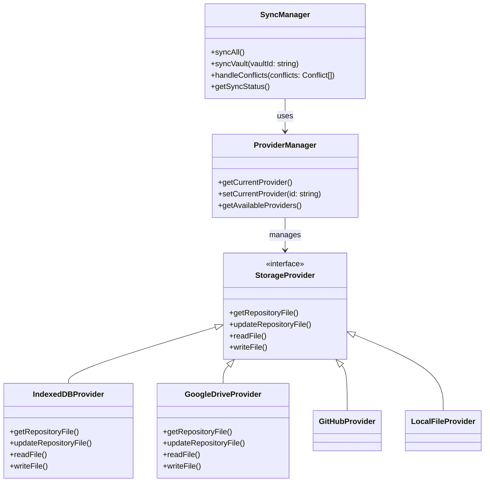

# Multi-Backend Storage Architecture

## Vision: Flexible Storage Provider System

### Current Backends:
- **IndexedDB** (Primary local storage)
- **Google Drive** (Primary cloud sync)

### Future Backends:
- **Local File System** (Electron version)
- **GitHub** (For versioning/advanced users via Octokit.js)
- **Dropbox** (Alternative cloud storage)
- **Amazon S3** (Enterprise/self-hosted option)
- **WebDAV** (Generic protocol support)
- **IPFS** (Decentralized option)

## Architecture Design: Provider-Based System

### Core Principles:
1. **Unified Interface**: All backends implement same interface
2. **IndexedDB as Primary**: Always the main working storage
3. **Backend as Sync Target**: Cloud/local storage for synchronization
4. **Repository File Pattern**: Consistent metadata approach across backends
5. **Pluggable Architecture**: Easy to add new backends

## Provider Interface Design

```typescript
// Core Storage Provider Interface
interface StorageProvider {
    // Provider identification
    readonly id: string;
    readonly name: string;
    readonly type: 'local' | 'cloud' | 'versioned';
    readonly capabilities: ProviderCapabilities;
    
    // Connection management
    initialize(config: ProviderConfig): Promise<ProviderStatus>;
    authenticate(): Promise<AuthResult>;
    checkConnection(): Promise<ConnectionStatus>;
    
    // Vault operations
    listVaults(): Promise<VaultMetadata[]>;
    createVault(vaultId: string, name: string): Promise<VaultMetadata>;
    deleteVault(vaultId: string): Promise<void>;
    
    // Repository file operations (core of our sync system)
    getRepositoryFile(vaultId: string): Promise<VaultRepository>;
    updateRepositoryFile(vaultId: string, repository: VaultRepository): Promise<void>;
    
    // File operations
    fileExists(vaultId: string, filePath: string): Promise<boolean>;
    readFile(vaultId: string, filePath: string): Promise<Uint8Array>;
    writeFile(vaultId: string, filePath: string, data: Uint8Array): Promise<void>;
    deleteFile(vaultId: string, filePath: string): Promise<void>;
    listFiles(vaultId: string, path?: string): Promise<FileMetadata[]>;
    
    // Advanced operations
    watchForChanges(vaultId: string, callback: (changes: FileChange[]) => void): void;
    unwatch(vaultId: string): void;
    
    // Utility
    getFileUrl(vaultId: string, filePath: string): Promise<string | null>;
}

interface ProviderCapabilities {
    supportsVersioning: boolean;
    supportsWatch: boolean;
    supportsOffline: boolean;
    maxFileSize: number | null;
    batchOperations: boolean;
}

interface VaultRepository {
    // Standard repository structure (same across all providers)
    vaultId: string;
    name: string;
    lastUpdated: number;
    files: Record<string, RepositoryFile>;
    deletedFiles: string[];
    providerSpecific?: Record<string, any>; // Provider extensions
}
```

## Provider Implementation Structure

```
src/core/storage/
├── providers/
│   ├── base/
│   │   ├── StorageProvider.ts          # Base interface
│   │   ├── ProviderManager.ts         # Manages multiple providers
│   │   └── RepositoryManager.ts       # Handles repository files
│   ├── indexedDB/
│   │   ├── IndexedDBProvider.ts       # Primary local provider
│   │   └── IndexedDBSchema.ts         # Database schema
│   ├── googleDrive/
│   │   ├── GoogleDriveProvider.ts     # Current cloud provider
│   │   ├── GoogleDriveAuth.ts         # Authentication
│   │   └── GoogleDriveAPI.ts          # API wrapper
│   ├── localFileSystem/
│   │   ├── LocalFileProvider.ts       # Electron local files
│   │   └── FileSystemAPI.ts           # Node.js fs wrapper
│   ├── github/
│   │   ├── GitHubProvider.ts          # Future: GitHub backend
│   │   ├── OctokitWrapper.ts          # Octokit.js wrapper
│   │   └── GitHubRepository.ts       # GitHub-specific repo handling
│   ├── dropbox/
│   │   ├── DropboxProvider.ts         # Future: Dropbox backend
│   │   └── DropboxAPI.ts              # Dropbox API wrapper
│   └── ...
├── sync/
│   ├── SyncManager.ts                # Core sync logic
│   ├── ConflictResolver.ts           # Conflict resolution
│   └── SyncWorker.ts                 # Web worker for background sync
└── index.ts                           # Public API
```

## Provider Manager Design

```typescript
class ProviderManager {
    private providers: Map<string, StorageProvider> = new Map();
    private currentProviderId: string | null = null;
    
    constructor() {
        // Register built-in providers
        this.registerProvider(new IndexedDBProvider());
        this.registerProvider(new GoogleDriveProvider());
        
        // Electron-only providers
        if (isElectron()) {
            this.registerProvider(new LocalFileProvider());
        }
    }
    
    registerProvider(provider: StorageProvider) {
        this.providers.set(provider.id, provider);
    }
    
    getProvider(id: string): StorageProvider | undefined {
        return this.providers.get(id);
    }
    
    getCurrentProvider(): StorageProvider {
        if (!this.currentProviderId) {
            throw new Error('No provider selected');
        }
        return this.getProvider(this.currentProviderId)!;
    }
    
    async setCurrentProvider(id: string) {
        const provider = this.getProvider(id);
        if (!provider) {
            throw new Error(`Provider ${id} not found`);
        }
        
        await provider.initialize();
        this.currentProviderId = id;
    }
    
    async getAvailableProviders(): Promise<ProviderInfo[]> {
        const results = [];
        
        for (const [id, provider] of this.providers) {
            try {
                const status = await provider.checkConnection();
                results.push({
                    id,
                    name: provider.name,
                    type: provider.type,
                    status: status.connected ? 'available' : 'unavailable',
                    capabilities: provider.capabilities
                });
            } catch (error) {
                results.push({
                    id,
                    name: provider.name,
                    type: provider.type,
                    status: 'error',
                    error: error.message
                });
            }
        }
        
        return results;
    }
}
```

## Repository File: Universal Approach

### Standard Repository Structure (All Providers):
```typescript
interface VaultRepository {
    // Universal fields (required for all providers)
    vaultId: string;
    name: string;
    version: '1.0'; // Schema version
    lastUpdated: number; // ISO timestamp
    
    // File structure (universal)
    files: Record<string, {
        id: string;
        path: string;
        name: string;
        timestamp: number;
        size: number;
        checksum?: string;
    }>;
    
    deletedFiles: string[];
    
    // Provider-specific extensions
    providerMetadata?: {
        googleDrive?: {
            folderId: string;
            webViewLink: string;
        };
        github?: {
            repo: string;
            branch: string;
            commitHash: string;
        };
        localFileSystem?: {
            basePath: string;
        };
    };
}
```

### Provider-Specific Adaptations:

#### Google Drive:
```typescript
// Google Drive repository file structure
interface GoogleDriveRepository extends VaultRepository {
    providerMetadata: {
        googleDrive: {
            folderId: string; // Google Drive folder ID
            webViewLink: string; // Web view URL
            permissionId?: string; // For shared vaults
        }
    };
}
```

#### GitHub:
```typescript
// GitHub repository structure
interface GitHubRepository extends VaultRepository {
    providerMetadata: {
        github: {
            owner: string;
            repo: string;
            branch: string;
            commitHash: string; // Last known commit
            prNumber?: number; // If using PR-based sync
        }
    };
    
    // GitHub-specific file tracking
    githubFiles?: Record<string, {
        path: string;
        sha: string; // Git blob SHA
        lastCommit: string;
    }>;
}
```

#### Local File System:
```typescript
// Local file system repository
interface LocalFileRepository extends VaultRepository {
    providerMetadata: {
        localFileSystem: {
            basePath: string; // Absolute path
            relativePaths: boolean; // Store paths relative to base
        }
    };
}
```

## Synchronization Architecture



## Vault Management with Multiple Providers

```typescript
interface VaultConfiguration {
    vaultId: string;
    name: string;
    primaryProvider: string; // Where vault is primarily stored
    syncProviders: string[]; // Additional sync targets
    
    // Provider-specific configurations
    providerConfigs: {
        googleDrive?: {
            folderId: string;
            useSharedDrive: boolean;
        };
        github?: {
            repo: string;
            branch: string;
            usePrivate: boolean;
        };
        localFileSystem?: {
            path: string;
        };
    };
    
    // Sync settings
    syncSettings: {
        conflictResolution: 'server' | 'local' | 'ask';
        autoSync: boolean;
        syncFrequency: 'manual' | '5min' | '15min' | 'hourly';
    };
}
```

## Implementation Roadmap

### Phase 1: Core Provider Architecture
- [ ] Define `StorageProvider` interface
- [ ] Implement `ProviderManager`
- [ ] Create base `RepositoryManager`
- [ ] Design universal repository file format

### Phase 2: Current Providers
- [ ] **IndexedDB Provider** (primary local storage)
- [ ] **Google Drive Provider** (current cloud sync)
- [ ] Repository file handling for both

### Phase 3: Provider Abstraction
- [ ] Abstract sync logic to work with any provider
- [ ] Implement provider-specific adaptations
- [ ] Create provider factory system

### Phase 4: Future Providers (Planned)
- [ ] **Local File System** (Electron version)
- [ ] **GitHub** (Octokit.js integration)
- [ ] **Dropbox** (API integration)
- [ ] **Amazon S3** (AWS SDK integration)

### Phase 5: Advanced Features
- [ ] Multi-provider sync (same vault to multiple backends)
- [ ] Provider capability detection
- [ ] Automatic fallback between providers
- [ ] Provider health monitoring

## Example: Adding GitHub Provider

```typescript
// 1. Implement GitHub provider
class GitHubProvider implements StorageProvider {
    id = 'github';
    name = 'GitHub';
    type = 'versioned';
    capabilities = {
        supportsVersioning: true,
        supportsWatch: true,
        supportsOffline: false,
        maxFileSize: 100 * 1024 * 1024, // 100MB
        batchOperations: true
    };
    
    private octokit: Octokit;
    
    async initialize(config: ProviderConfig) {
        this.octokit = new Octokit({ auth: config.token });
        // Verify authentication
        await this.octokit.rest.users.getAuthenticated();
    }
    
    async getRepositoryFile(vaultId: string): Promise<VaultRepository> {
        const config = await this.getVaultConfig(vaultId);
        
        // Read .vault-metadata.json from GitHub
        const response = await this.octokit.rest.repos.getContent({
            owner: config.owner,
            repo: config.repo,
            path: '.vault-metadata.json',
            ref: config.branch
        });
        
        const content = Buffer.from(response.data.content, 'base64').toString();
        return JSON.parse(content);
    }
    
    async updateRepositoryFile(vaultId: string, repository: VaultRepository) {
        const config = await this.getVaultConfig(vaultId);
        
        // Write .vault-metadata.json to GitHub
        await this.octokit.rest.repos.createOrUpdateFileContents({
            owner: config.owner,
            repo: config.repo,
            path: '.vault-metadata.json',
            message: `Update vault metadata: ${repository.name}`,
            content: Buffer.from(JSON.stringify(repository, null, 2)).toString('base64'),
            branch: config.branch,
            sha: await this.getCurrentSha(vaultId) // For updates
        });
    }
    
    async readFile(vaultId: string, filePath: string): Promise<Uint8Array> {
        const config = await this.getVaultConfig(vaultId);
        
        const response = await this.octokit.rest.repos.getContent({
            owner: config.owner,
            repo: config.repo,
            path: filePath,
            ref: config.branch
        });
        
        return Buffer.from(response.data.content, 'base64');
    }
    
    // ... other methods
}

// 2. Register the provider
providerManager.registerProvider(new GitHubProvider());

// 3. Use it in the app
await providerManager.setCurrentProvider('github');
const repository = await providerManager.getCurrentProvider().getRepositoryFile('vault-1');
```

## User Interface Integration

### Provider Selection UI:
```vue
<template>
    <q-select
        v-model="selectedProvider"
        :options="availableProviders"
        label="Storage Provider"
        option-value="id"
        option-label="name"
        emit-value
        map-options
    >
        <template v-slot:option="scope">
            <q-item v-bind="scope.itemProps">
                <q-item-section avatar>
                    <q-icon :name="getProviderIcon(scope.opt.type)" />
                </q-item-section>
                <q-item-section>
                    <q-item-label>{{ scope.opt.name }}</q-item-label>
                    <q-item-label caption>
                        {{ scope.opt.status }} • {{ getProviderDescription(scope.opt) }}
                    </q-item-label>
                </q-item-section>
                <q-item-section side>
                    <q-badge v-if="scope.opt.capabilities.supportsVersioning" color="positive">
                        Versioning
                    </q-badge>
                </q-item-section>
            </q-item>
        </template>
    </q-select>
</template>
```

### Vault Configuration UI:
```vue
<template>
    <q-card>
        <q-card-section>
            <div class="text-h6">Vault Storage Settings</div>
        </q-card-section>
        
        <q-card-section>
            <q-form @submit="saveConfig">
                <q-select
                    v-model="config.primaryProvider"
                    :options="providers"
                    label="Primary Storage"
                    hint="Where this vault is primarily stored"
                />
                
                <q-select
                    v-model="config.syncProviders"
                    :options="providers"
                    label="Additional Sync Targets"
                    hint="Other places to sync this vault"
                    multiple
                    use-chips
                />
                
                <div v-if="config.primaryProvider === 'googleDrive'">
                    <q-input v-model="config.googleDriveFolder" label="Google Drive Folder" />
                    <q-toggle v-model="config.useSharedDrive" label="Use Shared Drive" />
                </div>
                
                <div v-if="config.primaryProvider === 'github'">
                    <q-input v-model="config.githubRepo" label="Repository (owner/repo)" />
                    <q-input v-model="config.githubBranch" label="Branch" value="main" />
                    <q-toggle v-model="config.privateRepo" label="Private Repository" />
                </div>
                
                <q-btn type="submit" color="primary" label="Save Configuration" />
            </q-form>
        </q-card-section>
    </q-card>
</template>
```

## Benefits of This Architecture

### ✅ Future-Proof:
- Easy to add new storage providers
- Consistent interface across all backends
- Provider-specific features through extensions

### ✅ User Flexibility:
- Choose preferred storage backend
- Mix and match providers per vault
- Different providers for different use cases

### ✅ Technical Excellence:
- Clean separation of concerns
- Provider abstraction layer
- Universal repository file pattern
- Consistent sync logic

### ✅ Business Value:
- Support multiple platforms (web, desktop)
- Enterprise options (S3, self-hosted)
- Versioning for power users (GitHub)
- Consumer options (Google Drive, Dropbox)

## Migration Path

### Current Implementation → New Architecture:

1. **Extract current Google Drive code** into provider
2. **Create IndexedDB provider** for local storage
3. **Implement provider manager** to handle both
4. **Adapt sync logic** to use provider interface
5. **Add repository file handling** to both providers
6. **Test thoroughly** with existing functionality

### Adding New Providers:

1. Implement provider interface
2. Register with provider manager
3. Add provider-specific UI components
4. Test with repository file sync
5. Document provider capabilities

## Conclusion

This **provider-based architecture** with a **universal repository file approach** is the perfect foundation for MindPad's storage system. It:

1. **Solves immediate needs** with IndexedDB + Google Drive
2. **Enables future expansion** to GitHub, Dropbox, S3, etc.
3. **Maintains consistency** through universal repository files
4. **Provides user choice** in storage backends
5. **Supports all platforms** (web, desktop, mobile)
6. **Handles all sync scenarios** efficiently

The architecture is **flexible, extensible, and future-proof** while addressing all the synchronization challenges we've discussed. This is exactly the right approach for a professional application like MindPad.