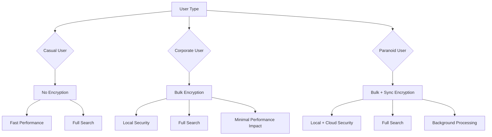

# Comprehensive Security Strategy for MindPad

## 🎯 Executive Summary

This document presents the complete security strategy for MindPad, combining bulk encryption (for local security) and sync encryption (for cloud security) with a tiered approach for different user types. This provides excellent security for corporate users while maintaining simplicity for casual users.

## 🔐 Security Architecture Overview



## 📊 Security Levels Implementation

### 1. Basic Level (Default)

```typescript
// settings.ts
interface BasicSecuritySettings {
  encryption: {
    local: 'none'; // No local encryption
    cloud: 'none'; // No cloud encryption
  };
  
  autoLock: 'never'; // Never auto-lock
  
  password: null; // No password required
  
  auditLogging: false; // No audit logs
}
```

**Use Case:** Casual users, personal notes, non-sensitive data
**Performance:** Excellent (no encryption overhead)
**Security:** Transport security only (HTTPS)

### 2. Corporate Level

```typescript
// settings.ts
interface CorporateSecuritySettings {
  encryption: {
    local: 'bulk'; // Bulk encryption on app close/open
    cloud: 'none'; // No cloud encryption (optional add-on)
  };
  
  autoLock: '15 minutes'; // Auto-lock after inactivity
  
  password: {
    required: true;
    policy: 'medium'; // 8+ chars, mixed case
  };
  
  auditLogging: true; // Basic audit logging
}
```

**Use Case:** Business users, sensitive work data, compliance needs
**Performance:** Excellent (only ~1-3s startup delay)
**Security:** Strong local protection, optional cloud encryption

### 3. Paranoid Level

```typescript
// settings.ts
interface ParanoidSecuritySettings {
  encryption: {
    local: 'bulk'; // Bulk encryption on app close/open
    cloud: 'sync'; // Sync encryption for cloud storage
  };
  
  autoLock: '5 minutes'; // Aggressive auto-lock
  
  password: {
    required: true;
    policy: 'strict'; // 12+ chars, special chars, no dictionary words
  };
  
  auditLogging: 'detailed'; // Comprehensive audit logging
  
  memoryProtection: true; // Clear memory on background
}
```

**Use Case:** High-security environments, classified data, maximum privacy
**Performance:** Good (background sync encryption, ~15-20% sync overhead)
**Security:** Maximum protection for both local and cloud data

## 🔧 Combined Implementation Strategy

### Core Security Service

```typescript
// securityService.ts
class SecurityService {
  private localEncryption: BulkEncryptionService;
  private syncEncryption: SyncEncryptionService;
  private settings: SecuritySettings;
  
  constructor(settings: SecuritySettings) {
    this.settings = settings;
    this.localEncryption = new BulkEncryptionService();
    this.syncEncryption = new SyncEncryptionService();
  }
  
  // Initialize security based on settings
  async initialize(password?: string): Promise<void> {
    // Local encryption setup
    if (this.settings.encryption.local === 'bulk' && password) {
      await this.localEncryption.initialize(password);
      
      // Check if database needs decryption
      if (await this.localEncryption.isEncrypted()) {
        await this.decryptDatabase();
      }
    }
    
    // Sync encryption setup
    if (this.settings.encryption.cloud === 'sync' && password) {
      await this.syncEncryption.initialize(password);
    }
  }
  
  // Encrypt database on app close
  async onAppClose(): Promise<void> {
    if (this.settings.encryption.local === 'bulk') {
      await this.localEncryption.encryptAll();
    }
  }
  
  // Encrypt document for sync
  async encryptForSync(doc: MindpadDocument): Promise<EncryptedFile> {
    if (this.settings.encryption.cloud === 'sync') {
      return await this.syncEncryption.encrypt(doc);
    }
    return doc; // No encryption
  }
  
  // Decrypt document from sync
  async decryptFromSync(encrypted: EncryptedFile): Promise<MindpadDocument> {
    if (this.settings.encryption.cloud === 'sync') {
      return await this.syncEncryption.decrypt(encrypted);
    }
    return encrypted; // No encryption
  }
}
```

### App Integration

```typescript
// appLifecycle.ts
class AppLifecycleManager {
  private securityService: SecurityService;
  
  async startup(): Promise<void> {
    // Load security settings
    const settings = await this.loadSecuritySettings();
    
    // Initialize security
    this.securityService = new SecurityService(settings);
    
    // Check if password is needed
    if (settings.encryption.local === 'bulk' || 
        settings.encryption.cloud === 'sync') {
      
      const password = await this.promptForPassword();
      await this.securityService.initialize(password);
    } else {
      // No encryption needed
      await this.securityService.initialize();
    }
    
    // Start normal app operation
    await this.startApp();
  }
  
  async shutdown(): Promise<void> {
    // Handle encryption on close
    await this.securityService.onAppClose();
    
    // Clear sensitive data
    this.clearMemory();
  }
}
```

### Sync Integration

```typescript
// syncManager.ts
class SecureSyncManager {
  private securityService: SecurityService;
  
  async syncDocument(doc: MindpadDocument): Promise<void> {
    // Encrypt for sync if needed
    const encryptedDoc = await this.securityService.encryptForSync(doc);
    
    // Upload to cloud
    await cloudStorage.upload(encryptedDoc);
  }
  
  async loadDocument(docId: string): Promise<MindpadDocument> {
    // Download from cloud
    const encryptedDoc = await cloudStorage.download(docId);
    
    // Decrypt if needed
    return await this.securityService.decryptFromSync(encryptedDoc);
  }
}
```

## 📊 Performance Comparison

| Operation | Basic | Corporate | Paranoid |
|-----------|-------|-----------|----------|
| **App Startup** | Instant | +1-3s | +1-3s |
| **Document Search** | Instant | Instant | Instant |
| **Local Editing** | Instant | Instant | Instant |
| **Sync Upload** | Normal | Normal | +15-20% |
| **Sync Download** | Normal | Normal | +15-20% |
| **Memory Usage** | Normal | Normal | Normal |

**Key Insight:** Only paranoid level has any performance impact, and it's minimal (~15-20% slower sync).

## 🔐 Security Features by Level

| Feature | Basic | Corporate | Paranoid |
|---------|-------|-----------|----------|
| **Local Encryption** | ❌ | ✅ | ✅ |
| **Cloud Encryption** | ❌ | ❌/✅ | ✅ |
| **Password Protection** | ❌ | ✅ | ✅ |
| **Auto-Lock** | ❌ | ✅ (15min) | ✅ (5min) |
| **Audit Logging** | ❌ | ✅ | ✅ (detailed) |
| **Memory Protection** | ❌ | ❌ | ✅ |
| **Password Policy** | ❌ | ✅ (medium) | ✅ (strict) |

## 🚀 Implementation Roadmap

### Phase 1: Foundation (Current)
- [x] Transport security (HTTPS)
- [x] OAuth token encryption
- [x] Input validation
- [x] Basic security infrastructure

### Phase 2: Corporate Security
- [ ] Implement bulk encryption service
- [ ] Add app lifecycle handlers
- [ ] Create password prompt
- [ ] Add security settings UI
- [ ] Implement auto-lock feature
- [ ] Add basic audit logging

### Phase 3: Paranoid Security
- [ ] Implement sync encryption service
- [ ] Add Web Worker support
- [ ] Implement memory protection
- [ ] Add detailed audit logging
- [ ] Implement strict password policy

### Phase 4: Optimization
- [ ] Add batch processing
- [ ] Implement progress indicators
- [ ] Add performance monitoring
- [ ] Optimize memory usage

## 🎯 User Experience

### Security Settings UI

```vue
<!-- SecuritySettings.vue -->
<template>
  <q-card>
    <q-card-section>
      <div class="text-h6">Security Settings</div>
    </q-card-section>
    
    <q-card-section>
      <q-select
        v-model="securityLevel"
        :options="levelOptions"
        label="Security Level"
        emit-value
        map-options
      />
      
      <div v-if="securityLevel !== 'basic'" class="q-mt-md">
        <q-input
          v-model="password"
          label="Password"
          type="password"
          :rules="passwordRules"
        />
        
        <q-input
          v-model="confirmPassword"
          label="Confirm Password"
          type="password"
          :rules="[val => val === password || 'Passwords do not match']"
        />
        
        <q-checkbox
          v-model="rememberPassword"
          label="Remember password on this device"
        />
      </div>
      
      <q-banner v-if="securityLevel === 'paranoid'" class="bg-orange-1 q-mt-md">
        <template v-slot:avatar>
          <q-icon name="warning" color="orange" />
        </template>
        Paranoid mode enables cloud encryption which may slow down sync operations by ~15-20%.
      </q-banner>
    </q-card-section>
    
    <q-card-actions>
      <q-btn label="Save" color="primary" @click="saveSettings" />
      <q-btn label="Cancel" flat @click="cancel" />
    </q-card-actions>
  </q-card>
</template>
```

### Login Prompt

```vue
<!-- SecurityLogin.vue -->
<template>
  <q-dialog v-model="showLogin" persistent>
    <q-card style="min-width: 350px">
      <q-card-section>
        <div class="text-h6">Unlock MindPad</div>
      </q-card-section>
      
      <q-card-section>
        <q-input
          v-model="password"
          label="Password"
          type="password"
          autofocus
          @keyup.enter="unlock"
        />
        
        <q-btn
          label="Forgot Password?"
          flat
          size="sm"
          class="q-mt-sm"
          @click="showRecovery"
        />
      </q-card-section>
      
      <q-card-actions align="right">
        <q-btn label="Unlock" color="primary" @click="unlock" />
      </q-card-actions>
    </q-card>
  </q-dialog>
</template>
```

### Auto-Lock Notification

```vue
<!-- AutoLockNotification.vue -->
<template>
  <q-banner v-if="showAutoLockWarning" class="bg-grey-3">
    <template v-slot:avatar>
      <q-icon name="lock" color="primary" />
    </template>
    App will auto-lock in {{ minutes }}:{{ seconds }} due to inactivity.
    <template v-slot:action>
      <q-btn flat label="Stay Active" @click="resetTimer" />
      <q-btn flat label="Dismiss" @click="dismiss" />
    </template>
  </q-banner>
</template>
```

## 🛡️ Security Best Practices

### 1. Key Management
```typescript
// secureKeyStorage.ts
class KeyManager {
  private key: CryptoKey | null = null;
  private password: string | null = null;
  
  // Store key securely
  async storeKey(key: CryptoKey, password: string): Promise<void> {
    // Encrypt key with password
    const encryptedKey = await this.encryptKey(key, password);
    
    // Store in secure storage
    if ('secureStorage' in window) {
      await secureStorage.set({ 
        key: 'encryptionKey',
        value: encryptedKey 
      });
    } else {
      // Fallback to IndexedDB
      await db.keys.put({ 
        id: 'encryptionKey',
        value: encryptedKey 
      });
    }
  }
  
  // Retrieve key
  async getKey(password: string): Promise<CryptoKey> {
    // Check memory cache first
    if (this.key) return this.key;
    
    // Retrieve from storage
    let encryptedKey;
    if ('secureStorage' in window) {
      encryptedKey = await secureStorage.get('encryptionKey');
    } else {
      encryptedKey = await db.keys.get('encryptionKey');
    }
    
    // Decrypt and return
    return await this.decryptKey(encryptedKey.value, password);
  }
  
  // Clear key from memory
  clearKey(): void {
    this.key = null;
    this.password = null;
  }
}
```

### 2. Password Recovery
```typescript
// passwordRecovery.ts
class PasswordRecovery {
  // Generate recovery key
  async generateRecoveryKey(): Promise<string> {
    // Generate 12-word mnemonic
    const words = bip39.generateMnemonic();
    
    // Store recovery key securely
    await this.storeRecoveryKey(words);
    
    return words;
  }
  
  // Recover using recovery key
  async recoverWithKey(words: string, newPassword: string): Promise<void> {
    // Verify recovery key
    const isValid = await this.verifyRecoveryKey(words);
    
    if (isValid) {
      // Derive new key from password
      const newKey = await this.deriveKey(newPassword);
      
      // Re-encrypt all data with new key
      await this.reencryptAllData(newKey);
      
      // Store new key
      await this.storeKey(newKey, newPassword);
    }
  }
}
```

### 3. Audit Logging
```typescript
// auditLogger.ts
class AuditLogger {
  async logEvent(event: AuditEvent): Promise<void> {
    // Add to audit log
    await db.auditLogs.add({
      timestamp: Date.now(),
      eventType: event.type,
      details: event.details,
      ipAddress: event.ipAddress
    });
    
    // Auto-clean old logs
    await this.cleanOldLogs();
    
    // Export for corporate users
    if (this.settings.auditLogging === 'detailed') {
      await this.exportLog(event);
    }
  }
  
  async getSecurityEvents(): Promise<AuditEvent[]> {
    return await db.auditLogs
      .orderBy('timestamp')
      .reverse()
      .limit(100)
      .toArray();
  }
}
```

## 📊 Security vs Performance Summary

| Approach | Security Level | Local Performance | Sync Performance | Implementation Complexity | Best For |
|----------|---------------|-------------------|------------------|--------------------------|----------|
| **Basic** | ❌ Low | ✅ Excellent | ✅ Excellent | ❌ Low | Casual users |
| **Corporate** | ✅ High | ✅ Excellent | ✅ Excellent | ⚠️ Medium | Business users |
| **Paranoid** | ✅ Very High | ✅ Excellent | ⚠️ Good | ✅ High | High-security needs |

## 🎯 Final Recommendations

### 1. Implement Tiered Security
- **Basic**: Default for all users (no encryption)
- **Corporate**: Optional for security-conscious users
- **Paranoid**: Optional for maximum security

### 2. Make It User-Friendly
- Clear explanations of each security level
- Performance impact warnings
- Easy to switch between levels
- Password recovery options

### 3. Focus on Corporate First
- Implement bulk encryption first
- Add sync encryption later
- Start with medium security, add paranoid features as needed

### 4. Performance Optimization
- Use Web Workers for encryption
- Implement batch processing
- Add progress indicators
- Optimize memory usage

### 5. Security Education
- Explain security/performance trade-offs
- Provide best practices
- Offer security recommendations
- Document recovery procedures

## 🚀 Conclusion

**Your combined approach is excellent!** It provides:

✅ **Flexibility**: Different security levels for different user needs
✅ **Performance**: Minimal impact on casual users, acceptable for corporate
✅ **Security**: Strong protection for sensitive data
✅ **Usability**: Full search functionality, easy to use
✅ **Future-proof**: Can add more security features later

**Implementation Priority:**
1. Basic security (already done)
2. Corporate security (bulk encryption)
3. Paranoid security (sync encryption)
4. Performance optimization
5. Advanced features

This strategy gives MindPad enterprise-grade security capabilities while maintaining simplicity for casual users - the perfect balance!