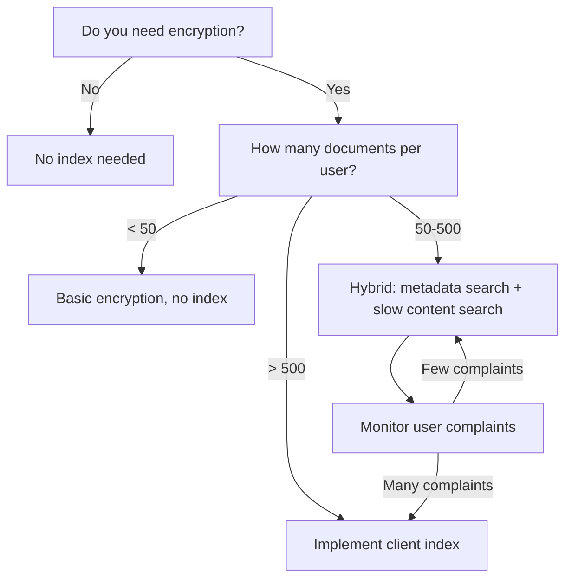

# Client Index Explained Simply

## 🎯 What is a Client Index?

**Simple Explanation:**
A client index is like a "table of contents" for your encrypted documents. Instead of searching through every encrypted document (which is slow), you create a separate searchable index that points to where the information is located.

**Real-world Analogy:**
Think of it like a library:
- **Without index**: You have to open every book to find what you're looking for (slow!)
- **With index**: You look up the topic in the card catalog, which tells you exactly which books contain that information (fast!)

## 🔍 How It Works - Simple Example

### Without Client Index (Slow):
```javascript
// You want to search for "project plan"
async function searchWithoutIndex(query) {
  const results = [];
  
  // Have to decrypt and search EVERY document
  for (const encryptedDoc of allDocuments) {
    const doc = await decrypt(encryptedDoc); // SLOW!
    if (doc.content.includes(query)) {
      results.push(doc);
    }
  }
  
  return results; // Takes 20-40 seconds for 1000 docs!
}
```

### With Client Index (Fast):
```javascript
// First, build the index
const searchIndex = {
  "project": ["doc1", "doc5", "doc42"],
  "plan": ["doc5", "doc8", "doc42"],
  "meeting": ["doc3", "doc8", "doc15"],
  // ... thousands of words mapped to document IDs
};

// Now search is FAST
async function searchWithIndex(query) {
  // Look up the word in our index
  const docIds = searchIndex[query]; // Instant!
  
  // Only decrypt the matching documents
  const results = [];
  for (const docId of docIds) {
    const encryptedDoc = await getDocument(docId);
    const doc = await decrypt(encryptedDoc); // Only decrypt relevant docs
    results.push(doc);
  }
  
  return results; // Takes 1-2 seconds for 1000 docs!
}
```

## 📊 Performance Comparison

| Scenario             | Without Index   | With Client Index | Speed Improvement |
| -------------------- | --------------- | ----------------- | ----------------- |
| **100 documents**    | 2-4 seconds     | 0.1-0.2 seconds   | **20x faster**    |
| **1000 documents**   | 20-40 seconds   | 1-2 seconds       | **20x faster**    |
| **10,000 documents** | 200-400 seconds | 10-20 seconds     | **20x faster**    |

**Key Insight:** The index makes search **20x faster** because you only decrypt documents that actually contain your search term, not every single document.

## 🔐 How It Works with Encryption

### The Trick: Encrypt the Index Too!

```javascript
// Your documents are encrypted
const encryptedDocuments = {
  "doc1": { encrypted: "...", iv: "...", salt: "..." },
  "doc2": { encrypted: "...", iv: "...", salt: "..." },
  // ...
};

// Your search index is ALSO encrypted
const encryptedIndex = {
  "project": encrypt(["doc1", "doc5", "doc42"]),
  "plan": encrypt(["doc5", "doc8", "doc42"]),
  "meeting": encrypt(["doc3", "doc8", "doc15"]),
};

// When you search:
async function secureSearch(query) {
  // 1. Decrypt just the index entry for your search term
  const encryptedDocIds = encryptedIndex[query];
  const docIds = await decrypt(encryptedDocIds); // Fast! Small data
  
  // 2. Only decrypt the matching documents
  const results = [];
  for (const docId of docIds) {
    const doc = await decryptDocument(docId);
    results.push(doc);
  }
  
  return results;
}
```

## 🎯 Simple Implementation Example

### Step 1: Create the Index Builder
```typescript
class SearchIndexBuilder {
  private index: Record<string, Set<string>> = {};
  
  // Add a document to the index
  addDocument(docId: string, content: string) {
    // Extract all words from content
    const words = this.extractWords(content);
    
    // Add each word to the index
    for (const word of words) {
      if (!this.index[word]) {
        this.index[word] = new Set();
      }
      this.index[word].add(docId);
    }
  }
  
  private extractWords(text: string): string[] {
    // Simple word extraction (improve as needed)
    return text.toLowerCase()
      .split(/\s+/) 
      .filter(word => word.length > 2) // Ignore short words
      .map(word => word.replace(/[^a-z0-9]/g, '')); // Remove punctuation
  }
  
  // Get the current index
  getIndex(): Record<string, string[]> {
    const result = {};
    for (const [word, docIds] of Object.entries(this.index)) {
      result[word] = Array.from(docIds);
    }
    return result;
  }
}
```

### Step 2: Use the Index for Search
```typescript
class SearchService {
  private index: Record<string, string[]>;
  private encryptionService: EncryptionService;
  
  constructor(index: Record<string, string[]>, encryptionService: EncryptionService) {
    this.index = index;
    this.encryptionService = encryptionService;
  }
  
  async search(query: string): Promise<MindpadDocument[]> {
    // 1. Normalize the query
    const normalizedQuery = this.normalizeQuery(query);
    
    // 2. Look up in index (fast!)
    const docIds = this.index[normalizedQuery] || [];
    
    // 3. Decrypt only matching documents
    const results = [];
    for (const docId of docIds) {
      const encryptedDoc = await getEncryptedDocument(docId);
      const doc = await this.encryptionService.decrypt(encryptedDoc);
      results.push(doc);
    }
    
    return results;
  }
  
  private normalizeQuery(query: string): string {
    return query.toLowerCase().replace(/[^a-z0-9]/g, '');
  }
}
```

### Step 3: Keep the Index Updated
```typescript
class IndexManager {
  private index: SearchIndexBuilder;
  private encryptionService: EncryptionService;
  
  constructor(encryptionService: EncryptionService) {
    this.index = new SearchIndexBuilder();
    this.encryptionService = encryptionService;
  }
  
  // Update index when document changes
  async updateDocument(doc: MindpadDocument) {
    // Add to index
    this.index.addDocument(doc.metadata.id, 
      this.extractSearchableContent(doc)
    );
    
    // Save encrypted index
    await this.saveIndex();
  }
  
  private extractSearchableContent(doc: MindpadDocument): string {
    // Extract text from all nodes
    return doc.nodes.map(node => node.data.content).join(' ');
  }
  
  private async saveIndex(): Promise<void> {
    const indexData = this.index.getIndex();
    const encryptedIndex = await this.encryptionService.encrypt(indexData);
    
    // Save to IndexedDB
    await db.searchIndex.put({
      id: 'main',
      data: encryptedIndex,
      updatedAt: Date.now()
    });
  }
  
  async loadIndex(): Promise<void> {
    const encryptedIndex = await db.searchIndex.get('main');
    if (encryptedIndex) {
      const indexData = await this.encryptionService.decrypt(encryptedIndex.data);
      
      // Rebuild index from data
      for (const [word, docIds] of Object.entries(indexData)) {
        for (const docId of docIds) {
          this.index.addDocument(docId, word); // Simplified
        }
      }
    }
  }
}
```

## 📊 Implementation Complexity Breakdown

### What Makes It "Complex":

1. **Index Maintenance** (Medium Complexity)
   - Need to update index when documents change
   - Handle document deletions
   - Manage index versioning

2. **Memory Management** (Medium Complexity)
   - Large indexes can use significant memory
   - Need to handle memory limits
   - May need to implement paging

3. **Performance Optimization** (High Complexity)
   - Index compression
   - Incremental updates
   - Background indexing

### What's Actually Simple:

1. **Basic Index Creation** ✅ Easy
2. **Simple Search** ✅ Easy  
3. **Encryption Integration** ✅ Easy (just encrypt the index)

## 🎯 Is It Worth It? Decision Guide

### When Client Index is Worth Implementing:

✅ **You have 100+ documents** - Index pays off quickly
✅ **Users frequently search** - Search is a core feature
✅ **You want full encryption** - Need to search encrypted content
✅ **Performance matters** - Can't tolerate 20-second searches

### When to Avoid Client Index:

❌ **Few documents (<50)** - Not worth the complexity
❌ **Rare searches** - Users don't search often
❌ **Simple metadata search is enough** - Can search titles/tags only
❌ **Development time is limited** - Need to ship quickly

## 🚀 Practical Recommendation

### For MindPad, I Recommend:

**Phase 1: Start Simple**
- Implement basic encryption (sync-based approach we discussed earlier)
- Keep local data unencrypted for fast search
- Focus on core functionality

**Phase 2: Add Client Index Later**
- Only if users complain about search performance
- Only if you have 100+ documents per user
- Only if search is a critical feature

**Alternative: Hybrid Approach**
```typescript
// Best of both worlds
class HybridSearch {
  // Fast metadata search (always available)
  async searchMetadata(query: string): Promise<DocumentMetadata[]> {
    return db.metadata
      .where('title').startsWithIgnoreCase(query)
      .or('tags').equals(query)
      .toArray();
  }
  
  // Advanced content search (user-initiated)
  async searchContent(query: string): Promise<SearchResult[]> {
    // Show progress indicator
    this.showProgress('Searching documents...');
    
    // If we have many documents, suggest using index
    const docCount = await db.documents.count();
    if (docCount > 100) {
      this.suggestIndexCreation();
    }
    
    // Proceed with slow search
    return this.slowSearchAllDocuments(query);
  }
}
```

## 💡 Simple Decision Flowchart



## 🎯 Final Verdict

**For MindPad's current stage:**
- **Don't implement client index yet** - It's overkill for MVP
- **Use sync-based encryption** - Provides security without complexity
- **Keep local data unencrypted** - Maintains fast search performance
- **Monitor usage patterns** - Add index later if needed

**Client index is powerful but complex** - It's worth implementing only when you actually need it (100+ documents per user with frequent searches). For now, the sync-based encryption approach gives you 80% of the security benefits with 20% of the complexity.