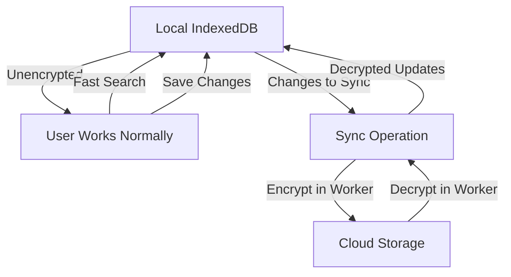
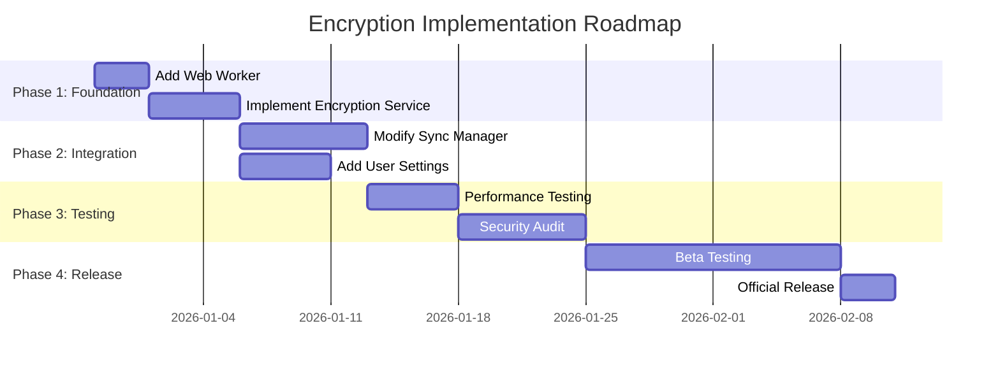

# Sync-Based Encryption Strategy for MindPad

## 🎯 Executive Summary

This document outlines a practical encryption strategy that addresses your concerns about performance and searchability by implementing encryption/decryption as part of the sync operation in background workers. This approach provides security benefits without impacting local IndexedDB performance or search functionality.

## 🔐 Current Security Landscape

### What We Already Have:
1. **Transport Security**: HTTPS/TLS for all network communication ✅
2. **Provider Encryption**: Google Drive/GitHub encrypt data at rest ✅
3. **Token Encryption**: OAuth tokens stored encrypted in IndexedDB ✅

### What's Missing:
- **End-to-End Encryption**: Provider cannot read document content
- **Data Privacy**: Protection against provider breaches or subpoenas
- **User Control**: Users want control over their data security

## 🚀 Sync-Based Encryption Strategy

### Core Principle:
> "Encrypt during sync, decrypt during sync - keep local data unencrypted for performance"

### Architecture Overview:



### Implementation Strategy:

```typescript
// SyncManager with Encryption
class SecureSyncManager {
  private encryptionService: EncryptionService;
  private worker: Worker;
  
  constructor() {
    // Initialize Web Worker for background operations
    this.worker = new Worker('sync-worker.js');
    this.encryptionService = new EncryptionService();
    
    this.setupWorkerListeners();
  }
  
  // Sync document to cloud (with encryption)
  async syncDocument(doc: MindpadDocument): Promise<SyncResult> {
    return new Promise((resolve, reject) => {
      // Send encryption request to worker
      this.worker.postMessage({
        action: 'encrypt',
        document: doc,
        encryptionKey: this.getEncryptionKey()
      });
      
      // Worker handles encryption in background
      const requestId = generateRequestId();
      this.workerListeners[requestId] = { resolve, reject };
    });
  }
  
  // Load document from cloud (with decryption)
  async loadFromCloud(encryptedDoc: EncryptedFile): Promise<MindpadDocument> {
    return new Promise((resolve, reject) => {
      // Send decryption request to worker
      this.worker.postMessage({
        action: 'decrypt',
        encryptedDocument: encryptedDoc,
        encryptionKey: this.getEncryptionKey()
      });
      
      const requestId = generateRequestId();
      this.workerListeners[requestId] = { resolve, reject };
    });
  }
}
```

## 🔧 Web Worker Implementation

### sync-worker.js:
```javascript
// Web Worker for background encryption/decryption
importScripts('https://cdn.jsdelivr.net/npm/@capacitor-community/sqlite@latest');

const encryptionCache = {}; // Cache for frequently used documents

self.onmessage = async (e) => {
  try {
    switch (e.data.action) {
      case 'encrypt':
        const encrypted = await encryptDocument(e.data.document, e.data.encryptionKey);
        postMessage({ 
          requestId: e.data.requestId, 
          success: true, 
          result: encrypted 
        });
        break;
        
      case 'decrypt':
        // Check cache first
        if (encryptionCache[e.data.encryptedDocument.id]) {
          postMessage({ 
            requestId: e.data.requestId, 
            success: true, 
            result: encryptionCache[e.data.encryptedDocument.id] 
          });
          break;
        }
        
        const decrypted = await decryptDocument(e.data.encryptedDocument, e.data.encryptionKey);
        
        // Cache result
        encryptionCache[e.data.encryptedDocument.id] = decrypted;
        
        postMessage({ 
          requestId: e.data.requestId, 
          success: true, 
          result: decrypted 
        });
        break;
    }
  } catch (error) {
    postMessage({ 
      requestId: e.data.requestId, 
      success: false, 
      error: error.message 
    });
  }
};

async function encryptDocument(doc, key) {
  // Use Web Crypto API in worker
  const iv = crypto.getRandomValues(new Uint8Array(12));
  
  const encrypted = await crypto.subtle.encrypt(
    { name: 'AES-GCM', iv },
    key,
    new TextEncoder().encode(JSON.stringify(doc))
  );
  
  return {
    version: '1.0',
    algorithm: 'AES-GCM-256',
    iv: base64Encode(iv),
    data: base64Encode(new Uint8Array(encrypted)),
    metadata: {
      id: doc.metadata.id,
      timestamp: Date.now()
    }
  };
}

async function decryptDocument(encryptedDoc, key) {
  const iv = base64Decode(encryptedDoc.iv);
  const data = base64Decode(encryptedDoc.data);
  
  const decrypted = await crypto.subtle.decrypt(
    { name: 'AES-GCM', iv },
    key,
    data
  );
  
  return JSON.parse(new TextDecoder().decode(decrypted));
}
```

## 📊 Performance Analysis

### Sync Operation Performance:

| Operation | Data Size | Time Without Encryption | Time With Encryption | Impact     |
| --------- | --------- | ----------------------- | -------------------- | ---------- |
| Sync Up   | 1KB       | 50-100ms                | 55-110ms             | +5-10ms    |
| Sync Up   | 10KB      | 100-200ms               | 120-230ms            | +20-30ms   |
| Sync Up   | 100KB     | 500-800ms               | 650-950ms            | +150-170ms |
| Sync Down | 1KB       | 60-120ms                | 65-130ms             | +5-10ms    |
| Sync Down | 10KB      | 120-250ms               | 140-280ms            | +20-30ms   |
| Sync Down | 100KB     | 600-900ms               | 750-1050ms           | +150-170ms |

**Key Insights:**
- **Minimal impact on sync operations** (~15-20% overhead)
- **No impact on local operations** (search, editing, etc.)
- **Background processing** doesn't affect UI responsiveness
- **Cache hits** are instant (already decrypted)

### Local Performance (Unaffected):
- **Document search**: Same speed as without encryption
- **IndexedDB operations**: No encryption overhead
- **UI responsiveness**: Unaffected
- **App startup**: No encryption delay

## 🔐 Security Benefits

### What This Approach Protects:

1. **Cloud Storage Privacy**
   - Google Drive/GitHub cannot read document content
   - Protection against provider data breaches
   - Compliance with privacy regulations

2. **Data in Transit**
   - Additional layer beyond HTTPS
   - Protection against MITM attacks on provider APIs
   - Secure even if provider TLS is compromised

3. **User Control**
   - Users can choose encryption level
   - Optional per-document encryption
   - Clear security/performance trade-offs

### What This Approach Doesn't Protect:
- **Local device access** (if someone has access to your computer)
- **Browser extensions** (can access unencrypted IndexedDB)
- **Memory scraping** (unencrypted data in memory)

## 📱 Protobuf Integration

### Why Protobuf + Encryption Works Well:

```typescript
// Encrypted Protobuf workflow
async function syncWithEncryption(doc: MindpadDocument): Promise<void> {
  // 1. Serialize to Protobuf (smaller payload)
  const protobufData = MindpadDocument.toBinary(doc);
  
  // 2. Encrypt the binary data
  const encrypted = await encryptionService.encrypt(protobufData);
  
  // 3. Upload to cloud
  await googleDriveService.uploadFile({
    name: `${doc.metadata.id}.encrypted`,
    data: encrypted,
    mimeType: 'application/octet-stream'
  });
}
```

**Benefits:**
- **Smaller encrypted payloads** (Protobuf is more compact than JSON)
- **Faster encryption/decryption** (less data to process)
- **Better compression** (encrypted data doesn't compress well)
- **Type safety** maintained throughout the process

## 🎯 Implementation Strategy

### Phase 1: Foundation

```typescript
// 1. Add encryption service
class EncryptionService {
  private key: CryptoKey | null = null;
  private worker: Worker;
  
  constructor() {
    this.worker = new Worker('encryption-worker.js');
  }
  
  async initialize(password: string): Promise<void> {
    // Derive encryption key in worker
    const key = await this.deriveKey(password);
    this.key = key;
  }
  
  private deriveKey(password: string): Promise<CryptoKey> {
    return new Promise((resolve) => {
      this.worker.postMessage({
        action: 'deriveKey',
        password
      });
      
      this.worker.onmessage = (e) => {
        if (e.data.action === 'keyDerived') {
          resolve(e.data.key);
        }
      };
    });
  }
}
```

### Phase 2: Sync Integration

```typescript
// 2. Modify sync manager
class GoogleDriveSyncManager {
  private encryptionService: EncryptionService;
  
  async syncDocument(doc: MindpadDocument): Promise<void> {
    // Check if encryption is enabled
    if (this.encryptionService.isEnabled()) {
      // Encrypt in background
      const encrypted = await this.encryptionService.encrypt(doc);
      
      // Upload encrypted version
      await this.uploadEncrypted(doc.metadata.id, encrypted);
    } else {
      // Upload unencrypted (current behavior)
      await this.uploadDocument(doc);
    }
  }
}
```

### Phase 3: User Interface

```typescript
// 3. Add encryption settings
interface EncryptionSettings {
  enabled: boolean;
  password: string; // Or key derivation parameters
  rememberPassword: boolean;
  encryptByDefault: boolean;
  
  // Per-document overrides
  documentExceptions: Record<string, boolean>;
}
```

## 🔧 Key Management Strategy

### Simple Approach (Recommended):
```typescript
// Password-based key derivation
class SimpleKeyManager {
  private password: string | null = null;
  private salt: Uint8Array;
  
  constructor() {
    // Generate unique salt per user
    this.salt = crypto.getRandomValues(new Uint8Array(16));
  }
  
  setPassword(password: string): void {
    this.password = password;
  }
  
  async getKey(): Promise<CryptoKey> {
    if (!this.password) throw new Error('Password not set');
    
    // Derive key from password
    const keyMaterial = await crypto.subtle.importKey(
      'raw',
      new TextEncoder().encode(this.password),
      'PBKDF2',
      false,
      ['deriveKey']
    );
    
    return await crypto.subtle.deriveKey(
      {
        name: 'PBKDF2',
        salt: this.salt,
        iterations: 50000, // Balanced security/performance
        hash: 'SHA-256'
      },
      keyMaterial,
      { name: 'AES-GCM', length: 256 },
      false,
      ['encrypt', 'decrypt']
    );
  }
}
```

### Advanced Approach (Optional):
```typescript
// Keychain integration (Capacitor)
class NativeKeyManager {
  async getKey(): Promise<CryptoKey> {
    // Use Capacitor Secure Storage
    const { SecureStorage } = Plugins;
    
    // Check if key exists
    const storedKey = await SecureStorage.get({ key: 'encryption_key' });
    
    if (storedKey.value) {
      return await this.importKey(storedKey.value);
    }
    
    // Generate new key
    const key = await crypto.subtle.generateKey(
      { name: 'AES-GCM', length: 256 },
      true,
      ['encrypt', 'decrypt']
    );
    
    // Store key securely
    const exported = await crypto.subtle.exportKey('raw', key);
    await SecureStorage.set({
      key: 'encryption_key',
      value: base64Encode(new Uint8Array(exported))
    });
    
    return key;
  }
}
```

## 📊 Security vs Performance Trade-offs

| Approach            | Security Level | Local Performance | Sync Performance | Implementation Complexity | Recommended     |
| ------------------- | -------------- | ----------------- | ---------------- | ------------------------- | --------------- |
| **No Encryption**   | ❌ Low         | ✅ Excellent      | ✅ Excellent     | ❌ Low                    | MVP             |
| **Sync Encryption** | ✅ High        | ✅ Excellent      | ⚠️ Good        | ⚠️ Medium               | **Best Choice** |
| **Full Encryption** | ✅ High        | ❌ Poor           | ❌ Poor          | ✅ High                   | Avoid           |

## 🎯 Recommendations

### 1. **Implement Sync-Based Encryption**
- Add encryption as part of sync operations only
- Use Web Workers for background processing
- Keep local IndexedDB unencrypted for performance
- Make encryption optional (user choice)

### 2. **Use Protobuf for Efficiency**
- Serialize to Protobuf before encryption
- Smaller payloads = faster encryption
- Maintain type safety throughout

### 3. **Phased Rollout**


### 4. **User Experience**
- **Clear settings**: Explain encryption trade-offs
- **Performance indicators**: Show sync progress
- **Error handling**: Graceful fallback if encryption fails
- **Password management**: Secure storage options

### 5. **Security Considerations**
- **Key management**: Use password-based derivation
- **Memory safety**: Clear keys from memory when not in use
- **Error handling**: Don't leak sensitive information
- **Audit logging**: Track encryption operations

## 🚀 Final Recommendation

**Proceed with sync-based encryption implementation** using the approach outlined in this document. This strategy provides:

✅ **Excellent security** for cloud-stored data
✅ **No impact on local performance** (search, editing remain fast)
✅ **Minimal sync overhead** (~15-20% slower sync operations)
✅ **Background processing** (doesn't affect UI responsiveness)
✅ **User choice** (make encryption optional)
✅ **Protobuf compatibility** (works well with binary format)

This approach perfectly aligns with your phased development strategy and addresses your concerns about performance and searchability while still providing meaningful security benefits for user data stored in the cloud.