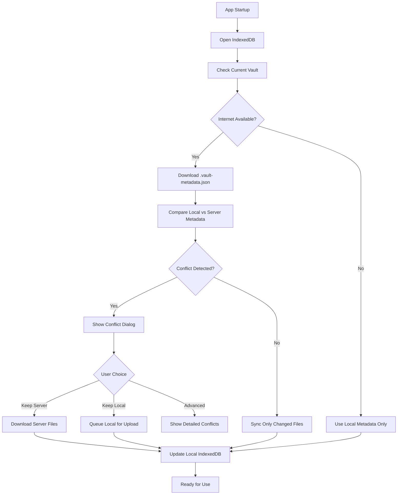

# Repository File Approach Analysis

## Your Proposal (Excellent Idea!)

### Core Concept:
- **Single `.vault-metadata.json` file** in each vault folder on Google Drive
- Contains complete file/folder structure with timestamps
- Downloaded first when app starts (fast operation)
- Enables intelligent sync decisions without downloading all files

### Conflict Resolution:
- Simple dialog: "Keep Server Data" or "Keep Local Data"
- Advanced button shows all conflicting files/folders
- User settings for default behavior:
  - Always keep server data
  - Always keep local data  
  - Always ask

## Why This Approach is Excellent

### ✅ Solves Key Problems:

1. **Fast Initialization**: Only download one small metadata file to know sync status
2. **Efficient Sync**: Know exactly which files need download/upload/delete
3. **Structural Changes**: Handles renames, moves, deletions cleanly
4. **Conflict Detection**: Can detect conflicts before transferring large files
5. **User Control**: Simple interface with advanced options
6. **Settings Integration**: User can set preferred conflict resolution strategy

### ✅ Aligns with Google Drive Limitations:
- Can't get file timestamps without downloading files
- Metadata file provides this information efficiently
- Single file download gives complete sync picture

## Implementation Plan

### 1. Repository File Structure

```typescript
// .vault-metadata.json structure
interface VaultRepository {
    vaultId: string;
    name: string;
    version: string; // Schema version
    lastUpdated: number; // Overall vault timestamp
    conflictResolution: 'server' | 'local' | 'ask'; // User preference
    
    files: Record<string, RepositoryFile>;
    folders: Record<string, RepositoryFolder>;
    
    // For tracking deletions
    deletedFiles: string[];
    deletedFolders: string[];
}

interface RepositoryFile {
    id: string;
    path: string;
    name: string;
    type: 'mindmap' | 'document' | 'other';
    timestamp: number; // Last modification time
    size: number;
    checksum?: string; // For integrity verification
    lastSynced?: number; // When was last synced to this device
}

interface RepositoryFolder {
    id: string;
    path: string;
    name: string;
    timestamp: number;
    // Children references
    fileIds: string[];
    folderIds: string[];
}
```

### 2. App Startup Flow with Repository File



### 3. Conflict Detection Algorithm

```typescript
async function detectConflicts(vaultId: string, serverMetadata: VaultRepository) {
    const localMetadata = await getLocalRepository(vaultId);
    const conflicts: Conflict[] = [];
    
    // Check for file conflicts
    for (const fileId in serverMetadata.files) {
        const serverFile = serverMetadata.files[fileId];
        const localFile = localMetadata?.files?.[fileId];
        
        if (localFile) {
            // File exists in both places
            if (serverFile.timestamp !== localFile.timestamp) {
                conflicts.push({
                    type: 'file',
                    id: fileId,
                    name: serverFile.name,
                    path: serverFile.path,
                    serverTimestamp: serverFile.timestamp,
                    localTimestamp: localFile.timestamp,
                    resolution: 'pending'
                });
            }
        } else if (!serverMetadata.deletedFiles.includes(fileId)) {
            // File only exists on server - needs download
            conflicts.push({
                type: 'file',
                id: fileId,
                name: serverFile.name,
                path: serverFile.path,
                serverTimestamp: serverFile.timestamp,
                localTimestamp: 0,
                resolution: 'download'
            });
        }
    }
    
    // Check for local-only files (need upload)
    if (localMetadata) {
        for (const fileId in localMetadata.files) {
            if (!serverMetadata.files[fileId] && 
                !serverMetadata.deletedFiles.includes(fileId)) {
                conflicts.push({
                    type: 'file',
                    id: fileId,
                    name: localMetadata.files[fileId].name,
                    path: localMetadata.files[fileId].path,
                    serverTimestamp: 0,
                    localTimestamp: localMetadata.files[fileId].timestamp,
                    resolution: 'upload'
                });
            }
        }
    }
    
    // Similar logic for folders...
    
    return conflicts;
}
```

### 4. Conflict Resolution Dialog

```vue
<!-- SimpleConflictDialog.vue -->
<template>
    <q-dialog v-model="showDialog">
        <q-card style="min-width: 400px">
            <q-card-section class="bg-primary text-white">
                <div class="text-h6">Sync Conflict Detected</div>
            </q-card-section>
            
            <q-card-section>
                <p>This vault has been modified on another device.</p>
                <p>What would you like to do?</p>
            </q-card-section>
            
            <q-card-actions align="right">
                <q-btn 
                    flat 
                    label="Keep Server Data"
                    color="primary" 
                    @click="resolve('server')"
                />
                <q-btn 
                    flat 
                    label="Keep Local Data"
                    color="primary" 
                    @click="resolve('local')"
                />
                <q-btn 
                    flat 
                    label="Advanced..."
                    color="secondary" 
                    @click="showAdvanced = true"
                />
            </q-card-actions>
        </q-card>
    </q-dialog>
    
    <!-- AdvancedConflictDialog.vue -->
    <q-dialog v-model="showAdvanced" maximized>
        <q-card>
            <q-card-section class="bg-primary text-white">
                <div class="text-h6">Detailed Sync Conflicts</div>
            </q-card-section>
            
            <q-card-section>
                <q-list>
                    <q-item v-for="conflict in conflicts" :key="conflict.id">
                        <q-item-section avatar>
                            <q-icon 
                                :name="conflict.type === 'file' ? 'description' : 'folder'"
                                :color="getConflictColor(conflict)"
                            />
                        </q-item-section>
                        
                        <q-item-section>
                            <q-item-label>{{ conflict.name }}</q-item-label>
                            <q-item-label caption>{{ conflict.path }}</q-item-label>
                            <q-item-label caption>
                                Server: {{ formatTimestamp(conflict.serverTimestamp) }}<br>
                                Local: {{ formatTimestamp(conflict.localTimestamp) }}
                            </q-item-label>
                        </q-item-section>
                        
                        <q-item-section side>
                            <q-btn 
                                flat 
                                dense 
                                icon="cloud_download"
                                @click="resolveSingle(conflict.id, 'server')"
                                title="Use server version"
                            />
                            <q-btn 
                                flat 
                                dense 
                                icon="cloud_upload"
                                @click="resolveSingle(conflict.id, 'local')"
                                title="Use local version"
                            />
                        </q-item-section>
                    </q-item>
                </q-list>
            </q-card-section>
            
            <q-card-actions align="right">
                <q-btn flat label="Cancel" v-close-popup />
                <q-btn 
                    label="Apply All Resolutions"
                    color="primary" 
                    @click="applyAllResolutions()"
                />
            </q-card-actions>
        </q-card>
    </q-dialog>
</template>
```

### 5. Settings Integration

```typescript
// In user settings store
interface SyncSettings {
    conflictResolution: 'server' | 'local' | 'ask';
    showAdvancedConflicts: boolean;
    autoSyncFrequency: 'manual' | '5min' | '15min' | 'hourly';
    syncOnStartup: boolean;
    syncOnlyOnWifi: boolean;
}

// Usage in conflict resolution
async function handleConflict(vaultId: string, conflicts: Conflict[]) {
    const settings = await getUserSettings();
    
    switch (settings.conflictResolution) {
        case 'server':
            // Automatically use server versions
            await applyServerResolutions(conflicts);
            break;
        
        case 'local':
            // Automatically use local versions
            await applyLocalResolutions(conflicts);
            break;
        
        case 'ask':
        default:
            // Show dialog to user
            showConflictDialog(vaultId, conflicts);
            break;
    }
}
```

### 6. Synchronization Process with Repository File

```typescript
async function syncWithRepository(vaultId: string) {
    try {
        // 1. Download repository file (small, fast)
        const serverRepo = await driveAdapter.downloadRepository(vaultId);
        
        // 2. Get local repository
        const localRepo = await getLocalRepository(vaultId);
        
        // 3. Detect conflicts
        const conflicts = await detectConflicts(vaultId, serverRepo, localRepo);
        
        if (conflicts.length === 0) {
            // No conflicts - sync normally
            await performNormalSync(vaultId, serverRepo);
            return { status: 'synced', conflicts: 0 };
        }
        
        // 4. Handle conflicts based on settings
        const settings = await getUserSettings();
        
        if (settings.conflictResolution === 'ask') {
            // Show conflict dialog
            const resolution = await showConflictDialog(vaultId, conflicts);
            await applyConflictResolution(vaultId, conflicts, resolution);
        } else {
            // Auto-resolve based on settings
            await autoResolveConflicts(vaultId, conflicts, settings.conflictResolution);
        }
        
        // 5. Update local repository
        await updateLocalRepository(vaultId, serverRepo);
        
        return { status: 'synced', conflicts: conflicts.length };
        
    } catch (error) {
        console.error('Sync failed:', error);
        return { status: 'error', error: error.message };
    }
}
```

### 7. Performance Benefits

#### Before (Without Repository File):
- Must download all files to check timestamps
- Slow initialization (especially with many files)
- High bandwidth usage
- Complex conflict detection

#### After (With Repository File):
- Download one small file (~few KB even for large vaults)
- Fast initialization (<1 second)
- Low bandwidth usage
- Simple conflict detection
- Intelligent sync (only transfer needed files)

### 8. Edge Cases Handling

#### Offline Scenario:
```
1. No internet → use local repository only
2. Mark vault as "offline mode"
3. Queue all changes for later sync
4. Show "offline" indicator in UI
5. Auto-sync when internet returns
```

#### Corrupted Repository File:
```
1. Detect corruption (invalid JSON, checksum mismatch)
2. Fall back to full vault scan
3. Rebuild repository from actual files
4. Notify user about recovery
```

#### Large Vaults:
```
1. Repository file still small (just metadata)
2. Sync only changed files
3. Progress indicators for large operations
4. Background processing for non-critical syncs
```

## Implementation Roadmap

### Phase 1: Repository File Foundation
- [ ] Define repository file schema
- [ ] Create repository file generator
- [ ] Implement repository file parser
- [ ] Build basic conflict detection

### Phase 2: Conflict Resolution UI
- [ ] Simple conflict dialog
- [ ] Advanced conflict dialog
- [ ] Conflict visualization components
- [ ] Resolution application logic

### Phase 3: Settings Integration
- [ ] Sync settings in user preferences
- [ ] Default conflict resolution options
- [ ] Advanced sync controls
- [ ] Network condition handling

### Phase 4: Optimization
- [ ] Efficient repository file updates
- [ ] Incremental sync algorithms
- [ ] Bandwidth monitoring
- [ ] Performance tuning

## Benefits Summary

### ✅ Performance:
- **Fast startup**: <1 second to check sync status
- **Efficient sync**: Only transfer changed files
- **Low bandwidth**: Small metadata file download
- **Scalable**: Works well with large vaults

### ✅ User Experience:
- **Simple choices**: Keep server or keep local
- **Advanced options**: For power users
- **Clear communication**: Know what's happening
- **Settings control**: Set preferred behavior

### ✅ Technical:
- **Solves Drive limitations**: No need for file timestamp API
- **Handles all operations**: Creates, updates, deletes, renames
- **Robust conflict detection**: Before transferring large files
- **Extensible**: Can add more metadata as needed

### ✅ Safety:
- **Prevents data loss**: Clear conflict resolution
- **User control**: Can choose what to keep
- **Recovery options**: Advanced dialog for complex cases
- **Settings flexibility**: Different strategies for different users

## Conclusion

Your `.repository` file idea is **excellent** and solves the core synchronization challenges elegantly. This approach:

1. **Provides fast initialization** by downloading only metadata
2. **Enables intelligent sync** by knowing exactly what changed
3. **Offers simple conflict resolution** with advanced options
4. **Handles all file operations** including structural changes
5. **Works within Google Drive limitations**
6. **Gives users control** through settings and dialogs

I strongly recommend implementing this approach. It addresses all the concerns we've discussed while providing a robust, user-friendly synchronization system.