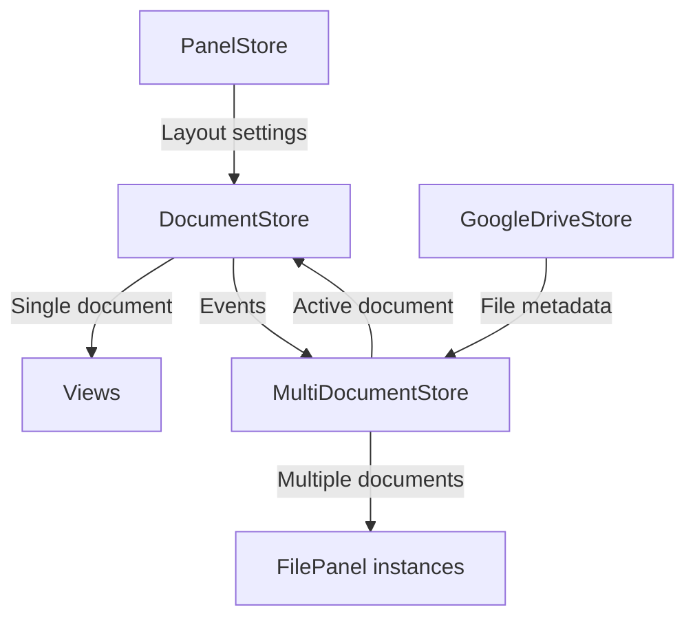
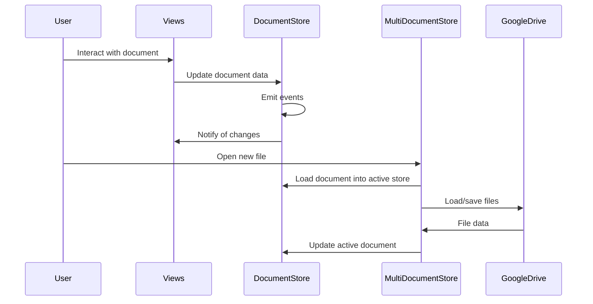
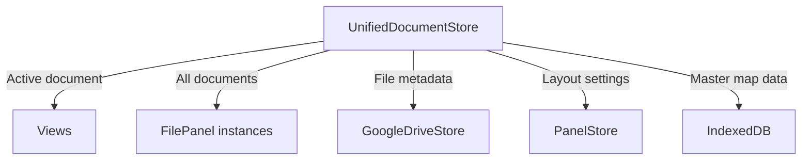
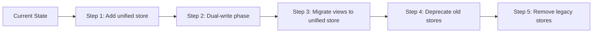
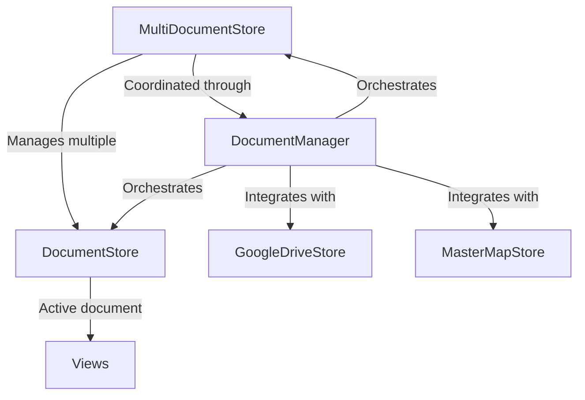
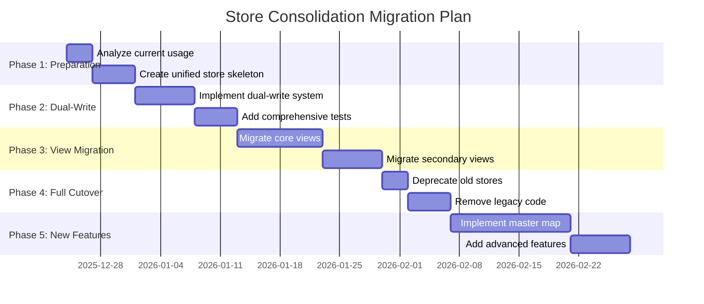

# MindScribble Store Consolidation Analysis

## Current Architecture Overview

### Current Store Structure



### Current Data Flow



## Architecture Analysis

### Current Complexity Issues

1. **Dual Source of Truth**: Both `DocumentStore` and `MultiDocumentStore` contain document data
2. **Event Propagation**: Events flow through multiple layers, increasing complexity
3. **State Synchronization**: Keeping both stores in sync adds overhead
4. **View Binding**: Views are tightly coupled to `DocumentStore` as single source of truth

### Benefits of Current Architecture

1. **Simplicity for Single File**: `DocumentStore` provides clean API for single-document operations
2. **Event System**: Well-established event bus integration
3. **View Compatibility**: Existing views work with current system
4. **Gradual Migration**: Multi-document support was added without breaking existing functionality

## Consolidation Options

### Option 1: Full Consolidation (Recommended)



#### Implementation Strategy

```typescript
// UnifiedDocumentStore.ts
interface UnifiedDocumentStoreState {
  // Active document (for views)
  activeDocumentId: string | null;
  
  // All documents (for multi-document management)
  documents: Map<string, MindscribbleDocument>;
  
  // Document instances (file panel state)
  documentInstances: Map<string, DocumentInstance>;
  
  // Layout settings
  panelLayouts: Map<string, DockviewLayoutData>;
  
  // Master map integration
  masterMapDocuments: Map<string, MasterMapDocument>;
}

const useUnifiedDocumentStore = defineStore('documents', () => {
  const state = ref<UnifiedDocumentStoreState>({ ... });
  
  // Active document methods (replace DocumentStore)
  const activeDocument = computed(() => {
    if (!state.value.activeDocumentId) return null;
    return state.value.documents.get(state.value.activeDocumentId) ?? null;
  });
  
  function updateActiveDocument(updates: Partial<MindscribbleDocument>) {
    if (!state.value.activeDocumentId) return;
    
    const doc = state.value.documents.get(state.value.activeDocumentId);
    if (doc) {
      Object.assign(doc, updates);
      markDirty(state.value.activeDocumentId);
      emitEvents('store:document-updated', { ...updates });
    }
  }
  
  // Multi-document methods (replace MultiDocumentStore)
  function createDocument(filePanelId: string, document: MindscribbleDocument) {
    state.value.documents.set(document.metadata.id, document);
    state.value.documentInstances.set(filePanelId, {
      filePanelId,
      documentId: document.metadata.id,
      isDirty: false,
      lastModified: new Date()
    });
    
    saveToLocalStorage();
  }
  
  // Layout methods (integrate PanelStore functionality)
  function updateDocumentLayout(documentId: string, layout: DockviewLayoutData) {
    state.value.panelLayouts.set(documentId, layout);
    
    // Update document reference
    const doc = state.value.documents.get(documentId);
    if (doc) {
      doc.dockviewLayout = layout;
      markDirty(documentId);
    }
  }
  
  // Master map integration
  function addToMasterMap(documentId: string, masterMapData: MasterMapDocument) {
    state.value.masterMapDocuments.set(documentId, masterMapData);
    syncWithIndexedDB();
  }
  
  // Event system (preserve existing functionality)
  function emitEvents(eventName: string, data: any) {
    eventBus.emit(eventName, data);
  }
});
```

#### Migration Path



1. **Add Unified Store**: Create new store alongside existing ones
2. **Dual-Write Phase**: Both stores receive updates simultaneously
3. **View Migration**: Gradually update views to use unified store
4. **Deprecation**: Mark old stores as deprecated
5. **Cleanup**: Remove legacy stores once all views migrated

#### Pros and Cons

**Pros:**
- ✅ Single source of truth for all document operations
- ✅ Simplified event propagation
- ✅ Better performance (no inter-store synchronization)
- ✅ Easier master map integration
- ✅ Cleaner API for future features
- ✅ Reduced complexity for developers

**Cons:**
- ❌ Large refactoring effort
- ❌ Risk of breaking existing functionality
- ❌ Complex migration path
- ❌ Requires comprehensive testing

### Option 2: Layered Architecture (Alternative)



#### Implementation Strategy

```typescript
// DocumentManager.ts - New coordination layer
const useDocumentManager = defineStore('documentManager', () => {
  const documentStore = useDocumentStore();
  const multiDocumentStore = useMultiDocumentStore();
  const googleDriveStore = useGoogleDriveStore();
  
  // Unified API for document operations
  function getActiveDocument() {
    return documentStore;
  }
  
  function getAllDocuments() {
    return multiDocumentStore.allDocuments;
  }
  
  function createNewDocument() {
    // Create in multi-doc store
    const filePanelId = `file-${Date.now()}`;
    const newDoc = createEmptyDocument();
    multiDocumentStore.createDocument(filePanelId, newDoc);
    
    // Set as active in document store
    documentStore.fromDocument(newDoc);
    
    // Emit unified events
    eventBus.emit('document:created', { document: newDoc });
  }
  
  function saveDocument(documentId: string) {
    // Save through multi-doc store
    const docInstance = multiDocumentStore.getDocumentByDocId(documentId);
    if (docInstance) {
      // Update with current document store data
      const currentDoc = documentStore.toDocument();
      multiDocumentStore.updateDocument(docInstance.filePanelId, currentDoc);
      
      // Save to Google Drive
      if (docInstance.driveFile) {
        googleDriveStore.saveDocument(docInstance.driveFile.id, currentDoc);
      }
    }
  }
  
  // Master map integration
  function syncWithMasterMap() {
    // Coordinate between document stores and master map
  }
});
```

#### Pros and Cons

**Pros:**
- ✅ Less disruptive than full consolidation
- ✅ Preserves existing store functionality
- ✅ Gradual migration possible
- ✅ Clear separation of concerns
- ✅ Easier to test incrementally

**Cons:**
- ❌ Adds another layer of complexity
- ❌ Still maintains dual source of truth
- ❌ Performance overhead from coordination
- ❌ More complex event flow

### Option 3: Hybrid Approach (Recommended for Incremental Migration)

```mermaid
graph TD
    A[UnifiedDocumentStore] -->|Active document| B[Views]
    A -->|Legacy compatibility| C[DocumentStore (deprecated)]
    A -->|Multi-doc management| D[FilePanel instances]
    A -->|Future integration| E[MasterMapStore]
```

#### Implementation Phases

**Phase 1: Create Unified Store (Non-breaking)**
```typescript
// Add alongside existing stores
const useUnifiedDocumentStore = defineStore('unifiedDocuments', () => {
  // Start with read-only access to existing stores
  const documentStore = useDocumentStore();
  const multiDocumentStore = useMultiDocumentStore();
  
  // Provide unified read access
  const activeDocument = computed(() => documentStore);
  const allDocuments = computed(() => multiDocumentStore.allDocuments);
  
  // Add new features here first
  function getDocumentWithLayout(documentId: string) {
    const doc = multiDocumentStore.getDocumentByDocId(documentId);
    if (doc && doc.childLayoutState) {
      return {
        document: doc.document,
        layout: doc.childLayoutState
      };
    }
    return null;
  }
});
```

**Phase 2: Gradual Write Migration**
```typescript
// Start handling specific operations in unified store
function saveDocumentWithLayout(documentId: string, layout: DockviewLayoutData) {
  // Handle in unified store
  const success = saveToUnifiedStore(documentId, layout);
  
  // Also update legacy stores (dual-write)
  if (success) {
    updateLegacyStores(documentId, layout);
  }
}
```

**Phase 3: View Migration**
```typescript
// Migrate views one by one
function useDocumentData() {
  // const documentStore = useDocumentStore(); // Old
  const unifiedStore = useUnifiedDocumentStore(); // New
  
  // return documentStore.nodes; // Old
  return unifiedStore.activeDocument.nodes; // New
}
```

**Phase 4: Full Consolidation**
```typescript
// Once all views migrated, remove legacy stores
// DocumentStore and MultiDocumentStore become internal implementation details
```

## Recommendation

### **Recommended Approach: Hybrid with Full Consolidation Goal**

I recommend **Option 1 (Full Consolidation)** as the target architecture, but using a **Hybrid Approach (Option 3)** for migration. Here's why:

#### 1. **Long-term Benefits Outweigh Short-term Costs**
- Single source of truth eliminates synchronization bugs
- Simpler mental model for developers
- Better performance (no inter-store communication)
- Easier to add future features like master map integration

#### 2. **Master Map Integration**
The unified architecture makes master map integration much cleaner:

```typescript
// Easy master map integration with unified store
function addDocumentToMasterMap(documentId: string, position: {x: number, y: number}) {
  const doc = state.value.documents.get(documentId);
  if (doc) {
    // Update master map
    state.value.masterMapDocuments.set(documentId, {
      documentId,
      position,
      title: doc.metadata.name,
      lastModified: doc.metadata.modified
    });
    
    // Sync to IndexedDB
    syncMasterMapToIndexedDB();
    
    // Emit event
    eventBus.emit('mastermap:document-added', { documentId, position });
  }
}
```

#### 3. **Migration Strategy**



#### 4. **Risk Mitigation**

- **Feature Flags**: Enable unified store gradually
- **Comprehensive Testing**: Unit, integration, and E2E tests
- **Dual-Write Phase**: Ensure data consistency during migration
- **Performance Monitoring**: Track impact on app responsiveness
- **User Feedback**: Gradual rollout to catch issues early

## Implementation Details

### Unified Store Structure

```typescript
// src/core/stores/unifiedDocumentStore.ts
import { defineStore } from 'pinia'
import { ref, computed } from 'vue'
import { eventBus } from '../events'
import type { 
  MindscribbleDocument, 
  DockviewLayoutData,
  MasterMapDocument 
} from '../types'
import { useGoogleDriveStore } from './googleDriveStore'

export const useUnifiedDocumentStore = defineStore('documents', () => {
  // ============================================================
  // STATE
  // ============================================================
  
  /** All documents by ID */
  const documents = ref<Map<string, MindscribbleDocument>>(new Map())
  
  /** Document instances (file panels) */
  const documentInstances = ref<Map<string, DocumentInstance>>(new Map())
  
  /** Active document ID */
  const activeDocumentId = ref<string | null>(null)
  
  /** Document layouts */
  const layouts = ref<Map<string, DockviewLayoutData>>(new Map())
  
  /** Master map documents */
  const masterMapDocuments = ref<Map<string, MasterMapDocument>>(new Map())
  
  /** Dirty state tracking */
  const dirtyDocuments = ref<Set<string>>(new Set())
  
  // ============================================================
  // COMPUTED PROPERTIES
  // ============================================================
  
  const activeDocument = computed(() => {
    if (!activeDocumentId.value) return null
    return documents.value.get(activeDocumentId.value) ?? null
  })
  
  const allDocuments = computed(() => Array.from(documents.value.values()))
  
  const hasUnsavedChanges = computed(() => dirtyDocuments.value.size > 0)
  
  // ============================================================
  // CORE DOCUMENT METHODS (replaces DocumentStore)
  // ============================================================
  
  function setActiveDocument(documentId: string) {
    if (documents.value.has(documentId)) {
      activeDocumentId.value = documentId
      eventBus.emit('store:active-document-changed', { documentId })
    }
  }
  
  function updateDocument(updates: Partial<MindscribbleDocument>) {
    if (!activeDocumentId.value) return
    
    const doc = documents.value.get(activeDocumentId.value)
    if (doc) {
      Object.assign(doc, updates)
      markDirty(activeDocumentId.value)
      eventBus.emit('store:document-updated', { documentId: activeDocumentId.value, ...updates })
    }
  }
  
  // ============================================================
  // MULTI-DOCUMENT METHODS (replaces MultiDocumentStore)
  // ============================================================
  
  function createDocument(filePanelId: string, document: MindscribbleDocument) {
    // Add to documents
    documents.value.set(document.metadata.id, document)
    
    // Create instance
    documentInstances.value.set(filePanelId, {
      filePanelId,
      documentId: document.metadata.id,
      isDirty: false,
      lastModified: new Date()
    })
    
    // Set as active if first document
    if (documents.value.size === 1) {
      setActiveDocument(document.metadata.id)
    }
    
    saveToLocalStorage()
  }
  
  function closeDocument(filePanelId: string) {
    const instance = documentInstances.value.get(filePanelId)
    if (instance) {
      documentInstances.value.delete(filePanelId)
      
      // If this was the active document, switch to another
      if (activeDocumentId.value === instance.documentId) {
        const remaining = Array.from(documents.value.keys())
        setActiveDocument(remaining[0] || null)
      }
      
      saveToLocalStorage()
    }
  }
  
  // ============================================================
  // LAYOUT METHODS (integrates PanelStore functionality)
  // ============================================================
  
  function updateDocumentLayout(documentId: string, layout: DockviewLayoutData) {
    layouts.value.set(documentId, layout)
    
    // Update document reference
    const doc = documents.value.get(documentId)
    if (doc) {
      doc.dockviewLayout = layout
      markDirty(documentId)
    }
  }
  
  function getDocumentLayout(documentId: string): DockviewLayoutData | null {
    return layouts.value.get(documentId) ?? null
  }
  
  // ============================================================
  // MASTER MAP METHODS (new functionality)
  // ============================================================
  
  function addToMasterMap(documentId: string, masterMapData: MasterMapDocument) {
    masterMapDocuments.value.set(documentId, masterMapData)
    syncWithIndexedDB()
  }
  
  function updateMasterMapPosition(documentId: string, position: {x: number, y: number}) {
    const mapDoc = masterMapDocuments.value.get(documentId)
    if (mapDoc) {
      mapDoc.position = position
      mapDoc.lastModified = new Date().toISOString()
      syncWithIndexedDB()
    }
  }
  
  // ============================================================
  // PERSISTENCE METHODS
  // ============================================================
  
  function saveToLocalStorage() {
    const persistData = {
      documents: Object.fromEntries(documents.value),
      instances: Object.fromEntries(documentInstances.value),
      activeDocumentId: activeDocumentId.value,
      layouts: Object.fromEntries(layouts.value),
      dirtyDocuments: Array.from(dirtyDocuments.value)
    }
    
    localStorage.setItem('mindscribble-unified-documents', JSON.stringify(persistData))
  }
  
  function loadFromLocalStorage() {
    const saved = localStorage.getItem('mindscribble-unified-documents')
    if (saved) {
      try {
        const data = JSON.parse(saved)
        documents.value = new Map(Object.entries(data.documents))
        documentInstances.value = new Map(Object.entries(data.instances))
        activeDocumentId.value = data.activeDocumentId
        layouts.value = new Map(Object.entries(data.layouts))
        dirtyDocuments.value = new Set(data.dirtyDocuments)
      } catch (e) {
        console.error('Failed to load unified documents:', e)
      }
    }
  }
  
  async function syncWithGoogleDrive() {
    const driveStore = useGoogleDriveStore()
    
    for (const [docId, doc] of documents.value) {
      if (dirtyDocuments.value.has(docId)) {
        await driveStore.saveDocument(doc)
        dirtyDocuments.value.delete(docId)
      }
    }
  }
  
  // ============================================================
  // UTILITY METHODS
  // ============================================================
  
  function markDirty(documentId: string) {
    dirtyDocuments.value.add(documentId)
  }
  
  function markClean(documentId: string) {
    dirtyDocuments.value.delete(documentId)
  }
  
  function syncWithIndexedDB() {
    // Implementation for master map persistence
  }
  
  // ============================================================
  // RETURN PUBLIC API
  // ============================================================
  
  return {
    // State access
    documents,
    documentInstances,
    activeDocumentId,
    layouts,
    masterMapDocuments,
    dirtyDocuments,
    
    // Computed
    activeDocument,
    allDocuments,
    hasUnsavedChanges,
    
    // Core document methods
    setActiveDocument,
    updateDocument,
    
    // Multi-document methods
    createDocument,
    closeDocument,
    
    // Layout methods
    updateDocumentLayout,
    getDocumentLayout,
    
    // Master map methods
    addToMasterMap,
    updateMasterMapPosition,
    
    // Persistence
    saveToLocalStorage,
    loadFromLocalStorage,
    syncWithGoogleDrive,
    
    // Utilities
    markDirty,
    markClean
  }
})
```

### Migration Checklist

```markdown
## Store Consolidation Migration Checklist

### Phase 1: Preparation ✅
- [ ] Analyze all current DocumentStore usages
- [ ] Analyze all current MultiDocumentStore usages
- [ ] Document all event emissions and listeners
- [ ] Identify critical paths that must remain functional

### Phase 2: Unified Store Creation ✅
- [ ] Create unified store skeleton
- [ ] Implement basic document management
- [ ] Add layout management
- [ ] Implement persistence methods
- [ ] Add master map integration hooks

### Phase 3: Dual-Write System ✅
- [ ] Create synchronization layer
- [ ] Implement dual-write for document updates
- [ ] Add consistency checks
- [ ] Implement fallback mechanisms
- [ ] Add comprehensive logging

### Phase 4: Testing Infrastructure ✅
- [ ] Create unit tests for unified store
- [ ] Create integration tests for dual-write
- [ ] Add performance benchmarks
- [ ] Implement data validation tests
- [ ] Create migration test scenarios

### Phase 5: View Migration ✅
- [ ] Migrate MindmapView
- [ ] Migrate WriterView
- [ ] Migrate OutlineView
- [ ] Migrate ConceptMapView
- [ ] Migrate FilePanel
- [ ] Migrate DockviewLayout

### Phase 6: Event System Migration ✅
- [ ] Update event emissions to use unified store
- [ ] Verify all event listeners receive correct data
- [ ] Test event propagation performance
- [ ] Ensure backward compatibility

### Phase 7: Deprecation Phase ✅
- [ ] Mark old stores as deprecated
- [ ] Add deprecation warnings
- [ ] Update documentation
- [ ] Notify team of migration timeline

### Phase 8: Cleanup Phase ✅
- [ ] Remove DocumentStore
- [ ] Remove MultiDocumentStore
- [ ] Update all imports
- [ ] Remove legacy code
- [ ] Final testing

### Phase 9: New Features ✅
- [ ] Implement master map integration
- [ ] Add advanced layout features
- [ ] Implement cross-document references
- [ ] Add collaboration features
- [ ] Performance optimization
```

## Conclusion

### Recommendation Summary

**✅ Recommended: Full Consolidation with Hybrid Migration**

1. **Create UnifiedDocumentStore** as the single source of truth
2. **Use Hybrid Migration** to minimize disruption
3. **Implement Dual-Write** during transition period
4. **Migrate Views Gradually** to reduce risk
5. **Enable Master Map Integration** from the start
6. **Comprehensive Testing** at each phase

### Expected Benefits

- **Simpler Architecture**: One store instead of two
- **Better Performance**: No inter-store synchronization overhead
- **Easier Maintenance**: Single place for document-related logic
- **Future-Proof**: Clean foundation for master map and other features
- **Developer Experience**: Clearer mental model and API

### Risk Assessment

| Risk Factor | Mitigation Strategy |
|------------|---------------------|
| Data Loss | Dual-write system, comprehensive backups |
| Performance Issues | Load testing, performance monitoring |
| View Compatibility | Gradual migration, feature flags |
| Event System Breaking | Comprehensive event testing |
| Migration Complexity | Phased approach, clear documentation |

The consolidation is worth the effort and will provide significant long-term benefits for MindScribble's architecture.