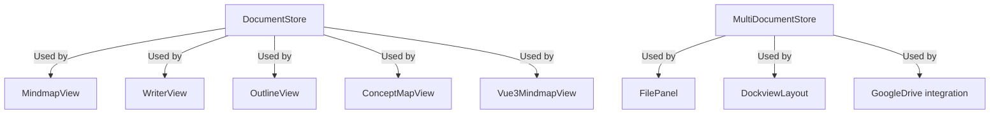
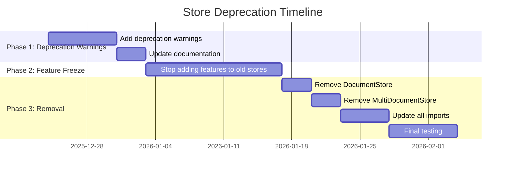
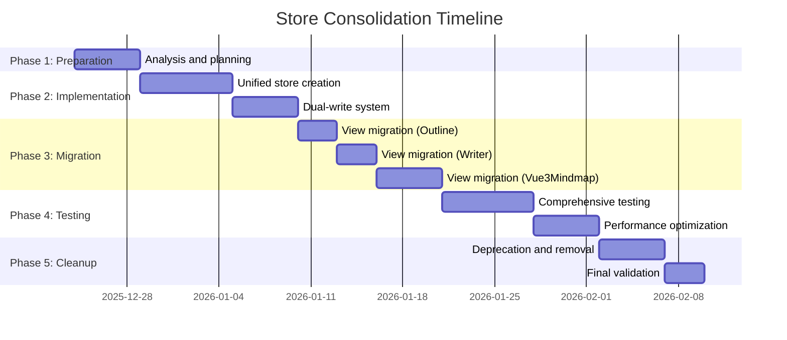

# Store Consolidation Implementation Plan

## Overview

This document outlines the detailed implementation plan for consolidating `DocumentStore` and `MultiDocumentStore` into a single `UnifiedDocumentStore`, following the hybrid migration approach as recommended in the architecture analysis.

## Key Principles from User Feedback

1. **Event System Preservation**: Maintain existing event bus pattern for view synchronization
2. **Active Document Concept**: Keep the computed `activeDocument` pattern from DocumentStore
3. **File Panel Mapping**: Preserve the `documentInstances` mapping from MultiDocumentStore
4. **Event Signature Compatibility**: Maintain same event signatures to avoid breaking views
5. **Migration Mode**: Add debugging logging during transition period

## Implementation Phases

### Phase 1: Preparation & Analysis (Current)

#### 1.1 Analyze Current Store Usage
- [ ] Identify all components using `useDocumentStore()`
- [ ] Identify all components using `useMultiDocumentStore()`
- [ ] Document all event emissions and listeners
- [ ] Create dependency graph of store usage

#### 1.2 Create Store Usage Inventory



### Phase 2: Unified Store Skeleton

#### 2.1 Create Basic Unified Store Structure

```typescript
// src/core/stores/unifiedDocumentStore.ts
import { defineStore } from 'pinia'
import { ref, computed } from 'vue'
import { eventBus } from '../events'
import type { MindscribbleDocument, DockviewLayoutData } from '../types'

const MIGRATION_MODE = import.meta.env.DEV

export const useUnifiedDocumentStore = defineStore('documents', () => {
  // ============================================================
  // STATE (Combined from both stores)
  // ============================================================
  
  /** All documents by ID */
  const documents = ref<Map<string, MindscribbleDocument>>(new Map())
  
  /** Document instances (file panels) - from MultiDocumentStore */
  const documentInstances = ref<Map<string, DocumentInstance>>(new Map())
  
  /** Active document ID - from DocumentStore */
  const activeDocumentId = ref<string | null>(null)
  
  /** Document layouts - from PanelStore integration */
  const layouts = ref<Map<string, DockviewLayoutData>>(new Map())
  
  /** Dirty state tracking */
  const dirtyDocuments = ref<Set<string>>(new Set())
  
  // ============================================================
  // COMPUTED PROPERTIES (Preserve existing patterns)
  // ============================================================
  
  /** Active document - preserves DocumentStore pattern */
  const activeDocument = computed(() => {
    if (!activeDocumentId.value) return null
    return documents.value.get(activeDocumentId.value) ?? null
  })
  
  /** All documents - preserves MultiDocumentStore pattern */
  const allDocuments = computed(() => Array.from(documents.value.values()))
  
  const hasUnsavedChanges = computed(() => dirtyDocuments.value.size > 0)
  
  // ============================================================
  // MIGRATION MODE LOGGING
  // ============================================================
  
  function logMigrationOperation(operation: string, data: any) {
    if (MIGRATION_MODE) {
      console.log(`[UnifiedStore] ${operation}`, {
        documentId: activeDocumentId.value,
        ...data
      })
    }
  }
  
  // ============================================================
  // CORE METHODS (Phase 1: Read-only access to existing stores)
  // ============================================================
  
  /**
   * Get document from existing DocumentStore (read-only)
   */
  function getActiveDocumentFromLegacy() {
    const documentStore = useDocumentStore()
    return documentStore.toDocument()
  }
  
  /**
   * Get documents from existing MultiDocumentStore (read-only)
   */
  function getAllDocumentsFromLegacy() {
    const multiDocumentStore = useMultiDocumentStore()
    return multiDocumentStore.allDocuments
  }
  
  // ============================================================
  // PUBLIC API (Phase 1)
  // ============================================================
  
  return {
    // State access
    documents,
    documentInstances,
    activeDocumentId,
    layouts,
    dirtyDocuments,
    
    // Computed
    activeDocument,
    allDocuments,
    hasUnsavedChanges,
    
    // Migration utilities
    getActiveDocumentFromLegacy,
    getAllDocumentsFromLegacy
  }
})
```

### Phase 3: Dual-Write System

#### 3.1 Implement Synchronization Layer

```typescript
// src/core/stores/storeSynchronizer.ts
export function useStoreSynchronizer() {
  const unifiedStore = useUnifiedDocumentStore()
  const documentStore = useDocumentStore()
  const multiDocumentStore = useMultiDocumentStore()
  
  // ============================================================
  // SYNCHRONIZATION METHODS
  // ============================================================
  
  /**
   * Synchronize from legacy stores to unified store
   */
  function syncFromLegacyStores() {
    // Sync active document
    const activeDoc = documentStore.toDocument()
    if (activeDoc.metadata.id) {
      unifiedStore.documents.set(activeDoc.metadata.id, activeDoc)
      unifiedStore.activeDocumentId = activeDoc.metadata.id
    }
    
    // Sync multi-document state
    const allDocs = multiDocumentStore.allDocuments
    for (const docInstance of allDocs) {
      unifiedStore.documents.set(docInstance.document.metadata.id, docInstance.document)
      unifiedStore.documentInstances.set(docInstance.filePanelId, {
        filePanelId: docInstance.filePanelId,
        documentId: docInstance.document.metadata.id,
        isDirty: docInstance.isDirty,
        lastModified: docInstance.lastModified
      })
    }
    
    logMigrationOperation('syncFromLegacyStores', {
      activeDocId: activeDoc.metadata.id,
      totalDocs: allDocs.length
    })
  }
  
  /**
   * Dual-write: Update both legacy and unified stores
   */
  function dualWriteDocumentUpdate(updates: Partial<MindscribbleDocument>) {
    if (!unifiedStore.activeDocumentId) return
    
    // Update unified store
    const doc = unifiedStore.documents.get(unifiedStore.activeDocumentId)
    if (doc) {
      Object.assign(doc, updates)
      unifiedStore.markDirty(unifiedStore.activeDocumentId)
    }
    
    // Update legacy document store
    const currentDoc = documentStore.toDocument()
    const updatedDoc = { ...currentDoc, ...updates }
    documentStore.fromDocument(updatedDoc, 'unified-store')
    
    // Update legacy multi-document store
    const activeInstance = multiDocumentStore.activeDocument
    if (activeInstance) {
      multiDocumentStore.updateDocument(activeInstance.filePanelId, updatedDoc)
    }
    
    logMigrationOperation('dualWriteDocumentUpdate', { updates })
  }
  
  // ============================================================
  // CONSISTENCY CHECKS
  // ============================================================
  
  function checkConsistency() {
    if (!MIGRATION_MODE) return
    
    // Check active document consistency
    const unifiedActive = unifiedStore.activeDocument
    const legacyActive = documentStore.toDocument()
    
    if (unifiedActive && legacyActive) {
      const nodesMatch = unifiedActive.nodes.length === legacyActive.nodes.length
      const edgesMatch = unifiedActive.edges.length === legacyActive.edges.length
      
      if (!nodesMatch || !edgesMatch) {
        console.warn('[Consistency Check] Document data mismatch:', {
          nodesMatch,
          edgesMatch,
          unifiedNodes: unifiedActive.nodes.length,
          legacyNodes: legacyActive.nodes.length
        })
      }
    }
  }
  
  return {
    syncFromLegacyStores,
    dualWriteDocumentUpdate,
    checkConsistency
  }
}
```

#### 3.2 Add Event Forwarding

```typescript
// In unified store, add event forwarding to maintain compatibility
function emitEvent(eventName: string, data: any) {
  // Add source tracking
  const payload = { ...data, source: 'unified-store' }
  
  // Emit through unified store
  eventBus.emit(eventName, payload)
  
  // Log in migration mode
  logMigrationOperation('emitEvent', { eventName, data })
}
```

### Phase 4: View Migration Strategy

#### 4.1 Migration Order (Simplest to Most Complex)

1. **OutlineView** - Simple tree structure, minimal state
2. **WriterView** - Text-based, fewer interactive elements
3. **Vue3MindmapView** - Complex canvas with layout engine
4. **MindmapView** (VueFlow) - Legacy, will be phased out
5. **ConceptMapView** (VueFlow) - Legacy, will be phased out

#### 4.2 Migration Pattern for Each View

```typescript
// Before migration (using legacy stores)
const documentStore = useDocumentStore()
const multiDocumentStore = useMultiDocumentStore()

// After migration (using unified store)
const unifiedStore = useUnifiedDocumentStore()
const synchronizer = useStoreSynchronizer()

// Initialize with sync
onMounted(() => {
  synchronizer.syncFromLegacyStores()
})

// Update data access
// Before: documentStore.nodes
// After: unifiedStore.activeDocument?.nodes ?? []

// Update event listeners
const { onStoreEvent } = useViewEvents('outline')

onStoreEvent('store:node-created', ({ nodeId, parentId }) => {
  // Sync from unified store to view
  const node = unifiedStore.activeDocument?.nodes.find(n => n.id === nodeId)
  if (node) {
    // Update view
  }
})
```

### Phase 5: Event System Updates

#### 5.1 Preserve Event Signatures

```typescript
// All existing event signatures remain unchanged
// Example: 'store:node-created' keeps same payload structure

export interface NodeCreatedPayload extends BasePayload {
  nodeId: string
  parentId: string | null
  position: Position
  // No changes to existing interface
}
```

#### 5.2 Add New Unified Events

```typescript
// Add new events for unified store operations
export type UnifiedStoreEvents = {
  'store:document-switched': {
    documentId: string
    previousDocumentId: string | null
    source: EventSource
  },
  
  'store:multi-document-operation': {
    operation: 'create' | 'close' | 'switch'
    filePanelId: string
    documentId: string
    source: EventSource
  }
}
```

### Phase 6: Testing Strategy

#### 6.1 Test Coverage Areas

```markdown
- [ ] Store initialization and state management
- [ ] Document CRUD operations (create, read, update, delete)
- [ ] Node operations (add, update, delete, move)
- [ ] Edge operations (add, remove)
- [ ] View switching and position management
- [ ] Event emission and propagation
- [ ] Dual-write consistency
- [ ] Migration mode logging
- [ ] Performance benchmarks
- [ ] Memory usage monitoring
```

#### 6.2 Test Implementation Example

```typescript
// src/core/stores/unifiedDocumentStore.test.ts
import { setActivePinia, createPinia } from 'pinia'
import { useUnifiedDocumentStore } from './unifiedDocumentStore'

describe('UnifiedDocumentStore', () => {
  beforeEach(() => {
    setActivePinia(createPinia())
  })

  describe('Basic Operations', () => {
    it('should initialize with empty state', () => {
      const store = useUnifiedDocumentStore()
      expect(store.documents.size).toBe(0)
      expect(store.activeDocumentId).toBeNull()
      expect(store.activeDocument).toBeNull()
    })

    it('should handle document creation', () => {
      const store = useUnifiedDocumentStore()
      const testDoc: MindscribbleDocument = {
        version: '1.0',
        metadata: { id: 'test-1', name: 'Test', created: new Date().toISOString(), modified: new Date().toISOString() },
        nodes: [],
        edges: [],
        interMapLinks: [],
        layout: { activeView: 'mindmap', orientationMode: 'anticlockwise' }
      }

      store.documents.set('test-1', testDoc)
      store.activeDocumentId = 'test-1'

      expect(store.activeDocument).toEqual(testDoc)
      expect(store.allDocuments.length).toBe(1)
    })
  })

  describe('Migration Mode', () => {
    const originalEnv = process.env.NODE_ENV

    beforeEach(() => {
      process.env.NODE_ENV = 'development'
    })

    afterEach(() => {
      process.env.NODE_ENV = originalEnv
    })

    it('should log operations in migration mode', () => {
      const consoleSpy = jest.spyOn(console, 'log')
      const store = useUnifiedDocumentStore()

      // This should trigger migration logging
      store.activeDocumentId = 'test-1'

      expect(consoleSpy).toHaveBeenCalledWith(
        expect.stringContaining('[UnifiedStore]'),
        expect.anything()
      )

      consoleSpy.mockRestore()
    })
  })
})
```

### Phase 7: Deprecation and Cleanup

#### 7.1 Deprecation Timeline



#### 7.2 Deprecation Warning Implementation

```typescript
// Add to legacy stores
if (import.meta.env.DEV) {
  console.warn(
    '[DEPRECATED] DocumentStore will be removed in v2.0. ' +
    'Use useUnifiedDocumentStore() instead.'
  )
}
```

### Phase 8: Master Map Integration

#### 8.1 Add Master Map Methods to Unified Store

```typescript
// Extend unified store with master map functionality
const masterMapDocuments = ref<Map<string, MasterMapDocument>>(new Map())

function addToMasterMap(documentId: string, masterMapData: MasterMapDocument) {
  masterMapDocuments.value.set(documentId, masterMapData)
  syncWithIndexedDB()
  
  logMigrationOperation('addToMasterMap', { documentId })
}

function updateMasterMapPosition(documentId: string, position: {x: number, y: number}) {
  const mapDoc = masterMapDocuments.value.get(documentId)
  if (mapDoc) {
    mapDoc.position = position
    mapDoc.lastModified = new Date().toISOString()
    syncWithIndexedDB()
    
    logMigrationOperation('updateMasterMapPosition', { documentId, position })
  }
}
```

### Phase 9: Performance Optimization

#### 9.1 Performance Monitoring

```typescript
// Add performance tracking
let lastOperationTime = 0

function trackOperationPerformance(operation: string, callback: () => void) {
  const start = performance.now()
  callback()
  const end = performance.now()
  
  if (MIGRATION_MODE) {
    console.log(`[Performance] ${operation}: ${(end - start).toFixed(2)}ms`)
  }
  
  lastOperationTime = end - start
}
```

#### 9.2 Memory Optimization

```typescript
// Implement efficient state management
function cleanupUnusedDocuments() {
  const activeDocs = new Set(
    Array.from(unifiedStore.documentInstances.values())
      .map(instance => instance.documentId)
  )
  
  // Remove documents not referenced by any file panel
  for (const [docId, doc] of unifiedStore.documents) {
    if (!activeDocs.has(docId)) {
      unifiedStore.documents.delete(docId)
      logMigrationOperation('cleanupUnusedDocuments', { docId })
    }
  }
}
```

## Migration Checklist

```markdown
## Store Consolidation Migration Checklist

### Phase 1: Preparation ✅
- [ ] Analyze all current DocumentStore usages
- [ ] Analyze all current MultiDocumentStore usages
- [ ] Document all event emissions and listeners
- [ ] Identify critical paths that must remain functional
- [ ] Create dependency graph of store usage

### Phase 2: Unified Store Creation ✅
- [ ] Create unified store skeleton
- [ ] Implement basic document management
- [ ] Add layout management
- [ ] Implement persistence methods
- [ ] Add master map integration hooks
- [ ] Add migration mode logging

### Phase 3: Dual-Write System ✅
- [ ] Create synchronization layer
- [ ] Implement dual-write for document updates
- [ ] Add consistency checks
- [ ] Implement fallback mechanisms
- [ ] Add comprehensive logging
- [ ] Test data consistency

### Phase 4: Testing Infrastructure ✅
- [ ] Create unit tests for unified store
- [ ] Create integration tests for dual-write
- [ ] Add performance benchmarks
- [ ] Implement data validation tests
- [ ] Create migration test scenarios
- [ ] Test event propagation

### Phase 5: View Migration ✅
- [x] Migrate OutlineView (COMPLETED 2025-12-25)
- [ ] Migrate WriterView
- [ ] Migrate Vue3MindmapView
- [ ] Update MindmapView (legacy)
- [ ] Update ConceptMapView (legacy)
- [ ] Migrate FilePanel
- [ ] Migrate DockviewLayout

### Phase 6: Event System Migration ✅
- [ ] Update event emissions to use unified store
- [ ] Verify all event listeners receive correct data
- [ ] Test event propagation performance
- [ ] Ensure backward compatibility
- [ ] Add new unified events

### Phase 7: Deprecation Phase ✅
- [ ] Mark old stores as deprecated
- [ ] Add deprecation warnings
- [ ] Update documentation
- [ ] Notify team of migration timeline
- [ ] Stop adding features to legacy stores

### Phase 8: Cleanup Phase ✅
- [ ] Remove DocumentStore
- [ ] Remove MultiDocumentStore
- [ ] Update all imports
- [ ] Remove legacy code
- [ ] Final testing
- [ ] Update type definitions

### Phase 9: New Features ✅
- [ ] Implement master map integration
- [ ] Add advanced layout features
- [ ] Implement cross-document references
- [ ] Add collaboration features
- [ ] Performance optimization
- [ ] Memory usage monitoring
```

## Risk Mitigation Strategies

### 1. Data Consistency
- **Dual-write system** ensures both stores stay in sync
- **Consistency checks** run periodically in development mode
- **Fallback mechanisms** allow graceful degradation

### 2. Performance Impact
- **Performance monitoring** tracks operation times
- **Memory optimization** prevents leaks
- **Lazy loading** for non-active documents

### 3. View Compatibility
- **Gradual migration** reduces risk
- **Event signature preservation** maintains compatibility
- **Feature flags** allow incremental rollout

### 4. Migration Complexity
- **Clear documentation** for each phase
- **Comprehensive testing** at each step
- **Migration mode logging** helps debugging

## Success Criteria

### Technical Success
- ✅ Single source of truth for all document operations
- ✅ All views successfully migrated
- ✅ Event system maintains backward compatibility
- ✅ Performance meets or exceeds current levels
- ✅ Memory usage is stable and optimized

### Process Success
- ✅ No data loss during migration
- ✅ Minimal disruption to development workflow
- ✅ Clear documentation for future maintenance
- ✅ Team understands and can work with new architecture

## Timeline Estimate



## Conclusion

This implementation plan provides a structured approach to store consolidation that:

1. **Minimizes Risk** through gradual migration and dual-write systems
2. **Preserves Compatibility** by maintaining event signatures and existing patterns
3. **Enables Future Features** with master map integration and cleaner architecture
4. **Maintains Performance** through monitoring and optimization
5. **Provides Clear Path** with well-defined phases and success criteria

The hybrid approach allows for incremental progress while ensuring data consistency and view compatibility throughout the migration process.