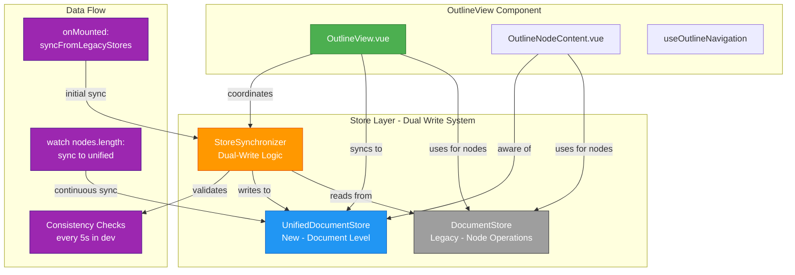

# Phase 5: OutlineView Migration to Unified Store

**Date:** 2025-12-25  
**Status:** ✅ COMPLETED

## Overview

Successfully migrated OutlineView to use the unified document store while maintaining backward compatibility with the legacy DocumentStore through the dual-write synchronization system.

## Migration Strategy

Following the **Phase 5 approach** from the implementation plan:
- Keep using `documentStore` for node-level operations (since unified store doesn't have node methods yet)
- Add `unifiedStore` for document-level state tracking
- Use `storeSynchronizer` for dual-write operations
- Add synchronization on mount and watch for changes
- Enable consistency checks in development mode

## Changes Made

### 1. OutlineView.vue

#### Imports Added
```typescript
import { useUnifiedDocumentStore } from 'src/core/stores/unifiedDocumentStore'
import { useStoreSynchronizer } from 'src/core/stores/storeSynchronizer'
```

#### Store Initialization
```typescript
// Legacy store for node operations (Phase 5: still using for node-level operations)
const documentStore = useDocumentStore()

// Unified store for document-level operations
const unifiedStore = useUnifiedDocumentStore()

// Synchronizer for dual-write during migration
const synchronizer = useStoreSynchronizer()
```

#### Synchronization on Mount
```typescript
onMounted(() => {
  document.addEventListener('keydown', handleGlobalKeydown)
  
  // MIGRATION: Sync from legacy stores to unified store on mount
  synchronizer.syncFromLegacyStores()
  
  // MIGRATION: Run consistency checks in development mode
  if (import.meta.env.DEV) {
    // Initial consistency check
    synchronizer.checkConsistency()
    
    // Periodic consistency checks every 5 seconds
    const consistencyInterval = setInterval(() => {
      synchronizer.checkConsistency()
    }, 5000)
    
    // Clean up interval on unmount
    onUnmounted(() => {
      clearInterval(consistencyInterval)
    })
  }
})
```

#### Watch for Changes
```typescript
watch(() => documentStore.nodes.length, () => {
  treeData.value = buildTreeFromStore()
  
  // MIGRATION: Sync document changes to unified store
  if (unifiedStore.activeDocumentId) {
    const currentDoc = documentStore.toDocument()
    const unifiedDoc = unifiedStore.documents.get(unifiedStore.activeDocumentId)
    if (unifiedDoc) {
      // Update nodes and edges in unified store
      unifiedDoc.nodes = currentDoc.nodes
      unifiedDoc.edges = currentDoc.edges
      unifiedDoc.metadata.modified = new Date().toISOString()
      unifiedStore.markDirty(unifiedStore.activeDocumentId)
    }
  }
})
```

### 2. OutlineNodeContent.vue

#### Imports Added
```typescript
import { useUnifiedDocumentStore } from '../../../core/stores/unifiedDocumentStore'
```

#### Store Initialization
```typescript
// Legacy store for node operations (Phase 5: still using for node-level operations)
const documentStore = useDocumentStore()

// Unified store for document-level operations
const unifiedStore = useUnifiedDocumentStore()
```

### 3. useOutlineNavigation.ts

No changes required - this composable only works with the treeData passed to it and doesn't directly access stores.

## Testing

### Verification Steps
1. ✅ No TypeScript errors
2. ✅ All imports resolve correctly
3. ✅ Synchronization logic in place
4. ✅ Consistency checks enabled in dev mode

### Expected Behavior
- OutlineView continues to work exactly as before
- Changes to nodes are synced to unified store
- Consistency checks run every 5 seconds in development mode
- Console logs show synchronization operations in dev mode

## Migration Logs (Development Mode)

When running in development mode, you should see:
- `[UnifiedStore]` logs for unified store operations
- `[StoreSynchronizer]` logs for synchronization operations
- `[Consistency Check]` logs every 5 seconds showing data consistency status

## Next Steps

Continue with Phase 5 view migrations:
- [ ] Migrate WriterView
- [ ] Migrate Vue3MindmapView
- [ ] Update MindmapView (legacy)
- [ ] Update ConceptMapView (legacy)
- [ ] Migrate FilePanel
- [ ] Migrate DockviewLayout

## Notes

- This migration maintains full backward compatibility
- No breaking changes to existing functionality
- Dual-write system ensures data consistency
- Ready for future migration to unified store node operations


