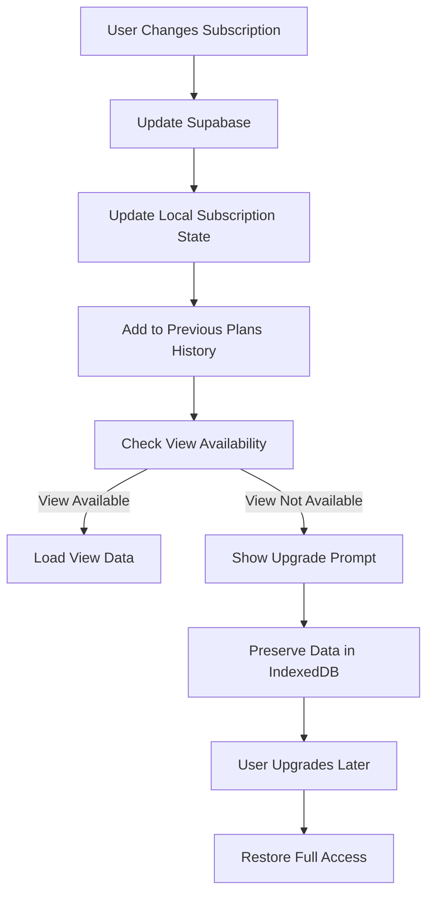

# Subscription-Aware Data Handling Strategy

## 🎯 Core Principle: "User Owns Data"

**Fundamental Rule:** All user data is preserved regardless of subscription level. When a user downgrades, view-specific data becomes inaccessible but is NOT deleted. When they upgrade again, all their data is immediately available.

## 🏗️ Subscription Integration Architecture

### 1. Subscription Level Definitions

```typescript
interface SubscriptionPlan {
  id: string;
  name: string;
  level: number;  // 1 = basic, 2 = pro, 3 = enterprise
  enabledViews: string[];  // Views available at this level
  maxMaps?: number;
  maxNodesPerMap?: number;
  aiFeatures?: boolean;
  collaboration?: boolean;
}

const SUBSCRIPTION_PLANS: Record<string, SubscriptionPlan> = {
  'free': {
    id: 'free',
    name: 'Free',
    level: 1,
    enabledViews: ['mindmap', 'writer', 'outline'],
    maxMaps: 50,
    maxNodesPerMap: 1000
  },
  'pro': {
    id: 'pro',
    name: 'Pro',
    level: 2,
    enabledViews: ['mindmap', 'writer', 'outline', 'conceptmap'],
    maxMaps: 500,
    maxNodesPerMap: 5000,
    aiFeatures: true
  },
  'enterprise': {
    id: 'enterprise',
    name: 'Enterprise',
    level: 3,
    enabledViews: ['mindmap', 'writer', 'outline', 'conceptmap', 'timeline', 'kanban', 'gantt'],
    maxMaps: 10000,
    maxNodesPerMap: 10000,
    aiFeatures: true,
    collaboration: true
  }
};
```

### 2. User Subscription State

```typescript
interface UserSubscription {
  userId: string;
  currentPlan: string;  // 'free', 'pro', 'enterprise'
  planLevel: number;
  expires: number;  // Timestamp when subscription expires
  status: 'active' | 'expired' | 'canceled' | 'trial';
  trialEnds?: number;
  
  // Historical plans for data preservation
  previousPlans: Array<{
    planId: string;
    planLevel: number;
    startDate: number;
    endDate: number;
  }>;
}
```

### 3. View Availability Manager

```typescript
class ViewAvailabilityManager {
  private subscriptionService: SubscriptionService;
  private viewManager: ViewManager;

  constructor(subscriptionService: SubscriptionService, viewManager: ViewManager) {
    this.subscriptionService = subscriptionService;
    this.viewManager = viewManager;
  }

  /**
   * Check if a view is available for current user
   */
  async isViewAvailable(viewType: string): Promise<boolean> {
    const subscription = await this.subscriptionService.getCurrentSubscription();
    const plan = SUBSCRIPTION_PLANS[subscription.currentPlan];
    
    if (!plan) return false;
    
    return plan.enabledViews.includes(viewType);
  }

  /**
   * Get all available views for current user
   */
  async getAvailableViews(): Promise<string[]> {
    const subscription = await this.subscriptionService.getCurrentSubscription();
    const plan = SUBSCRIPTION_PLANS[subscription.currentPlan];
    
    return plan?.enabledViews || ['mindmap', 'writer', 'outline']; // Fallback to free features
  }

  /**
   * Check if user has ever had access to a view (for data preservation)
   */
  async hasUserEverHadViewAccess(viewType: string): Promise<boolean> {
    const subscription = await this.subscriptionService.getCurrentSubscription();
    
    // Check current plan
    const currentPlan = SUBSCRIPTION_PLANS[subscription.currentPlan];
    if (currentPlan?.enabledViews.includes(viewType)) {
      return true;
    }

    // Check previous plans
    for (const previousPlan of subscription.previousPlans) {
      const plan = SUBSCRIPTION_PLANS[previousPlan.planId];
      if (plan?.enabledViews.includes(viewType)) {
        return true;
      }
    }

    return false;
  }

  /**
   * Get subscription requirements for a view
   */
  getViewRequirements(viewType: string): { minLevel: number; requiredPlan?: string } {
    // Find which plans include this view
    const plansWithView = Object.values(SUBSCRIPTION_PLANS)
      .filter(plan => plan.enabledViews.includes(viewType))
      .sort((a, b) => a.level - b.level);

    if (plansWithView.length === 0) {
      return { minLevel: 999, requiredPlan: 'none' }; // View doesn't exist
    }

    return { 
      minLevel: plansWithView[0].level,
      requiredPlan: plansWithView[0].id
    };
  }
}
```

## 🔒 Data Access Control Strategy

### 1. View Data Access Patterns

```typescript
class SubscriptionAwareNodeAccess {
  constructor(
    private nodeCache: NodeCache,
    private viewAvailability: ViewAvailabilityManager
  ) {}

  /**
   * Get view data with subscription check
   */
  async getViewData(nodeId: string, viewType: string): Promise<{ 
    data: any; 
    isAvailable: boolean; 
    isAccessible: boolean; 
    upgradeRequired?: { minLevel: number; requiredPlan: string } 
  }> {
    const node = await this.nodeCache.getNode(nodeId);
    const isViewAvailable = await this.viewAvailability.isViewAvailable(viewType);
    const hasEverHadAccess = await this.viewAvailability.hasUserEverHadViewAccess(viewType);

    // Get the raw view data (always preserved)
    const rawData = this.nodeCache.getViewData(nodeId, viewType);

    // Check if user can access this view
    const isAccessible = isViewAvailable;

    // Get upgrade requirements if not accessible
    let upgradeRequired = undefined;
    if (!isAccessible) {
      upgradeRequired = this.viewAvailability.getViewRequirements(viewType);
    }

    return {
      data: rawData,
      isAvailable,
      isAccessible,
      upgradeRequired
    };
  }

  /**
   * Update view data with subscription validation
   */
  async updateViewData(nodeId: string, viewType: string, updates: any): Promise<{ 
    success: boolean; 
    error?: string; 
    upgradeRequired?: { minLevel: number; requiredPlan: string } 
  }> {
    const isViewAvailable = await this.viewAvailability.isViewAvailable(viewType);

    if (!isViewAvailable) {
      const requirements = this.viewAvailability.getViewRequirements(viewType);
      return {
        success: false,
        error: 'VIEW_NOT_AVAILABLE',
        upgradeRequired: requirements
      };
    }

    // Update is allowed - proceed
    await this.nodeCache.updateViewData(nodeId, viewType, updates);

    return { success: true };
  }

  /**
   * Get node with all accessible view data
   */
  async getNodeWithAccessibleViews(nodeId: string): Promise<{ 
    node: BaseNode; 
    accessibleViews: Record<string, any>; 
    inaccessibleViews: string[]; 
    upgradeSuggestions: Record<string, { minLevel: number; requiredPlan: string }> 
  }> {
    const node = await this.nodeCache.getNode(nodeId);
    const availableViews = await this.viewAvailability.getAvailableViews();

    const accessibleViews: Record<string, any> = {};
    const inaccessibleViews: string[] = [];
    const upgradeSuggestions: Record<string, { minLevel: number; requiredPlan: string }> = {};

    // Check each view in the node's viewData
    for (const [viewType, viewData] of Object.entries(node.viewData || {})) {
      if (availableViews.includes(viewType)) {
        accessibleViews[viewType] = viewData.data;
      } else {
        inaccessibleViews.push(viewType);
        upgradeSuggestions[viewType] = this.viewAvailability.getViewRequirements(viewType);
      }
    }

    return {
      node,
      accessibleViews,
      inaccessibleViews,
      upgradeSuggestions
    };
  }
}
```

## 📊 UI Integration Patterns

### 1. View Access Components

```vue
<!-- ViewAccessWrapper.vue -->
<template>
  <div>
    <!-- Show view if accessible -->
    <template v-if="isAccessible">
      <slot :viewData="viewData"></slot>
    </template>

    <!-- Show upgrade prompt if view exists but not accessible -->
    <template v-else-if="hasViewData && !isAccessible">
      <q-banner class="bg-warning text-dark">
        <template v-slot:avatar>
          <q-icon name="lock" />
        </template>
        <div class="text-h6">{{ viewName }} View Locked</div>
        <div class="text-body2">
          You have {{ viewName }} data that requires {{ requiredPlan }} subscription to access.
        </div>
        <template v-slot:action>
          <q-btn 
            flat 
            label="Upgrade Now" 
            @click="$emit('upgrade-requested', requiredPlan)" 
          />
        </template>
      </q-banner>
    </template>

    <!-- Show feature discovery if view doesn't exist and not accessible -->
    <template v-else>
      <q-banner class="bg-info text-dark">
        <template v-slot:avatar>
          <q-icon name="star" />
        </template>
        <div class="text-h6">Discover {{ viewName }} View</div>
        <div class="text-body2">
          {{ viewName }} view is available in {{ requiredPlan }} subscription.
        </div>
        <template v-slot:action>
          <q-btn 
            flat 
            label="Learn More" 
            @click="$emit('learn-more', viewType)" 
          />
        </template>
      </q-banner>
    </template>
  </div>
</template>

<script setup lang="ts">
import { ref, computed, onMounted } from 'vue';

const props = defineProps<{
  nodeId: string;
  viewType: string;
  viewName: string;
}>();

const emit = defineEmits(['upgrade-requested', 'learn-more']);

const isAccessible = ref(false);
const hasViewData = ref(false);
const viewData = ref<any>(null);
const requiredPlan = ref('pro');
const isLoading = ref(true);

onMounted(async () => {
  try {
    const access = await window.subscriptionManager.getViewData(
      props.nodeId, 
      props.viewType
    );
    
    isAccessible.value = access.isAccessible;
    hasViewData.value = !!access.data; // Check if there's actual data
    viewData.value = access.data;
    
    if (access.upgradeRequired) {
      requiredPlan.value = access.upgradeRequired.requiredPlan;
    }
  } catch (error) {
    console.error('Failed to check view access:', error);
  } finally {
    isLoading.value = false;
  }
});
</script>
```

### 2. Subscription Upgrade Flow

```typescript
// SubscriptionUpgradeManager.ts
class SubscriptionUpgradeManager {
  constructor(
    private subscriptionService: SubscriptionService,
    private viewAvailability: ViewAvailabilityManager
  ) {}

  /**
   * Handle subscription upgrade
   */
  async handleUpgrade(userId: string, newPlanId: string): Promise<UpgradeResult> {
    const currentSubscription = await this.subscriptionService.getCurrentSubscription();
    const newPlan = SUBSCRIPTION_PLANS[newPlanId];

    if (!newPlan) {
      throw new Error('Invalid plan');
    }

    // Update subscription in Supabase
    const updateResult = await this.subscriptionService.updateSubscription(
      userId, 
      newPlanId
    );

    // Add to previous plans history
    currentSubscription.previousPlans.push({
      planId: currentSubscription.currentPlan,
      planLevel: currentSubscription.planLevel,
      startDate: currentSubscription.trialEnds || currentSubscription.expires,
      endDate: Date.now()
    });

    // Update local subscription state
    currentSubscription.currentPlan = newPlanId;
    currentSubscription.planLevel = newPlan.level;

    // Save updated subscription
    await this.subscriptionService.saveSubscription(currentSubscription);

    return {
      success: true,
      oldPlan: currentSubscription.currentPlan,
      newPlan: newPlanId,
      newFeatures: this.getNewFeatures(currentSubscription.planLevel, newPlan.level)
    };
  }

  /**
   * Handle subscription downgrade
   */
  async handleDowngrade(userId: string, newPlanId: string): Promise<DowngradeResult> {
    const currentSubscription = await this.subscriptionService.getCurrentSubscription();
    const newPlan = SUBSCRIPTION_PLANS[newPlanId];

    if (!newPlan) {
      throw new Error('Invalid plan');
    }

    // Add to previous plans history
    currentSubscription.previousPlans.push({
      planId: currentSubscription.currentPlan,
      planLevel: currentSubscription.planLevel,
      startDate: currentSubscription.trialEnds || currentSubscription.expires,
      endDate: Date.now()
    });

    // Update subscription in Supabase
    const updateResult = await this.subscriptionService.updateSubscription(
      userId, 
      newPlanId
    );

    // Update local subscription state
    currentSubscription.currentPlan = newPlanId;
    currentSubscription.planLevel = newPlan.level;

    // Save updated subscription
    await this.subscriptionService.saveSubscription(currentSubscription);

    // Identify which views will become inaccessible
    const currentPlan = SUBSCRIPTION_PLANS[currentSubscription.currentPlan];
    const losingViews = currentPlan.enabledViews.filter(
      view => !newPlan.enabledViews.includes(view)
    );

    return {
      success: true,
      oldPlan: currentSubscription.currentPlan,
      newPlan: newPlanId,
      losingViews,
      dataPreservationMessage: this.getDataPreservationMessage(losingViews)
    };
  }

  /**
   * Get data preservation message for downgrade
   */
  private getDataPreservationMessage(losingViews: string[]): string {
    if (losingViews.length === 0) {
      return 'Your data will remain accessible.';
    }

    return `Your ${losingViews.join(', ')} view data will be preserved but temporarily inaccessible. ` +
           `Upgrade back to ${losingViews[0]} plan to restore full access.`;
  }

  /**
   * Get new features available in upgrade
   */
  private getNewFeatures(oldLevel: number, newLevel: number): string[] {
    const newFeatures: string[] = [];
    
    // Find all plans between old and new level
    const plans = Object.values(SUBSCRIPTION_PLANS)
      .filter(plan => plan.level > oldLevel && plan.level <= newLevel)
      .sort((a, b) => a.level - b.level);

    for (const plan of plans) {
      // Add views that weren't available before
      const currentPlan = SUBSCRIPTION_PLANS[this.getPlanByLevel(oldLevel)?.id || 'free'];
      const newViews = plan.enabledViews.filter(view => !currentPlan?.enabledViews.includes(view));
      
      newFeatures.push(...newViews.map(view => `${view} view`));
      
      if (plan.aiFeatures && !currentPlan?.aiFeatures) {
        newFeatures.push('AI features');
      }
      
      if (plan.collaboration && !currentPlan?.collaboration) {
        newFeatures.push('Collaboration');
      }
    }

    return newFeatures;
  }

  private getPlanByLevel(level: number): SubscriptionPlan | undefined {
    return Object.values(SUBSCRIPTION_PLANS).find(plan => plan.level === level);
  }
}
```

## 🔄 Subscription Change Data Flow



## 📦 Data Export/Import Considerations

### 1. Subscription-Aware Export

```typescript
class DataExporter {
  async exportUserData(userId: string, format: 'json' = 'json'): Promise<Blob> {
    const subscription = await this.subscriptionService.getCurrentSubscription();
    const availableViews = await this.viewAvailability.getAvailableViews();

    // Get all user data
    const allData = await this.getAllUserData(userId);

    // Create export with metadata
    const exportData = {
      version: '1.0',
      exported: Date.now(),
      userId: userId,
      subscriptionPlan: subscription.currentPlan,
      subscriptionLevel: subscription.planLevel,
      
      // Include all data (even from inaccessible views)
      maps: allData.maps,
      nodes: allData.nodes,
      
      // Metadata about inaccessible views
      inaccessibleViews: this.identifyInaccessibleViews(allData, availableViews),
      
      // Preservation warning
      dataPreservationNotice: 
        'This export contains data from all views, including those not available ' +
        'in your current subscription plan. All data will be preserved and ' +
        'restored when importing, regardless of your subscription level.'
    };

    // Convert to requested format
    const content = JSON.stringify(exportData, null, 2);
    return new Blob([content], { type: 'application/json' });
  }

  private identifyInaccessibleViews(data: UserData, availableViews: string[]): string[] {
    const allViews = new Set<string>();
    
    // Collect all view types from all nodes
    for (const node of data.nodes) {
      if (node.viewData) {
        for (const viewType of Object.keys(node.viewData)) {
          allViews.add(viewType);
        }
      }
    }

    // Find views that aren't available in current plan
    return Array.from(allViews).filter(viewType => !availableViews.includes(viewType));
  }
}
```

### 2. Subscription-Aware Import

```typescript
class DataImporter {
  async importUserData(userId: string, file: File): Promise<ImportResult> {
    const content = await file.text();
    const importData = JSON.parse(content);

    const currentSubscription = await this.subscriptionService.getCurrentSubscription();
    const availableViews = await this.viewAvailability.getAvailableViews();

    // Validate the import
    if (!this.validateImport(importData)) {
      throw new Error('Invalid import file format');
    }

    // Check for inaccessible views in the import
    const inaccessibleViewsInImport = this.identifyInaccessibleViews(
      importData, 
      availableViews
    );

    // Import all data (including inaccessible views)
    const importResult = await this.importAllData(userId, importData);

    // Generate import report
    const report: ImportResult = {
      success: true,
      mapsImported: importResult.mapsImported,
      nodesImported: importResult.nodesImported,
      
      // Subscription-related information
      currentPlan: currentSubscription.currentPlan,
      inaccessibleViews: inaccessibleViewsInImport,
      
      warnings: [],
      recommendations: []
    };

    // Add warnings if there are inaccessible views
    if (inaccessibleViewsInImport.length > 0) {
      report.warnings.push(
        `Imported data contains ${inaccessibleViewsInImport.length} view types ` +
        `that are not available in your current ${currentSubscription.currentPlan} plan. ` +
        `This data has been preserved but is temporarily inaccessible.`
      );

      report.recommendations.push({
        type: 'subscription_upgrade',
        message: `Upgrade to ${this.getRequiredPlanForViews(inaccessibleViewsInImport)} ` +
                 `to access all imported data.`,
        requiredPlan: this.getRequiredPlanForViews(inaccessibleViewsInImport)
      });
    }

    return report;
  }

  private getRequiredPlanForViews(viewTypes: string[]): string {
    // Find the lowest plan that includes all the required views
    const plans = Object.values(SUBSCRIPTION_PLANS)
      .sort((a, b) => a.level - b.level);

    for (const plan of plans) {
      if (viewTypes.every(viewType => plan.enabledViews.includes(viewType))) {
        return plan.id;
      }
    }

    return 'enterprise'; // Fallback to highest plan
  }

  private async importAllData(userId: string, importData: any): Promise<{ 
    mapsImported: number; 
    nodesImported: number 
  }> {
    // Import logic that preserves all view data
    // Even data from views not available in current subscription
    
    let mapsImported = 0;
    let nodesImported = 0;

    // Import maps
    for (const map of importData.maps) {
      await this.mapService.importMap(userId, map);
      mapsImported++;
    }

    // Import nodes with ALL their view data
    for (const node of importData.nodes) {
      // Preserve all view data, regardless of current subscription
      await this.nodeService.importNode(userId, node);
      nodesImported++;
    }

    return { mapsImported, nodesImported };
  }
}
```

## 🛡️ Data Integrity & Security

### 1. Data Preservation Guarantees

```typescript
class DataIntegrityManager {
  /**
   * Verify that all user data is preserved during subscription changes
   */
  async verifyDataPreservation(userId: string): Promise<DataPreservationReport> {
    const allNodes = await this.nodeService.getAllUserNodes(userId);
    const subscription = await this.subscriptionService.getCurrentSubscription();
    const availableViews = await this.viewAvailability.getAvailableViews();

    const report: DataPreservationReport = {
      userId,
      checkDate: Date.now(),
      totalNodes: allNodes.length,
      viewsChecked: [],
      issuesFound: []
    };

    // Check each view type
    const allViewTypes = new Set<string>();
    for (const node of allNodes) {
      if (node.viewData) {
        for (const viewType of Object.keys(node.viewData)) {
          allViewTypes.add(viewType);
        }
      }
    }

    for (const viewType of allViewTypes) {
      const viewCheck = this.checkViewDataPreservation(
        allNodes, 
        viewType, 
        availableViews
      );
      
      report.viewsChecked.push(viewCheck);
      
      if (!viewCheck.isPreserved) {
        report.issuesFound.push({
          type: 'data_loss_risk',
          viewType,
          message: `View data for ${viewType} may not be properly preserved`
        });
      }
    }

    return report;
  }

  private checkViewDataPreservation(
    nodes: BaseNode[], 
    viewType: string, 
    availableViews: string[]
  ): ViewPreservationCheck {
    const nodesWithView = nodes.filter(node => node.viewData?.[viewType]);
    const isViewAvailable = availableViews.includes(viewType);

    return {
      viewType,
      nodesWithData: nodesWithView.length,
      isViewAvailable,
      isPreserved: true, // Data is always preserved in our design
      preservationMethod: isViewAvailable 
        ? 'fully_accessible' 
        : 'stored_but_inaccessible'
    };
  }

  /**
   * Create data preservation backup before major operations
   */
  async createPreservationBackup(userId: string): Promise<BackupResult> {
    // Create a backup of all user data
    const backupData = await this.exportUserData(userId);
    
    // Store in IndexedDB backup store
    const backupId = `backup_${userId}_${Date.now()}`;
    await this.backupService.storeBackup(backupId, backupData);

    // Also store in Google Drive if available
    if (await this.googleDriveService.isAvailable()) {
      await this.googleDriveService.storeBackup(backupId, backupData);
    }

    return {
      backupId,
      timestamp: Date.now(),
      size: backupData.size,
      location: 'indexedDB_and_drive'
    };
  }
}
```

## 📊 Analytics & User Communication

### 1. Subscription Change Notifications

```typescript
class SubscriptionNotificationManager {
  constructor(
    private notificationService: NotificationService,
    private viewAvailability: ViewAvailabilityManager
  ) {}

  /**
   * Notify user about subscription change impacts
   */
  async notifySubscriptionChange(
    oldPlan: string, 
    newPlan: string, 
    userId: string
  ): Promise<void> {
    const oldPlanDef = SUBSCRIPTION_PLANS[oldPlan];
    const newPlanDef = SUBSCRIPTION_PLANS[newPlan];

    if (!oldPlanDef || !newPlanDef) return;

    // Upgrade notification
    if (newPlanDef.level > oldPlanDef.level) {
      const newViews = newPlanDef.enabledViews.filter(
        view => !oldPlanDef.enabledViews.includes(view)
      );

      if (newViews.length > 0) {
        this.notificationService.show({
          type: 'positive',
          title: '🎉 Subscription Upgraded!',
          message: `You now have access to ${newViews.join(', ')} views!`,
          actions: [
            {
              label: 'Explore New Views',
              handler: () => this.navigateToViews()
            }
          ],
          timeout: 0
        });

        // Check if user has existing data for these views
        const nodesWithNewViewData = await this.checkForExistingViewData(userId, newViews);
        
        if (nodesWithNewViewData > 0) {
          this.notificationService.show({
            type: 'info',
            title: '📦 Your Data is Ready',
            message: `You have ${nodesWithNewViewData} nodes with ${newViews.join(', ')} data ` +
                     `that are now accessible!`,
            timeout: 5000
          });
        }
      }
    }
    
    // Downgrade notification
    else if (newPlanDef.level < oldPlanDef.level) {
      const lostViews = oldPlanDef.enabledViews.filter(
        view => !newPlanDef.enabledViews.includes(view)
      );

      if (lostViews.length > 0) {
        this.notificationService.show({
          type: 'warning',
          title: '🔒 Some Views Are Now Locked',
          message: `Your ${lostViews.join(', ')} views are temporarily inaccessible, ` +
                   `but all your data is preserved.`,
          actions: [
            {
              label: 'Learn More',
              handler: () => this.showDataPreservationInfo(lostViews)
            },
            {
              label: 'Upgrade',
              handler: () => this.navigateToSubscription()
            }
          ],
          timeout: 0
        });

        // Check if user has data in these views
        const nodesWithLostViewData = await this.checkForExistingViewData(userId, lostViews);
        
        if (nodesWithLostViewData > 0) {
          this.notificationService.show({
            type: 'info',
            title: '💾 Your Data is Safe',
            message: `Don't worry! You have ${nodesWithLostViewData} nodes with ` +
                     `${lostViews.join(', ')} data that are preserved. ` +
                     `Upgrade anytime to restore access.`,
            timeout: 5000
          });
        }
      }
    }
  }

  private async checkForExistingViewData(userId: string, viewTypes: string[]): Promise<number> {
    const allNodes = await this.nodeService.getAllUserNodes(userId);
    
    return allNodes.filter(node => 
      node.viewData && 
      viewTypes.some(viewType => node.viewData[viewType])
    ).length;
  }

  private showDataPreservationInfo(lostViews: string[]): void {
    this.notificationService.showDialog({
      title: 'Your Data is Preserved',
      message: `We never delete your data, even when you change subscription plans.`,
      html: `
        <div class="q-pa-md">
          <p>Your ${lostViews.join(', ')} view data is safely stored and will be immediately available if you upgrade again.</p>
          
          <q-list bordered class="q-mt-md">
            <q-item>
              <q-item-section avatar>
                <q-icon name="check_circle" color="positive" />
              </q-item-section>
              <q-item-section>
                <q-item-label>All your data is preserved</q-item-label>
                <q-item-label caption>Nothing is deleted when you downgrade</q-item-label>
              </q-item-section>
            </q-item>
            
            <q-item>
              <q-item-section avatar>
                <q-icon name="restore" color="primary" />
              </q-item-section>
              <q-item-section>
                <q-item-label>Instant restoration</q-item-label>
                <q-item-label caption>Upgrade anytime to restore full access</q-item-label>
              </q-item-section>
            </q-item>
            
            <q-item>
              <q-item-section avatar>
                <q-icon name="cloud" color="info" />
              </q-item-section>
              <q-item-section>
                <q-item-label>Cloud backup</q-item-label>
                <q-item-label caption>Your data is safe in Google Drive</q-item-label>
              </q-item-section>
            </q-item>
          </q-list>
        </div>
      `,
      buttons: [
        { label: 'Got it', flat: true },
        { label: 'Upgrade Now', color: 'primary', handler: () => this.navigateToSubscription() }
      ]
    });
  }
}
```

## 🎯 Implementation Checklist

### Core Implementation
- [ ] Implement subscription plan definitions
- [ ] Create ViewAvailabilityManager class
- [ ] Implement SubscriptionAwareNodeAccess
- [ ] Add subscription change handlers
- [ ] Implement data preservation verification

### UI Integration
- [ ] Create ViewAccessWrapper component
- [ ] Add subscription upgrade/downgrade dialogs
- [ ] Implement data preservation notifications
- [ ] Add view access indicators in UI

### Data Management
- [ ] Implement subscription-aware export/import
- [ ] Add data integrity checks
- [ ] Create preservation backups
- [ ] Implement cross-device sync for subscription state

### Testing
- [ ] Test subscription upgrade scenarios
- [ ] Test subscription downgrade scenarios
- [ ] Test data preservation across changes
- [ ] Test import/export with mixed subscription data
- [ ] Test UI behavior for inaccessible views

## ✅ Key Benefits

1. **Data Preservation**: User data is never lost during subscription changes
2. **Seamless Upgrades**: Previously inaccessible data becomes immediately available
3. **Transparent Downgrades**: Users understand their data is preserved
4. **Business Continuity**: Users can easily switch between plans without data loss
5. **Trust Building**: Reinforces the "user owns data" principle
6. **Upgrade Incentive**: Users see value in upgrading to access their preserved data

## 🚀 Recommendations

1. **Implement Early**: Add subscription-aware data handling from the beginning
2. **Clear Communication**: Always inform users about data preservation
3. **Regular Backups**: Automatically backup data before subscription changes
4. **Data Verification**: Provide tools for users to verify their data is preserved
5. **Upgrade Paths**: Make it easy for users to upgrade and restore access
6. **Support Resources**: Provide documentation about data preservation policies

This strategy ensures that MindPad honors the "user owns data" principle while supporting a sustainable subscription business model.