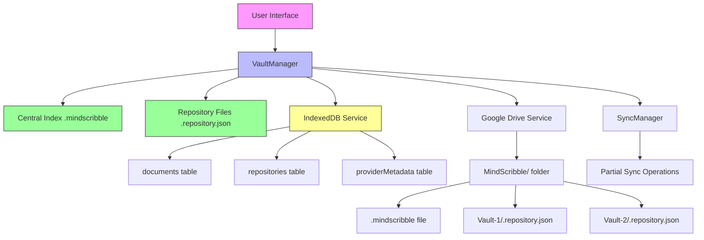

# Multi-Vault Architecture for MindScribble

## 🎯 Overview

This document proposes a comprehensive solution for managing multiple repositories/vaults in MindScribble, addressing the user's requirement to move files between different vaults while maintaining data integrity and synchronization.

## 🔄 Current System Analysis

Based on the existing implementation:

1. **Single Vault Support**: Currently supports one vault in IndexedDB with `.repository.json` files
2. **Provider-Aware Design**: Already implemented with `providerMetadata` table for multi-backend support
3. **Partial Sync**: Efficient synchronization using `.repository.json` files
4. **Conflict Detection**: Built-in conflict resolution system

## 🚀 Requirements

### User Requirements
1. **Multiple Vaults**: Support for multiple repositories/vaults on Google Drive
2. **File Movement**: Ability to move files/folders between vaults
3. **Central Management**: Central index for managing all vaults
4. **Data Integrity**: Ensure all `.repository.json` files are updated when files move
5. **Backward Compatibility**: Existing single-vault users should continue working

### Technical Requirements
1. **Google Drive Structure**: Each vault has its own `.repository.json` file
2. **Central Index**: `.mindscribble` file in central folder to track all vaults
3. **Atomic Operations**: File moves should be atomic to prevent data corruption
4. **Sync Consistency**: All repository files must stay in sync

## 🏗️ Proposed Architecture

### 1. Google Drive Structure

```
MindScribble/                          # Central folder (created by app)
├── .mindscribble                      # Central index file (NEW)
├── Vault-1/                           # Vault 1
│   ├── .repository.json              # Vault 1 repository file
│   ├── file1.mindmap                 # Mindmap files
│   └── folder1/                      # Folders
│       └── file2.mindmap
├── Vault-2/                           # Vault 2
│   ├── .repository.json              # Vault 2 repository file
│   └── file3.mindmap
└── Vault-N/                           # Additional vaults
    ├── .repository.json
    └── ...
```

### 2. Central Index File (`.mindscribble`)

```typescript
interface MindScribbleCentralIndex {
  version: '1.0';                     // Schema version
  lastUpdated: number;                // Timestamp of last update
  userId?: string;                    // User identifier
  vaults: Record<string, VaultMetadata>; // All vaults metadata
  settings?: {                        // Global settings
    defaultVaultId?: string;          // Default vault to open
    showAllVaults?: boolean;          // UI preference
  };
}

interface VaultMetadata {
  vaultId: string;                    // Unique vault identifier
  name: string;                      // Human-readable name
  created: number;                   // Creation timestamp
  modified: number;                  // Last modification timestamp
  provider: 'googleDrive';           // Storage provider
  providerId?: string;               // Provider-specific ID (Google Drive folder ID)
  fileCount: number;                 // Number of files in vault
  size: number;                      // Total size in bytes
  lastSynced?: number;               // Last sync timestamp
  isActive?: boolean;                // Currently active/loaded
}
```

### 3. Enhanced Repository File (`.repository.json`)

```typescript
interface EnhancedRepository {
  repositoryId: string;              // Vault ID
  name: string;                      // Vault name
  version: '1.1';                    // Updated version
  lastUpdated: number;               // Last update timestamp
  parentVaultId?: string;            // Reference to parent vault (for nested vaults)
  files: Record<string, RepositoryFile>;
  folders: Record<string, RepositoryFolder>;
  deletedFiles: string[];            // Files marked for deletion
  deletedFolders: string[];          // Folders marked for deletion
  syncSettings?: {                  // Sync preferences
    conflictResolution: 'server' | 'local' | 'ask';
    lastSynced: number;
  };
  vaultSettings?: {                 // Vault-specific settings
    color?: string;                  // Vault color
    icon?: string;                   // Vault icon
    description?: string;            // Vault description
  };
}
```

## 🔧 Implementation Strategy

### 1. Central Index Management

#### `VaultManager` Service (NEW)

```typescript
// mindscribble/quasar/src/core/services/vaultManager.ts

import { db } from './indexedDBService';
import { syncManager } from './syncManager';
import { NetworkError, StorageError } from '../errors';

export interface CentralIndex extends MindScribbleCentralIndex {}
export interface VaultMetadata extends VaultMetadata {}

export class VaultManager {
  private centralIndex: CentralIndex | null = null;
  private isLoading = false;

  /**
   * Load central index from IndexedDB or Google Drive
   */
  async loadCentralIndex(): Promise<CentralIndex> {
    if (this.centralIndex) {
      return this.centralIndex;
    }

    if (this.isLoading) {
      // Wait for existing load to complete
      while (this.isLoading) {
        await new Promise(resolve => setTimeout(resolve, 100));
      }
      return this.centralIndex!;
    }

    this.isLoading = true;
    try {
      // 1. Try IndexedDB first
      const localIndex = await db.settings.get('centralIndex');
      if (localIndex) {
        this.centralIndex = localIndex;
        return localIndex;
      }

      // 2. Try Google Drive
      if (navigator.onLine) {
        const driveIndex = await this.loadFromGoogleDrive();
        if (driveIndex) {
          this.centralIndex = driveIndex;
          await db.settings.put({ id: 'centralIndex', ...driveIndex });
          return driveIndex;
        }
      }

      // 3. Create new index if none exists
      const newIndex: CentralIndex = {
        version: '1.0',
        lastUpdated: Date.now(),
        vaults: {}
      };

      this.centralIndex = newIndex;
      await db.settings.put({ id: 'centralIndex', ...newIndex });
      return newIndex;

    } catch (error) {
      throw new StorageError('Failed to load central index', {
        error: error instanceof Error ? error.message : 'Unknown error'
      });
    } finally {
      this.isLoading = false;
    }
  }

  /**
   * Load central index from Google Drive
   */
  private async loadFromGoogleDrive(): Promise<CentralIndex | null> {
    try {
      // Implement Google Drive loading logic
      // This would use the existing Google Drive service
      return null; // Placeholder
    } catch (error) {
      console.error('Failed to load central index from Google Drive:', error);
      return null;
    }
  }

  /**
   * Save central index to both IndexedDB and Google Drive
   */
  async saveCentralIndex(index: CentralIndex): Promise<void> {
    // Update timestamp
    const updatedIndex = {
      ...index,
      lastUpdated: Date.now()
    };

    // Save to IndexedDB
    await db.settings.put({ id: 'centralIndex', ...updatedIndex });

    // Save to Google Drive if online
    if (navigator.onLine) {
      try {
        await this.saveToGoogleDrive(updatedIndex);
      } catch (error) {
        console.error('Failed to save central index to Google Drive:', error);
        // Don't throw - IndexedDB save is more important
      }
    }

    this.centralIndex = updatedIndex;
  }

  /**
   * Save central index to Google Drive
   */
  private async saveToGoogleDrive(index: CentralIndex): Promise<void> {
    // Implement Google Drive saving logic
  }

  /**
   * Create a new vault
   */
  async createVault(name: string, vaultId?: string): Promise<VaultMetadata> {
    const index = await this.loadCentralIndex();

    const newVaultId = vaultId || this.generateVaultId();
    const timestamp = Date.now();

    const newVault: VaultMetadata = {
      vaultId: newVaultId,
      name,
      created: timestamp,
      modified: timestamp,
      provider: 'googleDrive',
      fileCount: 0,
      size: 0
    };

    // Add to central index
    const updatedIndex: CentralIndex = {
      ...index,
      vaults: {
        ...index.vaults,
        [newVaultId]: newVault
      }
    };

    // Save updated index
    await this.saveCentralIndex(updatedIndex);

    // Create empty repository file for this vault
    await this.createEmptyRepository(newVaultId, name);

    return newVault;
  }

  /**
   * Create empty repository file for new vault
   */
  private async createEmptyRepository(vaultId: string, name: string): Promise<void> {
    const emptyRepo: EnhancedRepository = {
      repositoryId: vaultId,
      name,
      version: '1.1',
      lastUpdated: Date.now(),
      files: {},
      folders: {},
      deletedFiles: [],
      deletedFolders: []
    };

    // Save to IndexedDB
    await db.repositories.put(emptyRepo);

    // Create on Google Drive if online
    if (navigator.onLine) {
      try {
        await syncManager.uploadToProvider(`${vaultId}/.repository.json`, JSON.stringify(emptyRepo));
      } catch (error) {
        console.error('Failed to create repository file on Google Drive:', error);
      }
    }
  }

  /**
   * Get all vaults
   */
  async getAllVaults(): Promise<VaultMetadata[]> {
    const index = await this.loadCentralIndex();
    return Object.values(index.vaults);
  }

  /**
   * Get vault by ID
   */
  async getVault(vaultId: string): Promise<VaultMetadata | null> {
    const index = await this.loadCentralIndex();
    return index.vaults[vaultId] || null;
  }

  /**
   * Update vault metadata
   */
  async updateVault(vaultId: string, updates: Partial<VaultMetadata>): Promise<VaultMetadata> {
    const index = await this.loadCentralIndex();
    const existingVault = index.vaults[vaultId];

    if (!existingVault) {
      throw new StorageError('Vault not found', { vaultId });
    }

    const updatedVault = {
      ...existingVault,
      ...updates,
      modified: Date.now()
    };

    const updatedIndex: CentralIndex = {
      ...index,
      vaults: {
        ...index.vaults,
        [vaultId]: updatedVault
      }
    };

    await this.saveCentralIndex(updatedIndex);
    return updatedVault;
  }

  /**
   * Delete vault (mark as deleted, don't physically delete immediately)
   */
  async deleteVault(vaultId: string): Promise<void> {
    const index = await this.loadCentralIndex();
    const vault = index.vaults[vaultId];

    if (!vault) {
      throw new StorageError('Vault not found', { vaultId });
    }

    // Mark as deleted by adding to deletedVaults
    // Keep in vaults for now (soft delete)
    const updatedIndex: CentralIndex = {
      ...index,
      vaults: {
        ...index.vaults,
        [vaultId]: {
          ...vault,
          deleted: true,
          modified: Date.now()
        }
      }
    };

    await this.saveCentralIndex(updatedIndex);

    // TODO: Implement physical deletion after confirmation period
  }

  /**
   * Generate unique vault ID
   */
  private generateVaultId(): string {
    return `vault-${Date.now()}-${Math.random().toString(36).substring(2, 8)}`;
  }

  /**
   * Move file between vaults
   */
  async moveFileBetweenVaults(
    sourceVaultId: string,
    targetVaultId: string,
    fileId: string
  ): Promise<void> {
    // This is the core operation - see detailed implementation below
    await this.performAtomicFileMove(sourceVaultId, targetVaultId, fileId);
  }

  /**
   * Perform atomic file move between vaults
   */
  private async performAtomicFileMove(
    sourceVaultId: string,
    targetVaultId: string,
    fileId: string
  ): Promise<void> {
    // Implementation details in the File Movement section below
  }
}

// Singleton instance
export const vaultManager = new VaultManager();
```

### 2. File Movement Implementation

#### Atomic File Move Algorithm

```typescript
/**
 * Perform atomic file move between vaults
 */
private async performAtomicFileMove(
  sourceVaultId: string,
  targetVaultId: string,
  fileId: string
): Promise<void> {
  // 1. Acquire locks for both vaults to prevent concurrent modifications
  await this.acquireVaultLocks(sourceVaultId, targetVaultId);

  try {
    // 2. Load both repository files
    const [sourceRepo, targetRepo] = await Promise.all([
      this.loadRepositoryWithLock(sourceVaultId),
      this.loadRepositoryWithLock(targetVaultId)
    ]);

    // 3. Get file from source vault
    const fileToMove = sourceRepo.files[fileId];
    if (!fileToMove) {
      throw new StorageError('File not found in source vault', {
        sourceVaultId,
        fileId
      });
    }

    // 4. Remove from source vault
    const { [fileId]: removedFile, ...remainingFiles } = sourceRepo.files;
    const updatedSourceRepo: EnhancedRepository = {
      ...sourceRepo,
      files: remainingFiles,
      lastUpdated: Date.now()
    };

    // 5. Add to target vault (handle potential name conflicts)
    const finalFile = this.resolveFileNameConflict(targetRepo, fileToMove);
    const updatedTargetRepo: EnhancedRepository = {
      ...targetRepo,
      files: {
        ...targetRepo.files,
        [finalFile.id]: finalFile
      },
      lastUpdated: Date.now()
    };

    // 6. Update vault metadata
    await Promise.all([
      this.updateVault(sourceVaultId, {
        fileCount: sourceRepo.fileCount - 1,
        size: sourceRepo.size - (fileToMove.size || 0),
        modified: Date.now()
      }),
      this.updateVault(targetVaultId, {
        fileCount: targetRepo.fileCount + 1,
        size: targetRepo.size + (finalFile.size || 0),
        modified: Date.now()
      })
    ]);

    // 7. Save both repository files atomically
    await Promise.all([
      this.saveRepositoryFile(sourceVaultId, updatedSourceRepo),
      this.saveRepositoryFile(targetVaultId, updatedTargetRepo)
    ]);

    // 8. Move actual file content on Google Drive
    await this.moveFileContentOnGoogleDrive(sourceVaultId, targetVaultId, fileToMove);

    // 9. Update IndexedDB documents
    const doc = await db.documents.get(fileId);
    if (doc) {
      await db.documents.put({
        ...doc,
        metadata: {
          ...doc.metadata,
          vaultId: targetVaultId
        }
      });
    }

    // 10. Update provider metadata
    await this.updateProviderMetadata(fileId, targetVaultId);

  } catch (error) {
    // Clean up on failure
    console.error('File move failed, rolling back:', error);
    // TODO: Implement rollback logic
    throw error;
  } finally {
    // 11. Release locks
    await this.releaseVaultLocks(sourceVaultId, targetVaultId);
  }
}

/**
 * Resolve file name conflicts in target vault
 */
private resolveFileNameConflict(
  targetRepo: EnhancedRepository,
  file: RepositoryFile
): RepositoryFile {
  const existingFiles = Object.values(targetRepo.files);
  const nameConflict = existingFiles.some(f => f.name === file.name);

  if (!nameConflict) {
    return file; // No conflict
  }

  // Generate unique name
  const baseName = file.name.replace(/\s*\(\d+\)$/, '');
  let counter = 1;
  let newName = `${baseName} (${counter})`;

  while (existingFiles.some(f => f.name === newName)) {
    counter++;
    newName = `${baseName} (${counter})`;
  }

  return {
    ...file,
    name: newName,
    id: this.generateFileId() // New ID to avoid conflicts
  };
}

/**
 * Move file content on Google Drive
 */
private async moveFileContentOnGoogleDrive(
  sourceVaultId: string,
  targetVaultId: string,
  file: RepositoryFile
): Promise<void> {
  // Implement using Google Drive API
  // This would involve:
  // 1. Copy file from source to target vault
  // 2. Delete file from source vault
  // 3. Handle any errors
}

/**
 * Update provider metadata for moved file
 */
private async updateProviderMetadata(
  fileId: string,
  newVaultId: string
): Promise<void> {
  // Update all provider metadata entries for this file
  const metadataEntries = await db.providerMetadata
    .where('documentId')
    .equals(fileId)
    .toArray();

  for (const entry of metadataEntries) {
    await db.providerMetadata.update(entry.id, {
      // Update vault-related metadata if needed
    });
  }
}
```

### 3. Locking Mechanism

```typescript
/**
 * Vault locking to prevent concurrent modifications
 */
private vaultLocks: Record<string, boolean> = {};
private lockTimeouts: Record<string, NodeJS.Timeout> = {};

/**
 * Acquire locks for vaults
 */
private async acquireVaultLocks(...vaultIds: string[]): Promise<void> {
  const acquiredLocks: string[] = [];

  try {
    for (const vaultId of vaultIds) {
      // Check if already locked
      if (this.vaultLocks[vaultId]) {
        // Wait for existing lock to be released (with timeout)
        await new Promise<void>((resolve, reject) => {
          const startTime = Date.now();
          const checkInterval = setInterval(() => {
            if (!this.vaultLocks[vaultId]) {
              clearInterval(checkInterval);
              resolve();
            } else if (Date.now() - startTime > 30000) { // 30s timeout
              clearInterval(checkInterval);
              reject(new NetworkError('Timeout acquiring vault lock', { vaultId }));
            }
          }, 100);
        });
      }

      // Acquire lock
      this.vaultLocks[vaultId] = true;
      acquiredLocks.push(vaultId);

      // Set auto-release timeout (prevent deadlocks)
      this.lockTimeouts[vaultId] = setTimeout(() => {
        console.warn(`Auto-releasing vault lock for ${vaultId} (possible deadlock)`);
        this.releaseVaultLock(vaultId);
      }, 60000); // 60s timeout
    }
  } catch (error) {
    // Release any acquired locks on failure
    for (const vaultId of acquiredLocks) {
      this.releaseVaultLock(vaultId);
    }
    throw error;
  }
}

/**
 * Release vault locks
 */
private async releaseVaultLocks(...vaultIds: string[]): Promise<void> {
  for (const vaultId of vaultIds) {
    this.releaseVaultLock(vaultId);
  }
}

/**
 * Release single vault lock
 */
private releaseVaultLock(vaultId: string): void {
  if (this.vaultLocks[vaultId]) {
    this.vaultLocks[vaultId] = false;
    delete this.vaultLocks[vaultId];
  }

  // Clear timeout
  if (this.lockTimeouts[vaultId]) {
    clearTimeout(this.lockTimeouts[vaultId]);
    delete this.lockTimeouts[vaultId];
  }
}

/**
 * Load repository file with lock
 */
private async loadRepositoryWithLock(vaultId: string): Promise<EnhancedRepository> {
  const repo = await db.repositories.get(vaultId);
  if (!repo) {
    throw new StorageError('Repository not found', { vaultId });
  }
  return repo;
}

/**
 * Save repository file
 */
private async saveRepositoryFile(
  vaultId: string,
  repo: EnhancedRepository
): Promise<void> {
  // Save to IndexedDB
  await db.repositories.put(repo);

  // Save to Google Drive if online
  if (navigator.onLine) {
    try {
      await syncManager.uploadToProvider(
        `${vaultId}/.repository.json`,
        JSON.stringify(repo)
      );
    } catch (error) {
      console.error('Failed to save repository file to Google Drive:', error);
      // Don't throw - IndexedDB save is more important
    }
  }
}
```

## 🎨 Architecture Diagram



## 🔄 Migration Strategy

### For Existing Single-Vault Users

1. **Automatic Migration**: On first run with new version
2. **Create Central Index**: Initialize `.mindscribble` file with existing vault
3. **Update Repository File**: Enhance existing `.repository.json` to version 1.1
4. **Backward Compatibility**: Continue supporting single-vault mode

```typescript
// Migration function
async function migrateToMultiVault(): Promise<void> {
  // 1. Check if migration is needed
  const hasCentralIndex = await db.settings.get('centralIndex');
  if (hasCentralIndex) {
    return; // Already migrated
  }

  // 2. Find existing vaults (currently only one)
  const existingRepos = await db.repositories.toArray();

  if (existingRepos.length === 0) {
    // No existing data - create empty central index
    const newIndex: CentralIndex = {
      version: '1.0',
      lastUpdated: Date.now(),
      vaults: {}
    };
    await db.settings.put({ id: 'centralIndex', ...newIndex });
    return;
  }

  // 3. Create central index with existing vaults
  const vaults: Record<string, VaultMetadata> = {};

  for (const repo of existingRepos) {
    const vaultId = repo.repositoryId;
    vaults[vaultId] = {
      vaultId,
      name: repo.name,
      created: repo.lastUpdated,
      modified: repo.lastUpdated,
      provider: 'googleDrive',
      fileCount: Object.keys(repo.files).length,
      size: this.calculateVaultSize(repo)
    };
  }

  const centralIndex: CentralIndex = {
    version: '1.0',
    lastUpdated: Date.now(),
    vaults
  };

  // 4. Save central index
  await db.settings.put({ id: 'centralIndex', ...centralIndex });

  // 5. Update repository files to version 1.1
  for (const repo of existingRepos) {
    const enhancedRepo: EnhancedRepository = {
      ...repo,
      version: '1.1'
    };
    await db.repositories.put(enhancedRepo);

    // Update on Google Drive if online
    if (navigator.onLine) {
      try {
        await syncManager.uploadToProvider(
          `${repo.repositoryId}/.repository.json`,
          JSON.stringify(enhancedRepo)
        );
      } catch (error) {
        console.error('Failed to update repository file on Google Drive:', error);
      }
    }
  }
}

private calculateVaultSize(repo: EnhancedRepository): number {
  return Object.values(repo.files).reduce((sum, file) => sum + (file.size || 0), 0);
}
```

## 📋 Implementation Plan

### Phase 1: Core Infrastructure (2-3 days)

1. **Create VaultManager Service**
   - Implement central index management
   - Add vault CRUD operations
   - Implement locking mechanism

2. **Enhance Repository Structure**
   - Update `.repository.json` to version 1.1
   - Add vault metadata support
   - Implement file movement logic

3. **Update IndexedDB Schema**
   - Add central index to settings table
   - Enhance repositories table for multi-vault support

### Phase 2: File Movement (1-2 days)

1. **Implement Atomic File Move**
   - Add file movement between vaults
   - Implement conflict resolution
   - Add Google Drive file movement

2. **Update SyncManager**
   - Add multi-vault sync support
   - Enhance partial sync for multiple vaults
   - Update conflict detection

### Phase 3: UI Integration (1-2 days)

1. **Vault Management UI**
   - Vault list/selector
   - Create/rename/delete vaults
   - Vault settings

2. **File Movement UI**
   - Move files between vaults
   - Progress indicators
   - Error handling

### Phase 4: Testing & Migration (1 day)

1. **Automatic Migration**
   - Implement migration from single-vault
   - Test with existing data
   - Add rollback capability

2. **Comprehensive Testing**
   - Test file movement scenarios
   - Test conflict resolution
   - Test offline/online scenarios

## ✅ Benefits of This Approach

1. **Data Integrity**: Atomic operations prevent corruption
2. **Performance**: Efficient file movement with minimal data transfer
3. **User Experience**: Clear vault management interface
4. **Backward Compatibility**: Existing users continue working seamlessly
5. **Future-Proof**: Supports additional providers (GitHub, Dropbox, etc.)
6. **Conflict Resolution**: Built-in handling for name conflicts

## 🚫 Potential Challenges & Solutions

### Challenge 1: Concurrent Modifications
**Solution**: Vault locking mechanism with timeouts and deadlock prevention

### Challenge 2: Large File Moves
**Solution**: Progress indicators, background operations, and cancelability

### Challenge 3: Google Drive API Limitations
**Solution**: Fallback to copy+delete pattern, error handling, and retries

### Challenge 4: Offline Operations
**Solution**: Queue operations for later sync, clear status indicators

## 🎯 Conclusion

This multi-vault architecture provides a comprehensive solution for managing multiple repositories in MindScribble while maintaining data integrity, performance, and user experience. The implementation builds upon the existing provider-aware design and partial sync infrastructure, ensuring a smooth transition for existing users.

**Next Steps**:
1. Implement `VaultManager` service
2. Enhance repository file structure
3. Add file movement functionality
4. Update UI for vault management
5. Test and migrate existing users

The architecture is designed to be future-proof, supporting additional storage providers and advanced features as MindScribble evolves.