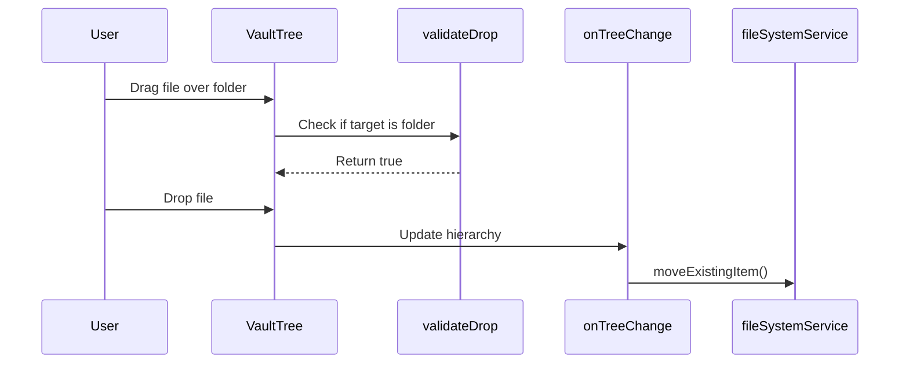
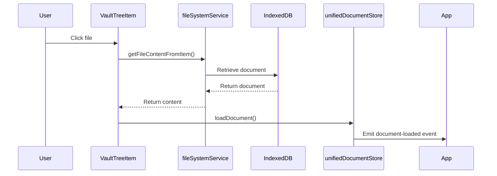
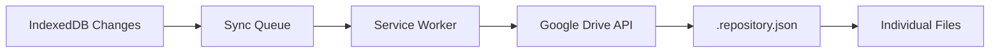

# Vault Management Fix Plan

## 🎯 Overview

This document outlines a comprehensive plan to fix all identified issues with the current vault management implementation. The plan addresses both UI/UX problems and backend functionality gaps.

## 🔍 Current Issues Analysis

### UI/UX Issues

1. **Vault Structure**: Treeview displays all files and folders separately, not in a proper hierarchy
2. **Drag-and-Drop**: Files cannot be dragged into folders or folders into folders
3. **Renaming**: Multiple files/folders are renamed when only one should be renamed
4. **Root Element**: No root vault element in the tree structure
5. **File Opening**: Files cannot be opened from the vault management UI
6. **File Naming**: Files opened don't retain their vault names

### Backend/IndexedDB Issues

1. **PWA Requirement**: Need to upgrade app to PWA for service worker testing
2. **Google Drive Sync**: Background sync via worker not implemented
3. **Google Drive Initialization**: No vault initialization on Google Drive
4. **Active Vault Concept**: IndexedDB should have index of all vaults + one active vault

## 🚀 Comprehensive Fix Plan

### Phase 1: Fix Tree Structure and Root Vault Element

**Objective**: Create proper hierarchical tree structure with root vault element

**Tasks**:
1. **Modify VaultTree.vue** to include root vault element
2. **Update buildTreeFromVault()** to create proper hierarchy
3. **Add vault type** to VaultTreeItem interface
4. **Create root vault node** that contains all files/folders
5. **Allow vault renaming** like other items

**Files to Modify**:
- `src/features/vault/components/VaultTree.vue`
- `src/features/vault/components/VaultTreeItem.vue`

**Implementation Details**:
- Add root vault element as the first level in the tree
- All files/folders should be children of this root vault
- Root vault should be renameable but not movable
- Update tree building logic to handle vault → folder → file hierarchy

### Phase 2: Fix Drag-and-Drop Functionality

**Objective**: Enable proper drag-and-drop with validation

**Tasks**:
1. **Fix validateDrop()** to allow files into folders
2. **Fix validateDrop()** to allow folders into folders
3. **Add visual feedback** for valid/invalid drop targets
4. **Prevent circular references** in folder hierarchy
5. **Update onTreeChange()** to handle proper hierarchy updates

**Files to Modify**:
- `src/features/vault/components/VaultTree.vue`
- `src/features/vault/components/VaultTreeItem.vue`

**Implementation Details**:
- Allow files to be dropped into folders (type === 'folder')
- Allow folders to be dropped into other folders
- Prevent vaults from being moved (root level only)
- Add visual indicators for drop targets
- Implement circular reference detection

### Phase 3: Fix Renaming Issues

**Objective**: Ensure only the selected item is renamed

**Tasks**:
1. **Debug renameItem()** in VaultTreeItem.vue
2. **Fix event handling** to prevent multiple renames
3. **Update fileSystemService.renameExistingItem()** to be more robust
4. **Add proper error handling** for rename operations

**Files to Modify**:
- `src/features/vault/components/VaultTreeItem.vue`
- `src/composables/useFileSystem.ts`

**Implementation Details**:
- Ensure rename operations target only the specific item
- Add transaction safety to prevent cascading renames
- Improve error handling and user feedback
- Add validation for duplicate names

### Phase 4: Implement File Opening

**Objective**: Enable opening files from vault management

**Tasks**:
1. **Integrate with unified document store**
2. **Implement openItem()** in VaultTreeItem.vue
3. **Add file opening command** to command system
4. **Ensure file name preservation** when opening
5. **Update document store** to handle vault-based file loading

**Files to Modify**:
- `src/features/vault/components/VaultTreeItem.vue`
- `src/core/stores/unifiedDocumentStore.ts`
- `src/core/commands/definitions/fileCommands.ts`

**Implementation Details**:
- Load file content from IndexedDB when clicked
- Pass file name to document store
- Update document metadata with vault information
- Ensure proper cleanup when switching files

### Phase 5: PWA Upgrade for Service Worker

**Objective**: Convert app to PWA for background sync testing

**Tasks**:
1. **Update quasar.config.ts** for PWA configuration
2. **Add service worker** registration
3. **Create sync worker** for background operations
4. **Implement offline caching** strategy
5. **Add PWA manifest** and icons

**Files to Create/Modify**:
- `quasar.config.ts` (update PWA settings)
- `src-pwa/register-service-worker.js` (new)
- `src-pwa/custom-service-worker.js` (new)
- `public/manifest.json` (new)

**Implementation Details**:
- Configure Quasar for PWA mode
- Implement service worker with caching
- Add background sync capabilities
- Ensure offline functionality

### Phase 6: Google Drive Initialization

**Objective**: Initialize vault structure on Google Drive

**Tasks**:
1. **Create Google Drive initialization service**
2. **Implement vault creation** on Google Drive
3. **Add .repository.json** file creation
4. **Handle OAuth token refresh**
5. **Implement initial sync** from IndexedDB to Google Drive

**Files to Create/Modify**:
- `src/core/services/googleDriveInitialization.ts` (new)
- `src/core/services/googleDriveService.ts` (update)
- `src/boot/google-api.ts` (update)

**Implementation Details**:
- Create Mindscribble folder on Google Drive if it doesn't exist
- Initialize vault structure with proper folder hierarchy
- Create .repository.json for sync metadata
- Handle OAuth token management

### Phase 7: Active Vault Management

**Objective**: Implement proper active vault concept

**Tasks**:
1. **Update IndexedDB schema** for active vault tracking
2. **Modify vaultService** to handle active vault switching
3. **Update UI** to show active vault indicator
4. **Ensure only one vault** is active at a time
5. **Add vault switching** functionality

**Files to Modify**:
- `src/core/services/vaultService.ts`
- `src/core/services/indexedDBService.ts`
- `src/features/vault/components/VaultTree.vue`

**Implementation Details**:
- Track active vault in centralIndex
- Ensure proper vault activation/deactivation
- Update UI to reflect active vault status
- Handle vault switching gracefully

### Phase 8: Integration and Testing

**Objective**: Ensure all components work together properly

**Tasks**:
1. **Comprehensive integration testing**
2. **Fix any remaining bugs**
3. **Performance optimization**
4. **User experience polishing**
5. **Documentation updates**

**Files to Update**:
- Test files as needed
- Documentation files

## 📋 Detailed Implementation Steps

### Step 1: Fix Tree Structure (Phase 1)

```mermaid
graph TD
    A[Current: Files and folders separate] --> B[New: Root vault with hierarchy]
    B --> C[Vault (root)]
    C --> D[Folder 1]
    C --> E[File 1]
    D --> F[Subfolder]
    D --> G[File 2]
```

**Code Changes**:
- Modify `buildTreeFromVault()` to create root vault element
- Update tree data structure to include vault type
- Ensure proper parent-child relationships

### Step 2: Fix Drag-and-Drop (Phase 2)



**Validation Rules**:
- Files → Folders: ✅ Allowed
- Files → Files: ❌ Not allowed
- Folders → Folders: ✅ Allowed
- Folders → Files: ❌ Not allowed
- Vaults → Anywhere: ❌ Not allowed

### Step 3: Fix Renaming (Phase 3)

**Problem Analysis**:
- Current implementation may have event propagation issues
- Multiple items might be receiving rename events
- Need to ensure only targeted item is renamed

**Solution**:
- Add unique identifiers to rename events
- Implement proper event targeting
- Add validation before rename operations

### Step 4: File Opening (Phase 4)



### Step 5: PWA Implementation (Phase 5)

**Key Components**:
- Service Worker: Background sync, caching
- Manifest: App metadata, icons
- Workbox: Advanced caching strategies
- Background Sync API: For Google Drive sync

### Step 6: Google Drive Sync (Phase 6)



## ✅ Success Criteria

### UI/UX Success
- [ ] Tree shows proper hierarchy with root vault
- [ ] Files can be dragged into folders
- [ ] Folders can be dragged into folders
- [ ] Only selected item is renamed
- [ ] Root vault is renameable but not movable
- [ ] Files open properly with correct names
- [ ] Active vault is clearly indicated

### Backend Success
- [ ] App is PWA with service worker
- [ ] Google Drive initialization works
- [ ] Vault structure syncs to Google Drive
- [ ] Active vault concept implemented
- [ ] Background sync operational

### Integration Success
- [ ] All components work together
- [ ] No breaking changes to existing functionality
- [ ] Performance is acceptable
- [ ] Error handling is robust

## 🎯 Priority Order

1. **Critical UI Fixes** (Phases 1-4) - Users can't use vault management properly
2. **PWA Upgrade** (Phase 5) - Required for service worker testing
3. **Google Drive Sync** (Phase 6) - Background sync functionality
4. **Active Vault** (Phase 7) - Proper vault management
5. **Integration** (Phase 8) - Polish and testing

## 📊 Estimated Timeline

| Phase | Description | Priority |
|-------|-------------|----------|
| 1 | Tree Structure & Root Vault | Critical |
| 2 | Drag-and-Drop Functionality | Critical |
| 3 | Renaming Fixes | Critical |
| 4 | File Opening Integration | Critical |
| 5 | PWA Upgrade | High |
| 6 | Google Drive Initialization | High |
| 7 | Active Vault Management | Medium |
| 8 | Integration & Testing | Critical |

**Recommendation**: Start with Phases 1-4 immediately as they directly impact user experience and basic functionality. Phases 5-6 are important for the sync architecture but can be developed in parallel.

## 🔮 Next Steps

1. **Implement Phase 1** (Tree Structure Fix)
2. **Implement Phase 2** (Drag-and-Drop)
3. **Implement Phase 3** (Renaming Fixes)
4. **Implement Phase 4** (File Opening)
5. **Test thoroughly** before proceeding to PWA and sync
6. **Implement Phase 5** (PWA Upgrade)
7. **Implement Phase 6** (Google Drive Sync)
8. **Final integration and testing**

This plan addresses all the identified issues systematically while maintaining the existing architecture and ensuring backward compatibility.