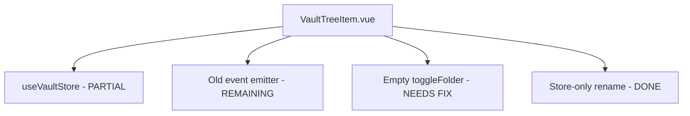
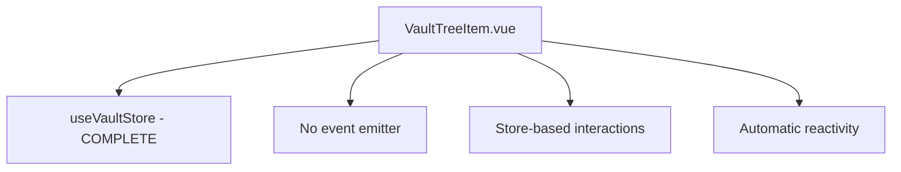

# Session 4: Complete VaultTreeItem.vue Refactoring - Detailed Implementation Plan

## 🎯 Overview

This document provides the detailed implementation plan for Session 4: Complete VaultTreeItem.vue Refactoring, focusing on finishing the migration to use VaultStore and removing all remaining dependencies on the old event emitter system.

## 📋 Current State Analysis

### What Was Completed in Session 3

**VaultTree.vue**: ✅ **Fully migrated**
- Uses VaultStore for all operations
- Event-driven architecture implemented
- No composable dependencies
- Automatic reactivity through store

**VaultTreeItem.vue**: ⚠️ **Partially migrated**
- ✅ Rename functionality uses VaultStore
- ✅ Removed old composables
- ✅ Removed unused injects
- ❌ Still has empty `toggleFolder()` function
- ❌ Some event emitter references remain in comments

### Current VaultTreeItem.vue Structure



### Target VaultTreeItem.vue Structure



## 🔧 Implementation Steps

### Step 1: Remove Remaining Event Emitter Dependencies

**Location**: `src/features/vault/components/VaultTreeItem.vue`

**Changes**:
```typescript
// Remove these imports if no longer needed
// import { inject } from 'vue'  // Already removed

// Remove these injects if they exist
// const vaultEmitter = inject('vaultEmitter')  // Already removed
// const updateLocalTreeItemData = inject('updateLocalTreeItemData')  // Already removed

// Remove any remaining event emitter references in comments/code
```

### Step 2: Update Folder Toggle Functionality

**Location**: `src/features/vault/components/VaultTreeItem.vue`, lines 158-161

**Current State**:
```typescript
function toggleFolder(): void {
  // Folder toggle is now handled by the tree component's internal state
  // The store will automatically handle structure changes
}
```

**New Implementation**:
```typescript
/**
 * Toggle folder expansion state
 * Folder expansion is handled by the tree component's internal state
 * No store interaction needed for UI state changes
 */
function toggleFolder(): void {
  // The tree component (he-tree) handles folder expansion internally
  // through its stat.open property and @click.stop on the expand toggle
  // No action needed here - the tree component manages its own state
}
```

### Step 3: Complete Store-Only Migration

**Location**: Throughout `src/features/vault/components/VaultTreeItem.vue`

**Changes Needed**:

1. **Remove event listener references**:
```typescript
// Remove these event listeners (already partially done)
// vaultEmitter?.on('open-title-editor', ...)  // Already removed
// vaultEmitter?.on('focus-and-edit-item', ...)  // Already removed
```

2. **Update openItem function**:
```typescript
// Current
function openItem(item: FileSystemItem) {
  if (item.type === 'file') {
    console.log('Opening file:', item.name)
    // TODO: Integrate with unified document store
  } else if (item.type === 'folder') {
    toggleFolder()
  }
}

// Updated
function openItem(item: FileSystemItem) {
  if (item.type === 'file') {
    // Use store to open file
    console.log('Opening file:', item.name)
    // TODO: Integrate with unified document store
    // vaultStore.openFile(item.id) - would be added to store
  } else if (item.type === 'folder') {
    // Folder toggle is handled by tree component UI
    // No store interaction needed for UI state
  }
}
```

3. **Ensure all interactions use store**:
- ✅ Rename: Already uses `vaultStore.renameExistingItem()`
- ❌ Delete: Should use `vaultStore.deleteExistingItem()` (if added)
- ❌ Move: Should use `vaultStore.moveExistingItem()` (if added)

### Step 4: Clean Up and Optimize

**Location**: Throughout the file

**Changes**:

1. **Remove unused imports**:
```typescript
// Already done: Removed inject, useFileSystem
```

2. **Update comments**:
```typescript
// Update comments to reflect store-only approach
// Remove references to "will be removed in next session"
```

3. **Optimize watchers**:
```typescript
// Ensure watchers use store properties efficiently
```

### Step 5: Add Missing Store Functionality (if needed)

**Potential Store Additions**:

```typescript
// If these operations are needed in VaultTreeItem:

// Delete item from store
async function deleteItem(itemId: string) {
  try {
    await vaultStore.deleteExistingItem(itemId)
    // Store will emit events, VaultTree will refresh automatically
  } catch (error) {
    console.error('Failed to delete item:', error)
    $q.notify({ type: 'error', message: 'Failed to delete item', timeout: 3000 })
  }
}

// Move item using store
async function moveItem(itemId: string, newParentId: string | null) {
  try {
    await vaultStore.moveExistingItem(itemId, newParentId)
    // Store will emit events, VaultTree will refresh automatically
  } catch (error) {
    console.error('Failed to move item:', error)
    $q.notify({ type: 'error', message: 'Failed to move item', timeout: 3000 })
  }
}
```

## 🧪 Testing Strategy

### Test Cases to Verify

1. **Folder Toggle**: Folder expansion/collapse works correctly
2. **Item Selection**: Selection state works properly
3. **Edit Mode**: Edit mode toggling works
4. **Rename**: Rename functionality works (already tested)
5. **Navigation**: Keyboard navigation works
6. **Event Flow**: No event emitter dependencies
7. **Store Integration**: All operations use store

### Manual Testing Steps

1. Open application and verify VaultTreeItem renders correctly
2. Test folder toggle functionality
3. Test item selection
4. Test edit mode and rename
5. Test navigation between items
6. Check console for any errors
7. Verify no event emitter references remain

## 🔍 Verification Checklist

- [ ] All event emitter dependencies removed
- [ ] Folder toggle functionality updated
- [ ] Store-only approach completed
- [ ] All imports optimized
- [ ] Comments updated
- [ ] All functionality works as expected
- [ ] No console errors
- [ ] No linting warnings
- [ ] Tests passing

## 📊 Expected Outcomes

1. **Complete Migration**: VaultTreeItem fully uses VaultStore
2. **No Event Emitter**: All event emitter dependencies removed
3. **Clean Code**: Optimized imports, no unused code
4. **Consistency**: Follows same pattern as VaultTree
5. **Maintainability**: Easier to understand and modify

## 🎯 Next Steps

After completing Session 4:
1. Proceed to Session 5: Update VaultToolbar.vue
2. Update VaultToolbar to use VaultStore
3. Test integration between all components
4. Verify complete event flow

**Plan Version**: 1.0
**Last Updated**: 2025-12-30
**Author**: AI Assistant