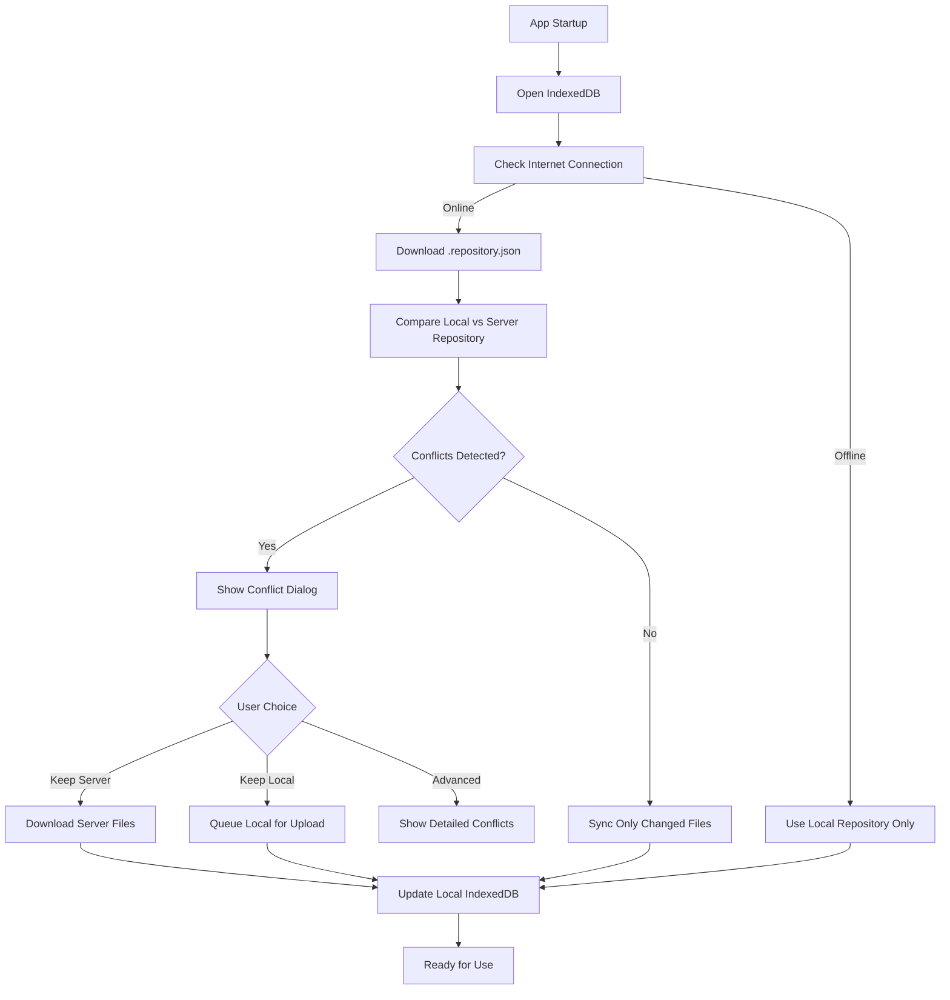

# MindScribble Storage Architecture - Summary

## 🎯 Overview

This work is focused on designing a robust, flexible storage architecture for MindScribble with efficient synchronization, multi-backend support, and user-friendly naming.

## 📁 1. Repository File System

### Core Concept
- **Single `.repository.json` file** (or similar name) in each storage location
- Contains complete file/folder structure with timestamps
- Enables intelligent synchronization without downloading all files

### File Structure

```typescript
// .repository.json (Universal structure across all backends)
interface RepositoryFile {
    id: string;              // Unique file identifier
    path: string;            // File path within repository
    name: string;            // File name
    type: 'mindmap' | 'document' | 'folder' | 'other';
    timestamp: number;       // Last modification timestamp (ISO)
    size: number;            // File size in bytes
    checksum?: string;       // Optional: SHA-256 hash for integrity
    created?: number;        // Creation timestamp
    deleted?: boolean;       // Soft deletion flag
}

interface Repository {
    repositoryId: string;    // Unique repository identifier
    name: string;            // Human-readable name
    version: '1.0';          // Schema version
    lastUpdated: number;     // Overall repository timestamp
    
    // File structure
    files: Record<string, RepositoryFile>;
    folders: Record<string, RepositoryFolder>;
    
    // Deletion tracking
    deletedFiles: string[];  // Files marked for deletion
    deletedFolders: string[];
    
    // Provider-specific metadata
    providerMetadata?: {
        googleDrive?: {
            folderId: string;
            webViewLink: string;
            permissionId?: string;
        };
        github?: {
            repo: string;
            branch: string;
            commitHash: string;
        };
        localFileSystem?: {
            basePath: string;
        };
    };
    
    // Sync settings
    syncSettings?: {
        conflictResolution: 'server' | 'local' | 'ask';
        lastSynced: number;
    };
}

interface RepositoryFolder {
    id: string;
    path: string;
    name: string;
    timestamp: number;
    parentId?: string;
    // Children references
    fileIds: string[];
    folderIds: string[];
}
```

### Benefits
- **Fast Initialization**: Download one small file to know entire sync status
- **Efficient Sync**: Know exactly which files need transfer
- **Conflict Detection**: Compare timestamps before transferring large files
- **Structural Changes**: Handle renames, moves, deletions cleanly
- **Provider Agnostic**: Works with any storage backend

## 🔄 2. Synchronization Strategy

### Core Workflow



### Conflict Resolution

#### Simple Dialog
```
Title: "Sync Conflict Detected"
Message: "This repository has been modified on another device."
Options:
- [Keep Server Data] - Use the latest version from cloud
- [Keep Local Data] - Keep your local changes
- [Advanced...] - Show detailed file conflicts
```

#### Advanced Dialog
```
Title: "Detailed Sync Conflicts"
List of conflicting files with:
- File name and path
- Server timestamp vs Local timestamp
- Individual resolution buttons (↓ Use Server / ↑ Use Local)
- [Apply All Resolutions] button
```

### Partial Synchronization

```typescript
async function performPartialSync(repositoryId: string) {
    // 1. Get server repository file
    const serverRepo = await provider.getRepositoryFile(repositoryId);
    
    // 2. Get local repository
    const localRepo = await getLocalRepository(repositoryId);
    
    // 3. Identify changes needed
    const changes = {
        toDownload: [],
        toUpload: [],
        toDelete: []
    };
    
    // Files to download (server newer or missing locally)
    for (const fileId in serverRepo.files) {
        const serverFile = serverRepo.files[fileId];
        const localFile = localRepo?.files?.[fileId];
        
        if (!localFile || serverFile.timestamp > localFile.timestamp) {
            changes.toDownload.push(fileId);
        }
    }
    
    // Files to upload (local newer or missing on server)
    if (localRepo) {
        for (const fileId in localRepo.files) {
            if (!localRepo.files[fileId].deleted) {
                const serverFile = serverRepo.files[fileId];
                const localFile = localRepo.files[fileId];
                
                if (!serverFile || localFile.timestamp > serverFile.timestamp) {
                    changes.toUpload.push(fileId);
                }
            }
        }
    }
    
    // Files to delete (marked as deleted)
    changes.toDelete = [...serverRepo.deletedFiles, ...(localRepo?.deletedFiles || [])];
    
    // 4. Execute changes
    await executeSyncChanges(repositoryId, changes);
    
    // 5. Update local repository
    await updateLocalRepository(repositoryId, serverRepo);
}
```

### User Interaction Flow

1. **App Startup**: Automatic repository file download (if online)
2. **Conflict Detection**: Compare timestamps, identify conflicts
3. **Simple Choice**: "Keep Server" / "Keep Local" / "Advanced"
4. **Background Sync**: Non-blocking file transfers
5. **Progress Notifications**: Show sync status and completion
6. **Conflict Logging**: Keep record of resolved conflicts

## 🗃️ 3. Multi-Backend Architecture

### Provider Interface

```typescript
interface StorageProvider {
    // Provider identification
    readonly id: string;
    readonly name: string;
    readonly type: 'local' | 'cloud' | 'versioned';
    readonly capabilities: ProviderCapabilities;
    
    // Connection management
    initialize(config: ProviderConfig): Promise<ProviderStatus>;
    authenticate(): Promise<AuthResult>;
    checkConnection(): Promise<ConnectionStatus>;
    
    // Repository operations (CORE)
    getRepositoryFile(repositoryId: string): Promise<Repository>;
    updateRepositoryFile(repositoryId: string, repository: Repository): Promise<void>;
    
    // File operations
    fileExists(repositoryId: string, filePath: string): Promise<boolean>;
    readFile(repositoryId: string, filePath: string): Promise<Uint8Array>;
    writeFile(repositoryId: string, filePath: string, data: Uint8Array): Promise<void>;
    deleteFile(repositoryId: string, filePath: string): Promise<void>;
    listFiles(repositoryId: string, path?: string): Promise<FileMetadata[]>;
    
    // Advanced
    watchForChanges(repositoryId: string, callback: (changes: FileChange[]) => void): void;
    unwatch(repositoryId: string): void;
}
```

### Current Providers

| Provider | Type | Status | Capabilities |
|----------|------|--------|--------------|
| **IndexedDB** | Local | ✅ Implemented | Primary local storage |
| **Google Drive** | Cloud | ✅ Implemented | Cloud sync backend |
| **Local File System** | Local | 🟡 Planned | Electron desktop |
| **GitHub** | Versioned | 🟡 Planned | Octokit.js integration |
| **Dropbox** | Cloud | 🟡 Planned | API integration |
| **Amazon S3** | Cloud | 🟡 Planned | Enterprise option |

### Provider Manager

```typescript
class ProviderManager {
    private providers: Map<string, StorageProvider>;
    private currentProviderId: string | null;
    
    // Register and manage multiple providers
    registerProvider(provider: StorageProvider);
    setCurrentProvider(id: string): Promise<void>;
    getCurrentProvider(): StorageProvider;
    getAvailableProviders(): Promise<ProviderInfo[]>;
    
    // Unified operations
    async syncRepository(repositoryId: string) {
        const provider = this.getCurrentProvider();
        return await provider.syncRepository(repositoryId);
    }
}
```

### Architecture Diagram

```
┌─────────────────────────────────────────────────────────────┐
│                    MindScribble App                          │
├─────────────────────────────────────────────────────────────┤
│  IndexedDB (PRIMARY - Full Content)                          │
│  ├─ repositories (full metadata)                             │
│  ├─ files (full content)                                    │
│  └─ syncState (last sync timestamps)                        │
│  ↕                                                           │
│  Provider Manager                                           │
│  ├─ IndexedDB Provider (local)                              │
│  ├─ Google Drive Provider (cloud)                           │
│  ├─ GitHub Provider (versioned)                             │
│  └─ ...                                                      │
│  ↕                                                           │
│  Current Provider (e.g., Google Drive)                      │
│  ├─ .repository.json (metadata)                             │
│  ├─ file1.mindmap                                           │
│  ├─ file2.mindmap                                           │
│  └─ ...                                                      │
└─────────────────────────────────────────────────────────────┘
```

## 🔤 4. Repository Naming Analysis

### Criteria for Perfect Name:
1. **Knowledge/learning association**
2. **Container/organization metaphor**
3. **User-friendly and intuitive**
4. **Distinctive but not too technical**
5. **Positive, modern feel**
6. **Single word preferred**

### Evaluated Options:

| Term | Knowledge Fit | Container Fit | Distinctive | Modern | Notes |
|------|---------------|---------------|-------------|--------|-------|
| **Atlas** | ⭐⭐⭐⭐⭐ | ⭐⭐⭐⭐ | ⭐⭐⭐⭐ | ⭐⭐⭐⭐ | Collection of maps metaphor |
| **Reference** | ⭐⭐⭐⭐ | ⭐⭐⭐ | ⭐⭐⭐ | ⭐⭐⭐ | Academic/professional |
| **Hub** | ⭐⭐⭐ | ⭐⭐⭐⭐ | ⭐⭐⭐⭐ | ⭐⭐⭐⭐ | Central connection point |
| **Compendium** | ⭐⭐⭐⭐ | ⭐⭐⭐⭐ | ⭐⭐⭐⭐ | ⭐⭐⭐ | Scholarly collection |
| **Binder** | ⭐⭐ | ⭐⭐⭐⭐ | ⭐⭐⭐ | ⭐⭐ | Physical metaphor |
| **Bucket** | ⭐ | ⭐⭐⭐⭐ | ⭐⭐ | ⭐⭐⭐ | Too technical (AWS) |
| **Bin** | ⭐ | ⭐⭐⭐⭐ | ⭐ | ⭐⭐ | Too simple, trash association |
| **Pocket** | ⭐⭐ | ⭐⭐⭐ | ⭐⭐⭐ | ⭐⭐⭐ | Small scale, "pocket" apps |
| **Box** | ⭐ | ⭐⭐⭐⭐ | ⭐ | ⭐⭐ | Too generic, "Box" service |
| **Storage** | ⭐ | ⭐⭐⭐⭐ | ⭐ | ⭐⭐ | Too technical/generic |
| **Tank** | ⭐ | ⭐⭐⭐⭐ | ⭐⭐⭐ | ⭐⭐ | Military/industrial |
| **Depot** | ⭐ | ⭐⭐⭐⭐ | ⭐⭐⭐ | ⭐⭐ | Military/transport |
| **Vault** | ⭐⭐ | ⭐⭐⭐⭐ | ⭐⭐⭐ | ⭐⭐⭐ | Obsidian association |
| **Repository** | ⭐⭐⭐ | ⭐⭐⭐⭐ | ⭐⭐ | ⭐⭐⭐ | Too technical |

### 🥇 Top Recommendation: **Atlas**

**Why Atlas is Perfect:**
- **Metaphor**: Collection of maps = perfect for mindmaps
- **Knowledge Focus**: Strong association with organized knowledge
- **Distinctive**: Memorable and unique
- **Modern**: Contemporary and professional
- **Short**: Single word, easy to use
- **Avoids Obsidian**: No "vault" association

**Usage Examples:**
- "Create a new Atlas"
- "Your MindScribble Atlas"
- "Atlas synchronization"
- "Open Atlas settings"

### 🥈 Excellent Alternatives:

1. **Reference** - Academic/professional, clear knowledge focus
2. **Hub** - Technical/connection-focused, modern
3. **Compendium** - Scholarly, comprehensive collection

## 🎯 Key Decisions Summary

### 1. **Repository File System** ✅
- Single `.repository.json` file per storage location
- Contains complete structure with timestamps
- Enables efficient partial synchronization
- Works across all storage providers

### 2. **Synchronization Strategy** ✅
- Download repository file first (fast)
- Compare timestamps to detect changes
- Sync only changed files (efficient)
- Simple conflict resolution with advanced options
- Background processing for non-blocking operation

### 3. **Multi-Backend Architecture** ✅
- Provider interface for all storage backends
- Provider manager handles multiple providers
- Universal repository structure
- Easy to add new providers (GitHub, Dropbox, etc.)

### 4. **Naming** ✅
- **Primary Choice**: "Atlas" (collection of maps metaphor)
- **Alternatives**: "Reference", "Hub", "Compendium"
- **Avoided**: "Vault" (Obsidian), "Repository" (too technical)

## 🚀 Implementation Roadmap

### Phase 1: Core Repository System
- [ ] Define repository file schema
- [ ] Implement repository file generator/parser
- [ ] Create conflict detection algorithm
- [ ] Build simple conflict resolution UI

### Phase 2: Provider Architecture
- [ ] Define StorageProvider interface
- [ ] Implement ProviderManager
- [ ] Create IndexedDB provider
- [ ] Extract Google Drive code into provider

### Phase 3: Synchronization
- [ ] Implement partial sync logic
- [ ] Build background sync worker
- [ ] Create progress notifications
- [ ] Add conflict logging

### Phase 4: Naming Migration
- [ ] Update UI to use "Atlas" (or chosen term)
- [ ] Update documentation
- [ ] Add help text/tooltips
- [ ] Create migration guide if needed

### Phase 5: Future Expansion
- [ ] Add GitHub provider (Octokit.js)
- [ ] Add Local File System provider
- [ ] Add Dropbox provider
- [ ] Add Amazon S3 provider

## 📊 Benefits of This Architecture

### Performance:
- **Fast startup**: <1 second to check sync status
- **Efficient sync**: Only transfer changed files
- **Low bandwidth**: Small metadata file download
- **Scalable**: Works well with large repositories

### User Experience:
- **Simple choices**: Keep server or keep local
- **Advanced options**: For power users
- **Clear communication**: Know what's happening
- **Settings control**: Set preferred behavior

### Technical:
- **Provider abstraction**: Clean separation
- **Universal repository**: Consistent structure
- **Easy expansion**: Add new providers easily
- **Future-proof**: Supports all planned backends

### Business:
- **Multiple platforms**: Web, desktop, mobile
- **User choice**: Different backends for different needs
- **Enterprise options**: S3, self-hosted
- **Power users**: GitHub versioning

## 🎉 Conclusion

This has established a **robust, flexible, and user-friendly** storage architecture for MindScribble that:

1. **Solves immediate needs** with efficient synchronization
2. **Provides future growth** with multi-backend support
3. **Enhances user experience** with clear naming and simple conflict resolution
4. **Maintains technical excellence** with clean provider abstraction

The architecture is ready for implementation and provides a solid foundation for MindScribble's storage system.