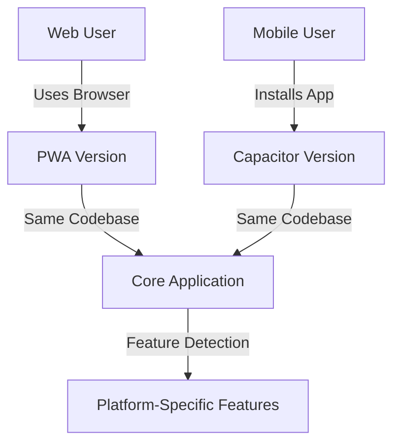

# PWA vs Capacitor Comparison for MindScribble

## 🎯 Quick Decision Guide

This document provides a concise comparison to help decide between PWA and Capacitor approaches for MindScribble's mobile strategy.

## 📊 Feature Comparison Matrix

| Category               | PWA Approach         | Capacitor Approach         | Winner        |
| ---------------------- | -------------------- | -------------------------- | ------------- |
| **Storage Capacity**   | ❌ 50MB limit on iOS | ✅ Full device storage     | **Capacitor** |
| **Data Persistence**   | ❌ Can be evicted    | ✅ Reliable persistence    | **Capacitor** |
| **Background Sync**    | ❌ No iOS support    | ✅ Full background tasks   | **Capacitor** |
| **Device Features**    | ❌ Limited access    | ✅ Full native APIs        | **Capacitor** |
| **Performance**        | ⚠️ Browser-limited | ✅ Native WebView          | **Capacitor** |
| **Installation**       | ✅ No app store      | ❌ App store required      | **PWA**       |
| **Updates**            | ✅ Instant updates   | ❌ App store review        | **PWA**       |
| **Discovery**          | ✅ URL-based         | ❌ App store only          | **PWA**       |
| **Offline Capability** | ✅ Service Worker    | ✅ Native + Service Worker | **Tie**       |
| **Development Speed**  | ✅ Web-only          | ⚠️ Hybrid approach       | **PWA**       |
| **Maintenance**        | ✅ Single codebase   | ⚠️ Platform builds       | **PWA**       |

## 🚨 Critical Issues Solved by Capacitor

### 1. **iOS Storage Limitations**
**Problem**: iOS Safari's 50MB IndexedDB limit and data eviction
**Solution**: Native filesystem access with proper permissions
**Impact**: ✅ **CRITICAL** - Solves the biggest mobile pain point

### 2. **Background Operations**
**Problem**: No background sync on iOS, limited service workers
**Solution**: Native background tasks and proper lifecycle management
**Impact**: ✅ **HIGH** - Enables reliable document sync

### 3. **Device Integration**
**Problem**: Limited access to camera, biometrics, files
**Solution**: Full native API access via Capacitor plugins
**Impact**: ✅ **MEDIUM** - Enhances user experience

## 📈 Business Impact Analysis

### User Experience
- **PWA**: Good for casual users, but frustrating on iOS
- **Capacitor**: Professional-grade experience, reliable performance
- **Winner**: **Capacitor** for serious users

### Development Cost
- **PWA**: Lower initial cost, web-only development
- **Capacitor**: Higher setup cost, but better long-term ROI
- **Winner**: **PWA** for MVP, **Capacitor** for production

### Maintenance
- **PWA**: Single codebase, easier updates
- **Capacitor**: Platform-specific builds, app store submissions
- **Winner**: **PWA** for simplicity

### Monetization
- **PWA**: Harder to monetize (no app store)
- **Capacitor**: Easier monetization via app stores
- **Winner**: **Capacitor** for business model

## 🎯 Recommendation

### **Short-term (MVP)**: Start with PWA
- Quick to implement
- Good enough for basic functionality
- Test market demand
- Lower development cost

### **Long-term (Production)**: Migrate to Capacitor
- Solves critical iOS limitations
- Better user experience
- Professional app presence
- Future-proof architecture

### **Hybrid Approach**: Best of Both Worlds

## 🔧 Implementation Strategy

### Phase 1: PWA Foundation (Current)
- Complete existing PWA implementation
- Focus on core functionality
- Test with real users
- Gather feedback

### Phase 2: Capacitor Integration
- Add Capacitor configuration
- Implement hybrid storage
- Add native lifecycle management
- Test on real devices

### Phase 3: Native Enhancements
- Add camera/file access
- Implement biometric auth
- Add background sync
- Optimize performance

### Phase 4: App Store Launch
- Prepare app store assets
- Implement monetization
- Beta testing
- Official launch

## 📊 Decision Factors

| Factor | Weight | PWA Score | Capacitor Score |
|--------|--------|-----------|-----------------|
| **Storage Reliability** | 30% | 2/10 | 9/10 |
| **Background Sync** | 25% | 3/10 | 8/10 |
| **Device Features** | 15% | 4/10 | 9/10 |
| **Performance** | 15% | 6/10 | 8/10 |
| **Development Cost** | 10% | 9/10 | 5/10 |
| **Maintenance** | 5% | 8/10 | 6/10 |
| **Total** | 100% | **4.8/10** | **7.9/10** |

**Conclusion**: Capacitor scores significantly higher (7.9 vs 4.8) for MindScribble's needs.

## 🚀 Final Recommendation

**Proceed with Capacitor implementation** using the hybrid approach outlined in the main strategy document. The benefits far outweigh the additional development cost, particularly in solving the critical iOS limitations that would severely impact user experience and data reliability.