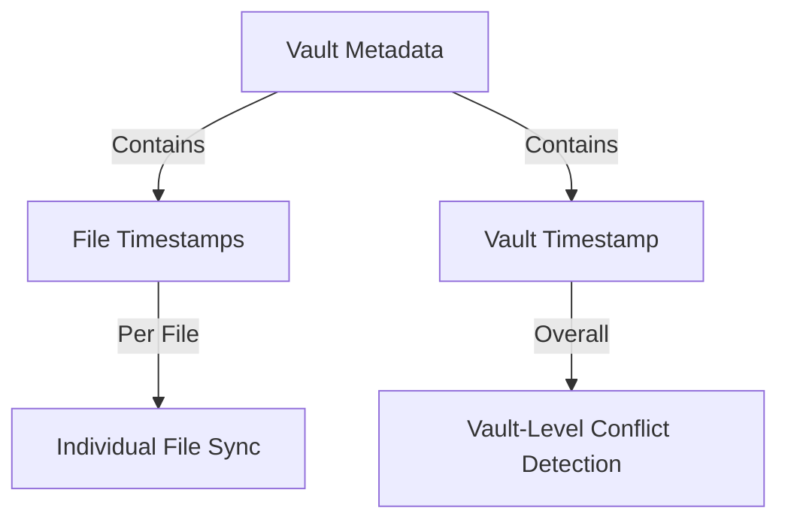

# Synchronization Strategy Analysis: Vault vs File-Level

## Current Understanding

### Key Constraints:
1. **Single Vault Open**: Only one vault can be open at a time in the app
2. **Simplified Conflict Resolution**: "Latest always wins" approach preferred
3. **Offline-First**: Must handle offline scenarios gracefully
4. **Data Integrity**: Prevent data loss in complex sync scenarios

### The Core Problem:
The scenario you described is critical:
1. Device A makes significant changes → syncs to Drive
2. Device B (offline) has old version → makes changes → goes online
3. Device B's old changes could overwrite Device A's new work

## Synchronization Level Comparison

### 🔹 Vault-Level Synchronization

**Pros:**
- ✅ **Atomic Operations**: Entire vault syncs as one unit
- ✅ **Consistency**: All files in vault are from same version
- ✅ **Simpler Logic**: One timestamp for entire vault
- ✅ **Easier Conflict Detection**: Compare single vault timestamp
- ✅ **Better for Deletions**: Handles file deletions cleanly
- ✅ **Structural Changes**: Handles renames, moves, etc.

**Cons:**
- ❌ **Slower Sync**: Must sync entire vault even for small changes
- ❌ **Higher Bandwidth**: More data transferred
- ❌ **Longer Blocking**: Users wait longer for sync to complete
- ❌ **Resource Intensive**: More IndexedDB operations

### 🔹 File-Level Synchronization

**Pros:**
- ✅ **Faster Sync**: Only changed files are synced
- ✅ **Lower Bandwidth**: Less data transferred
- ✅ **Granular Control**: Can sync individual files
- ✅ **Parallel Processing**: Multiple files can sync simultaneously

**Cons:**
- ❌ **Complex Conflict Resolution**: Must handle per-file conflicts
- ❌ **Inconsistent State**: Files from different versions mixed
- ❌ **Structural Issues**: Harder to handle renames/moves
- ❌ **Deletion Problems**: Must track deleted files separately
- ❌ **Metadata Sync**: Need separate sync for vault structure

## Hybrid Approach Recommendation

Based on your constraints and the critical scenario you described, I recommend a **hybrid approach**:

### Core Strategy: **Vault-Level Metadata + File-Level Content**



### How It Works:

1. **Vault Metadata File** (`.vault-metadata.json`):
   - Contains timestamp for entire vault
   - Contains individual file timestamps
   - Tracks file deletions
   - Maintains structural integrity

2. **Synchronization Process**:
   ```
   1. Check vault-level timestamp first
   2. If vault timestamps match, check individual file timestamps
   3. Sync only files that are newer or missing
   4. Handle deletions based on metadata
   5. Update both vault and file timestamps atomically
   ```

### Conflict Resolution: **"Latest Always Wins" with Safety Net**

```typescript
async function resolveConflict(vaultId: string, fileId: string) {
    const localTimestamp = await getLocalFileTimestamp(vaultId, fileId)
    const driveTimestamp = await getDriveFileTimestamp(vaultId, fileId)
    
    if (localTimestamp > driveTimestamp) {
        // Local is newer - use local version
        await syncLocalToDrive(vaultId, fileId)
        return 'local'
    } else if (driveTimestamp > localTimestamp) {
        // Drive is newer - use drive version
        await syncDriveToLocal(vaultId, fileId)
        return 'drive'
    } else {
        // Same timestamp - no conflict
        return 'none'
    }
}
```

## Handling the Critical Scenario

### Problem Scenario:
1. Device A: Makes changes → syncs to Drive (timestamp: 1000)
2. Device B (offline): Has old version (timestamp: 500) → makes changes (timestamp: 501)
3. Device B goes online → tries to sync

### Solution with Hybrid Approach:

```
Device B Sync Process:
1. Check vault metadata timestamp
   - Local vault timestamp: 501 (from Device B's changes)
   - Drive vault timestamp: 1000 (from Device A's changes)
   
2. Detect conflict: Drive is newer (1000 > 501)
   
3. Apply "Latest Always Wins" logic:
   - Drive version (timestamp 1000) is newer than local (timestamp 501)
   - Therefore, Drive version wins
   
4. Merge process:
   - Download all files from Drive that are newer than local
   - Preserve any local files that are actually newer (unlikely in this case)
   - Update local IndexedDB with Drive content
   - Update local timestamps to match Drive
   
5. Result: Device B gets Device A's work, Device B's changes are discarded
```

## File Operations Handling

### File Renames/Moves:
- Track in vault metadata as structural changes
- When file is renamed, update metadata with new path
- Sync metadata first, then content
- If conflict, use latest structure

### File Deletions:
- Mark in vault metadata as deleted
- Include deletion timestamp
- Sync deletion to other devices
- Clean up during next sync cycle

### Structural Changes Without Content Changes:
- Only sync metadata (fast operation)
- No need to transfer file content
- Update timestamps appropriately

## Implementation Recommendations

### 1. Enhanced Vault Metadata Structure:

```typescript
interface VaultMetadata {
    vaultId: string
    name: string
    lastModified: number  // Overall vault timestamp
    files: Record<string, {
        path: string
        timestamp: number
        size: number
        deleted?: boolean
        deletedAt?: number
    }>
    structureVersion: number
}
```

### 2. Two-Phase Synchronization:

```typescript
async function syncVault(vaultId: string) {
    // Phase 1: Sync metadata
    const metadataResult = await syncVaultMetadata(vaultId)
    
    if (metadataResult.conflict) {
        // Handle vault-level conflict
        await resolveVaultConflict(vaultId, metadataResult)
    }
    
    // Phase 2: Sync individual files based on metadata
    const filesToSync = getFilesNeedingSync(vaultId)
    
    for (const file of filesToSync) {
        await syncFile(vaultId, file.id)
    }
}
```

### 3. Safety Mechanisms:

1. **Backup Before Overwrite**: Always backup local version before applying Drive changes
2. **User Notification**: Show what was discarded and why
3. **Conflict Log**: Keep log of resolved conflicts for user review
4. **Undo Capability**: Allow reverting to previous version if needed

## Pros and Cons of This Approach

### ✅ Advantages:
- **Prevents Data Loss**: Latest version always wins prevents overwriting newer work
- **Efficient Sync**: Only transfers changed files
- **Handles All Operations**: Works for creates, updates, deletes, renames
- **Simple Logic**: Easy to understand and implement
- **Good UX**: Fast sync for small changes, comprehensive for large changes

### ❌ Disadvantages:
- **Some Data Loss Possible**: Older changes are discarded (but this is by design)
- **Slightly More Complex**: Than pure vault-level sync
- **Metadata Overhead**: Need to maintain file-level timestamps

## Conclusion

The **hybrid approach** (vault-level metadata + file-level content) with **"latest always wins" conflict resolution** provides the best balance for your requirements:

1. **Prevents the critical data loss scenario** you described
2. **Maintains good performance** by syncing only changed files
3. **Handles all file operations** including structural changes
4. **Keeps logic simple** for better maintainability
5. **Provides good user experience** with fast, reliable sync

This approach aligns with your goal of simplicity while providing robust synchronization capabilities.