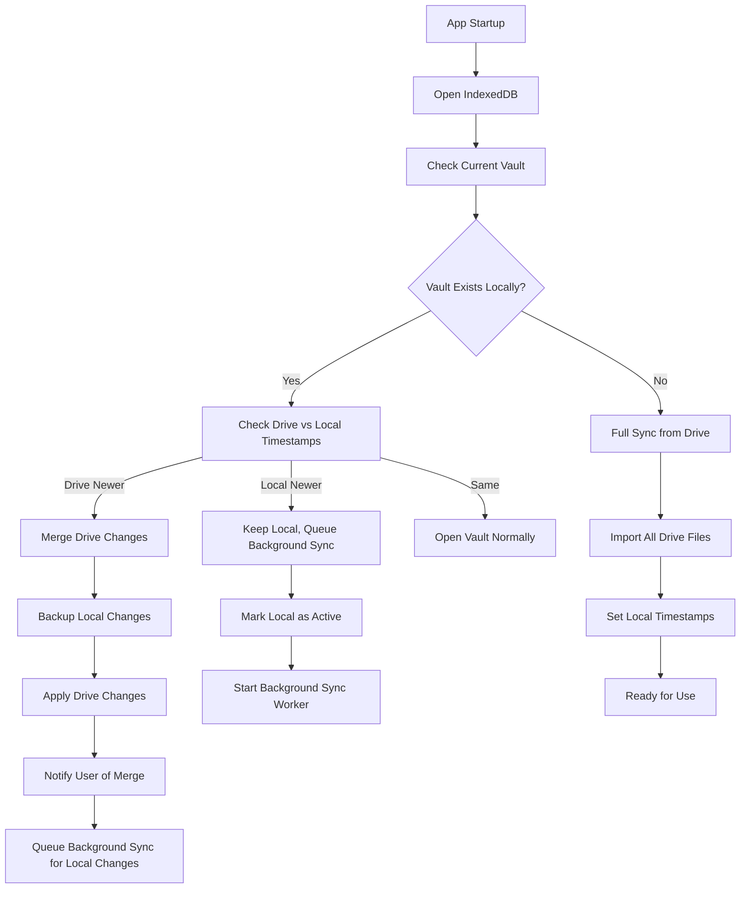

# Updated IndexedDB Workflow Recommendation

## Key Changes from Original Workflow

### 1. Simplified Conflict Resolution
- **Removed complex manual resolution** - now uses "latest always wins"
- **Added safety mechanisms** to prevent data loss
- **Clear user notifications** about what happened

### 2. Hybrid Synchronization Approach
- **Vault-level metadata** for overall consistency
- **File-level timestamps** for efficient sync
- **Two-phase synchronization** process

### 3. Enhanced Safety Features
- **Backup before overwrite**
- **Conflict logging**
- **User notifications**
- **Undo capability**

## Recommended Workflow Structure



## Detailed Workflow Steps

### 1. App Initialization

```typescript
async function initializeApp() {
    // 1. Open IndexedDB (immediate)
    const db = await openDB('mindscribble', 1)
    
    // 2. Get current vault ID
    const currentVaultId = await getCurrentVaultId()
    
    // 3. Check if vault exists locally
    const localVault = await db.get('vaults', currentVaultId)
    
    if (!localVault) {
        // First time - full sync from Drive
        return await performFullSync(currentVaultId)
    }
    
    // 4. Check Drive vs Local timestamps
    const driveTimestamp = await getDriveVaultTimestamp(currentVaultId)
    
    if (driveTimestamp > localVault.driveTimestamp) {
        // Drive has newer changes
        return await mergeDriveChanges(currentVaultId, driveTimestamp)
    } else if (localVault.lastModified > localVault.lastSynced) {
        // Local has unsynced changes
        startBackgroundSync(currentVaultId)
        return { status: 'ready', hasUnsyncedChanges: true }
    } else {
        // Everything in sync
        return { status: 'ready', synced: true }
    }
}
```

### 2. Merge Drive Changes (With Safety)

```typescript
async function mergeDriveChanges(vaultId: string, driveTimestamp: number) {
    const db = await openDB('mindscribble', 1)
    
    // 1. Backup current local state
    const backupResult = await createLocalBackup(vaultId)
    
    // 2. Get Drive metadata
    const driveMetadata = await driveAdapter.getVaultMetadata(vaultId)
    
    // 3. Compare file-by-file
    const localFiles = await getLocalFiles(vaultId)
    const changes = []
    
    for (const fileId in driveMetadata.files) {
        const driveFile = driveMetadata.files[fileId]
        const localFile = localFiles.find(f => f.id === fileId)
        
        if (!localFile) {
            // File doesn't exist locally - download from Drive
            changes.push({ type: 'download', fileId })
        } else if (driveFile.timestamp > localFile.timestamp) {
            // Drive version is newer - use Drive version
            changes.push({ type: 'update', fileId, from: 'drive' })
        } else if (localFile.timestamp > driveFile.timestamp) {
            // Local version is newer - keep local, but note for sync
            changes.push({ type: 'keep', fileId, needsSync: true })
        }
    }
    
    // 4. Apply changes
    const appliedChanges = []
    for (const change of changes) {
        if (change.type === 'download' || change.type === 'update') {
            const fileData = await driveAdapter.readFile(vaultId, change.fileId)
            await localStorage.importFile(vaultId, change.fileId, fileData)
            appliedChanges.push(change.fileId)
        }
    }
    
    // 5. Update metadata
    await updateLocalMetadata(vaultId, driveMetadata)
    
    // 6. Queue local changes for sync
    const localChanges = changes.filter(c => c.needsSync)
    if (localChanges.length > 0) {
        syncManager.queueOperations(localChanges)
    }
    
    // 7. Notify user
    if (appliedChanges.length > 0) {
        showMergeNotification(vaultId, appliedChanges.length)
    }
    
    return { status: 'merged', changes: appliedChanges.length }
}
```

### 3. Background Sync Process

```typescript
class BackgroundSyncManager {
    private queue: SyncOperation[] = []
    private isProcessing = false
    
    queueOperations(operations: SyncOperation[]) {
        this.queue.push(...operations)
        this.processQueue()
    }
    
    async processQueue() {
        if (this.isProcessing || !navigator.onLine) return
        
        this.isProcessing = true
        
        try {
            while (this.queue.length > 0 && navigator.onLine) {
                const operation = this.queue.shift()
                
                try {
                    // Check if file still needs sync (might have been updated again)
                    const stillNeedsSync = await checkIfNeedsSync(operation)
                    
                    if (stillNeedsSync) {
                        if (operation.type === 'create' || operation.type === 'update') {
                            await driveAdapter.writeFile(
                                operation.vaultId,
                                operation.fileId,
                                operation.data
                            )
                        } else if (operation.type === 'delete') {
                            await driveAdapter.deleteFile(operation.vaultId, operation.fileId)
                        }
                        
                        // Mark as synced
                        await markOperationAsSynced(operation)
                    }
                } catch (error) {
                    // Re-add to queue for retry
                    this.queue.push(operation)
                    await new Promise(resolve => setTimeout(resolve, 1000))
                }
            }
        } finally {
            this.isProcessing = false
        }
    }
}
```

### 4. Conflict Resolution with Safety Net

```typescript
async function resolveFileConflict(vaultId: string, fileId: string) {
    const localTimestamp = await getLocalFileTimestamp(vaultId, fileId)
    const driveTimestamp = await getDriveFileTimestamp(vaultId, fileId)
    
    // 1. Create backup of local version
    await backupLocalFile(vaultId, fileId)
    
    if (localTimestamp > driveTimestamp) {
        // Local is newer - sync to Drive
        const localData = await getLocalFileData(vaultId, fileId)
        await driveAdapter.writeFile(vaultId, fileId, localData)
        
        // Log the resolution
        logConflictResolution(vaultId, fileId, 'local', {
            localTimestamp,
            driveTimestamp
        })
        
        return 'local'
    } else {
        // Drive is newer - update local
        const driveData = await driveAdapter.readFile(vaultId, fileId)
        await localStorage.updateFile(vaultId, fileId, driveData)
        
        // Log the resolution
        logConflictResolution(vaultId, fileId, 'drive', {
            localTimestamp,
            driveTimestamp
        })
        
        // Notify user
        showConflictNotification(vaultId, fileId, 'drive')
        
        return 'drive'
    }
}
```

## Handling the Critical Scenario

### Scenario: Device A overwrites Device B's work

**Before (Problematic):**
1. Device A: Makes changes → syncs to Drive (timestamp: 1000)
2. Device B (offline): Has old version (timestamp: 500) → makes changes (timestamp: 501)
3. Device B goes online → syncs old changes → overwrites Device A's work

**After (Fixed):**
1. Device A: Makes changes → syncs to Drive (timestamp: 1000)
2. Device B (offline): Has old version (timestamp: 500) → makes changes (timestamp: 501)
3. Device B goes online → tries to sync
4. **Conflict Detection**: Drive timestamp (1000) > Local timestamp (501)
5. **Resolution**: Drive version wins (latest always wins)
6. **Result**: Device B gets Device A's work, Device B's changes are discarded
7. **Notification**: User is informed about the merge and what was discarded

## User Experience Considerations

### 1. Clear Notifications
- "Your vault was updated from Google Drive"
- "X files were updated from other devices"
- "Your local changes from [date] were preserved"
- "Some changes were discarded to prevent conflicts"

### 2. Conflict History
- Keep log of all resolved conflicts
- Allow user to review what was changed
- Provide option to restore discarded changes if needed

### 3. Backup System
- Automatic backups before major sync operations
- Ability to restore from backup
- Version history for important files

## Implementation Priority

### Phase 1: Core Synchronization
- [ ] Vault metadata structure
- [ ] Timestamp comparison logic
- [ ] Basic merge functionality
- [ ] Background sync worker

### Phase 2: Safety Features
- [ ] Backup system
- [ ] Conflict logging
- [ ] User notifications
- [ ] Undo capability

### Phase 3: Optimization
- [ ] File-level sync optimization
- [ ] Batch processing
- [ ] Network efficiency
- [ ] Memory management

## Conclusion

This updated workflow addresses your concerns about:
1. **Simplified conflict resolution** - "latest always wins" approach
2. **Data loss prevention** - through backup and notification systems
3. **Efficient synchronization** - hybrid vault/file-level approach
4. **Good user experience** - clear communication about what's happening

The workflow now properly handles the critical scenario you described while maintaining simplicity and performance.