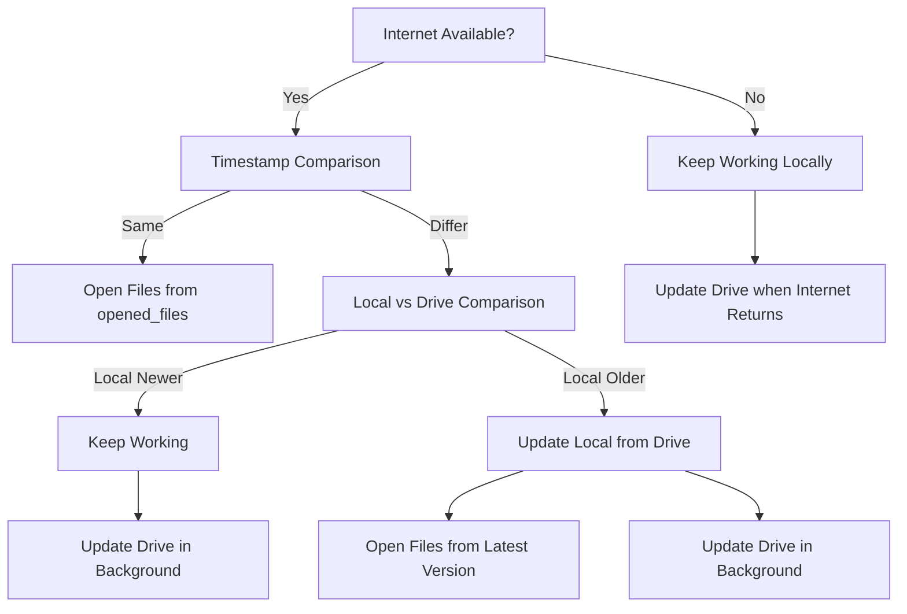

# IndexedDB Workflow Analysis

## Current Workflow Structure

The workflow export shows a decision tree for handling synchronization:

## Architecture Requirements Analysis

Looking at the OPTIMIZED_STORAGE_ARCHITECTURE.md, I can see several key requirements:

### ✅ Covered in Workflow:
1. **Internet availability check** - Covered in root node
2. **Timestamp comparison** - Covered in "Timestamp" node
3. **Local vs Drive version handling** - Covered in "Local Newer" and "Local Older" nodes
4. **Background synchronization** - Covered in multiple "Update Drive" nodes
5. **Conflict resolution** - Implicit in the timestamp comparison logic

### ❓ Potentially Missing or Unclear:

1. **Initial App Startup Flow**: The architecture mentions checking vault existence and performing full sync if needed
2. **Vault Switching**: The architecture has specific logic for switching between vaults
3. **Operation Queue Management**: The background sync manager uses operation queues
4. **Web Worker Implementation**: The sync should happen in web workers
5. **Conflict Resolution Strategies**: The architecture mentions 'local', 'drive', and 'manual' strategies
6. **Offline Detection and Handling**: More detailed offline/online transition handling
7. **Periodic Sync**: The architecture mentions sync every 5-10 minutes
8. **Batch Processing**: Operations should be processed in batches

### 🔍 Detailed Analysis:

Looking at the workflow more carefully:

1. **The workflow focuses on the synchronization decision tree** but doesn't show the full app initialization process
2. **Missing the vault management aspect** - how different vaults are handled
3. **No explicit operation queue** - the architecture shows a sophisticated queue system
4. **No web worker integration** - sync should be off-main-thread
5. **Conflict resolution is binary** - but architecture shows 3 strategies
6. **No periodic sync mechanism** - architecture mentions regular sync intervals

## Recommendations:

The workflow export covers the core synchronization logic well, but could be enhanced with:

1. **Add vault management nodes** to show how multiple vaults are handled
2. **Include operation queue** in the workflow
3. **Show web worker integration** for background processing
4. **Expand conflict resolution** to include all 3 strategies
5. **Add periodic sync trigger** node
6. **Include batch processing** logic

## Missing Components:

1. **App Initialization**: First-time vault setup and loading
2. **Vault Switching**: How switching between vaults works
3. **Operation Batching**: Grouping operations for efficient sync
4. **Web Worker Communication**: How main thread communicates with workers
5. **Error Handling and Retry**: What happens when sync fails
6. **Progress Reporting**: How sync progress is shown to user

The workflow is a good start but needs expansion to cover all aspects mentioned in the architecture document.