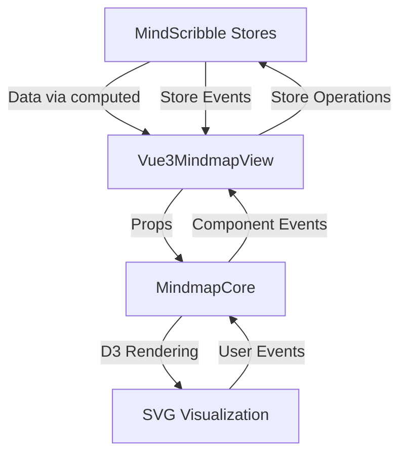
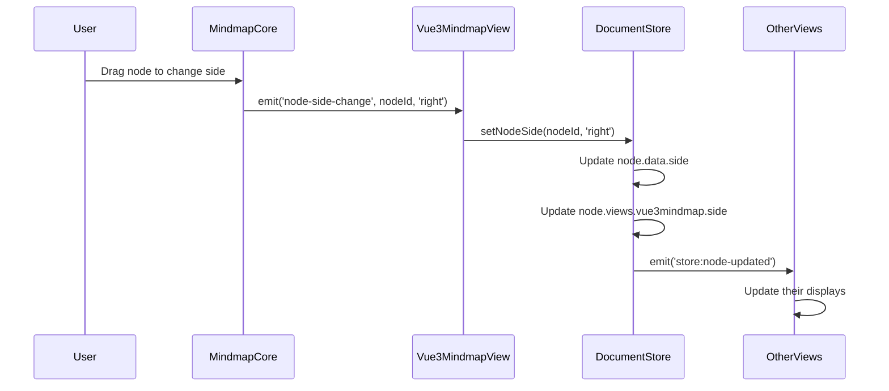

# Vue3-Mindmap to MindScribble Integration - Migration Plan

## Overview

This document provides a comprehensive guide for integrating vue3-mindmap as a new view in MindScribble. The integration follows MindScribble's architecture patterns, using the existing event system and state management while providing vue3-mindmap's visualization capabilities.

## Table of Contents

1. [Architecture Overview](#architecture-overview)
2. [File Organization](#file-organization)
3. [Step-by-Step Migration Process](#step-by-step-migration-process)
4. [Dockview Panel Integration](#dockview-panel-integration)
5. [View Configuration](#view-configuration)
6. [Data Integration Strategy](#data-integration-strategy)
7. [Event System Integration](#event-system-integration)
8. [Icon and UI Configuration](#icon-and-ui-configuration)
9. [Testing and Validation](#testing-and-validation)
10. [Troubleshooting](#troubleshooting)

## Architecture Overview

### Integration Approach

The integration follows a **stateless view pattern** where:
- **Vue3MindmapView** is a thin wrapper component
- **MindmapCore** handles D3 visualization (no internal state)
- **All state management** happens in MindScribble stores
- **Event-driven communication** via MindScribble's event bus
- **Lazy loading** support for Dockview integration

### Component Flow



## File Organization

### Target Structure in MindScribble

```
mindscribble/quasar/src/
├── features/
│   ├── canvas/
│   │   ├── components/
│   │   │   ├── Vue3MindmapView.vue          # Main view component
│   │   │   ├── Vue3MindmapPanel.vue         # Dockview panel wrapper
│   │   │   └── vue3-mindmap/               # Core components
│   │   │       ├── MindmapCore.vue          # D3 visualization component
│   │   │       ├── d3-utils.ts              # D3 rendering utilities
│   │   │       └── types/
│   │   │           └── mindmap-types.ts     # Type definitions
│   │   └── composables/
│   │       └── useVue3MindmapIntegration.ts # Integration logic
├── pages/
│   └── components/
│       └── Vue3MindmapPanel.vue           # Dockview panel component
└── shared/
    └── utils/
        └── viewIcons.ts                   # Updated with new icon
```

### Files to Copy from vue3-mindmap

1. **D3 Utilities**: `src/components/Mindmap/d3.ts` → `d3-utils.ts`
2. **Type Definitions**: Create simplified `mindmap-types.ts`

## Step-by-Step Migration Process

### Phase 1: Setup and Configuration

#### 1. Create Directory Structure

```bash
# Create the necessary directories
mkdir -p mindscribble/quasar/src/features/canvas/components/vue3-mindmap/types
mkdir -p mindscribble/quasar/src/pages/components
```

#### 2. Add View Type Configuration

**File**: `mindscribble/quasar/src/core/types/view.ts`

```typescript
// Add to ViewType union
export type ViewType =
  | 'outline'
  | 'mindmap'
  | 'concept-map'
  | 'writer'
  | 'kanban'
  | 'timeline'
  | 'circle-pack'
  | 'sunburst'
  | 'treemap'
  | 'd3-mindmap'
  | 'd3-concept-map'
  | 'vue3-mindmap'  // Add this new view type

// Add to VIEW_CONFIGS object
export const VIEW_CONFIGS: Record<ViewType, ViewConfig> = {
  // ... existing views ...
  'vue3-mindmap': {
    type: 'vue3-mindmap',
    label: 'Vue3 Mindmap',
    icon: 'sym_o_graph_1',
    description: 'Vue3-based mindmap visualization',
    component: 'Vue3MindmapView'
  }
}
```

#### 3. Update View Icons Utility

**File**: `mindscribble/quasar/src/shared/utils/viewIcons.ts`

```typescript
export function getViewIcon(viewType: string): string {
  const iconMap: Record<string, string> = {
    // ... existing icons ...
    'vue3-mindmap-panel': 'sym_o_graph_1',  // Add this line
  }
  return iconMap[viewType] || 'help_outline'
}

export function getViewTitle(viewType: string): string {
  const titleMap: Record<string, string> = {
    // ... existing titles ...
    'vue3-mindmap-panel': 'Vue3 Mindmap',  // Add this line
  }
  return titleMap[viewType] || viewType
}
```

### Phase 2: Create Core Components

#### 4. Create the Integration Composable

**File**: `mindscribble/quasar/src/features/canvas/composables/useVue3MindmapIntegration.ts`

```typescript
import { computed } from 'vue'
import { useDocumentStore } from 'src/core/stores/documentStore'
import { useMultiDocumentStore } from 'src/core/stores/multiDocumentStore'
import { useViewEvents } from 'src/core/events'
import type { Data } from '../components/vue3-mindmap/types/mindmap-types'

export function useVue3MindmapIntegration() {
  const documentStore = useDocumentStore()
  const multiDocumentStore = useMultiDocumentStore()
  const { onStoreEvent } = useViewEvents('vue3-mindmap')

  /**
   * Transform MindScribble nodes to vue3-mindmap format
   */
  const mindmapData = computed<Data[]>(() => {
    return transformNodesToMindmapFormat(documentStore.nodes)
  })

  /**
   * Handle node selection
   */
  function handleNodeSelect(nodeId: string) {
    documentStore.selectNode(nodeId, 'vue3-mindmap', false)
  }

  /**
   * Handle node operations
   */
  function handleNodeOperation(operation: 'create' | 'update' | 'delete', nodeData: any) {
    switch (operation) {
      case 'create':
        // Convert and create node via store
        break
      case 'update':
        // Convert and update node via store
        break
      case 'delete':
        // Delete node via store
        break
    }
  }

  /**
   * Setup event listeners
   */
  function setupStoreEventListeners() {
    onStoreEvent('store:node-created', ({ nodeId }) => {
      // Auto-update via computed property
    })

    onStoreEvent('store:node-updated', ({ nodeId }) => {
      // Auto-update via computed property
    })

    onStoreEvent('store:node-deleted', () => {
      // Auto-update via computed property
    })

    onStoreEvent('store:node-selected', ({ nodeId }) => {
      // Update mindmap selection
    })
  }

  return {
    mindmapData,
    handleNodeSelect,
    handleNodeOperation,
    setupStoreEventListeners
  }
}

function transformNodesToMindmapFormat(nodes: any[]): Data[] {
  const rootNodes = nodes.filter(node => !node.data.parentId)
  
  function convertNode(node: any): Data {
    const children = nodes.filter(n => n.data.parentId === node.id)
    return {
      name: node.data.title,
      children: children.map(convertNode),
      left: node.views.mindmap?.left ?? false,
      collapse: node.views.mindmap?.collapsed ?? false,
      ...(node.views.vue3mindmap || {})
    }
  }

  return rootNodes.map(convertNode)
}
```

#### 5. Create Type Definitions

**File**: `mindscribble/quasar/src/features/canvas/components/vue3-mindmap/types/mindmap-types.ts`

```typescript
export interface Data {
  name: string
  children?: Data[]
  left?: boolean
  collapse?: boolean
  id?: string
  [key: string]: any
}
```

#### 6. Create D3 Utilities

**File**: `mindscribble/quasar/src/features/canvas/components/vue3-mindmap/d3-utils.ts`

```typescript
// This is a simplified version of the original d3.ts
// Copy and adapt the D3 rendering logic from vue3-mindmap/src/components/Mindmap/d3.ts
import * as d3 from 'd3'
import type { Data } from './types/mindmap-types'

// Implement the core D3 rendering functions
// Focus on:
// - Tree layout creation
// - Node rendering
// - Link rendering
// - Zoom and pan functionality
// - Event handling for node interactions

export function createMindmap(options: {
  svg: d3.Selection<SVGSVGElement, unknown, null, undefined>
  g: d3.Selection<SVGGElement, unknown, null, undefined>
  data: Data[]
  branch: number
  xGap: number
  yGap: number
  onNodeSelect: (nodeId: string) => void
  onNodeOperation: (operation: 'create' | 'update' | 'delete', nodeData: any) => void
}) {
  // Implement D3 mindmap rendering
  // Return methods for updating data, configuration, etc.
}
```

#### 7. Create Mindmap Core Component

**File**: `mindscribble/quasar/src/features/canvas/components/vue3-mindmap/MindmapCore.vue`

```vue
<template>
  <div :class="[$style['container'], 'vue3-mindmap-container']">
    <div :id="$style['svg-wrapper']" ref="wrapperEle">
      <svg :class="$style['svg']" ref="svgEle">
        <g ref="gEle">
          <foreignObject ref="foreignEle" style="display: none">
            <div ref="foreignDivEle" contenteditable></div>
          </foreignObject>
        </g>
      </svg>
    </div>
    <div :class="[$style['button-list'], $style['right-bottom']]">
      <button v-if="zoom" @click="centerView()"><i :class="$style['gps']"></i></button>
      <button v-if="zoom" @click="fitView()"><i :class="$style['fit']"></i></button>
    </div>
  </div>
</template>

<script lang="ts">
import { defineComponent, onMounted, PropType, ref, watch } from 'vue'
import { Data } from './types/mindmap-types'
import * as d3Utils from './d3-utils'

// Implement the core component logic
// Focus on:
// - Receiving props from parent
// - Initializing D3 visualization
// - Handling data updates
// - Emitting events for user interactions
// - Providing control methods (center, fit, etc.)
</script>

<style module>
/* Include essential styles */
.container {
  width: 100%;
  height: 100%;
  position: relative;
  overflow: hidden;
}

/* Add other necessary styles */
</style>
```

#### 8. Create Main View Component

**File**: `mindscribble/quasar/src/features/canvas/components/Vue3MindmapView.vue`

```vue
<template>
  <div class="vue3-mindmap-view">
    <MindmapCore
      :modelValue="mindmapData"
      :branch="branchThickness"
      :x-gap="horizontalSpacing"
      :y-gap="verticalSpacing"
      :edit="true"
      :drag="true"
      :zoom="true"
      @node-select="handleNodeSelect"
      @node-operation="handleNodeOperation"
    />
  </div>
</template>

<script setup lang="ts">
import { ref, onMounted } from 'vue'
import { useVue3MindmapIntegration } from '../composables/useVue3MindmapIntegration'
import MindmapCore from './vue3-mindmap/MindmapCore.vue'

const {
  mindmapData,
  handleNodeSelect,
  handleNodeOperation,
  setupStoreEventListeners
} = useVue3MindmapIntegration()

// Configuration
const branchThickness = ref(2)
const horizontalSpacing = ref(84)
const verticalSpacing = ref(18)

onMounted(() => {
  setupStoreEventListeners()
})
</script>

<style scoped>
.vue3-mindmap-view {
  width: 100%;
  height: 100%;
  position: relative;
}

:deep(.vue3-mindmap-container) {
  width: 100%;
  height: 100%;
}
</style>
```

### Phase 3: Dockview Panel Integration

#### 9. Create Dockview Panel Component

**File**: `mindscribble/quasar/src/pages/components/Vue3MindmapPanel.vue`

```vue
<template>
  <div class="vue3-mindmap-panel">
    <Vue3MindmapView />
    
    <!-- Shield overlay to block pointer events during dockview drag -->
    <div v-if="isDraggingPanel" class="drag-shield"></div>
  </div>
</template>

<script setup lang="ts">
import { onMounted, watch, inject, type Ref } from 'vue'
import Vue3MindmapView from 'src/features/canvas/components/Vue3MindmapView.vue'
import { useDocumentStore } from 'src/core/stores/documentStore'

defineOptions({
  name: 'Vue3MindmapPanelComponent'
})

const documentStore = useDocumentStore()
const isDraggingPanel = inject<Ref<boolean>>('isDraggingPanel')

onMounted(() => {
  // Ensure the document store is set to vue3-mindmap view when this panel is active
  if (documentStore.activeView !== 'vue3-mindmap') {
    documentStore.switchView('vue3-mindmap', 'vue3-mindmap')
  }
})

// Watch for active view changes
watch(() => documentStore.activeView, (newView) => {
  if (newView !== 'vue3-mindmap') {
    // Handle view changes if needed
  }
})
</script>

<style scoped lang="scss">
.vue3-mindmap-panel {
  width: 100%;
  height: 100%;
  overflow: auto;
  background-color: #1e1e1e;
  position: relative;
}

.drag-shield {
  position: absolute;
  top: 0;
  left: 0;
  right: 0;
  bottom: 0;
  z-index: 9999;
  background: transparent;
  pointer-events: all;
  cursor: grabbing;
}
</style>
```

#### 10. Register Panel Component in Dockview

**File**: `mindscribble/quasar/src/boot/dockview.ts`

```typescript
// Add import
const Vue3MindmapPanel = defineAsyncComponent(() =>
  import('src/pages/components/Vue3MindmapPanel.vue')
)

// Add component registration
app.component('vue3-mindmap-panel', Vue3MindmapPanel)
```

## Data Integration Strategy

### Data Flow

```
MindScribble Document Store
          ↓ (nodes array)
    transformNodesToMindmapFormat()
          ↓ (computed property)
        Vue3MindmapView.mindmapData
          ↓ (prop binding)
          MindmapCore.modelValue
          ↓ (D3 rendering)
          SVG Visualization
```

### Data Transformation

The `transformNodesToMindmapFormat()` function converts MindScribble nodes to vue3-mindmap format:

**Input**: MindScribble nodes with hierarchical relationships
**Output**: vue3-mindmap Data[] format with tree structure

Key mappings:
- `node.data.title` → `data.name`
- `node.data.parentId` → hierarchical structure
- `node.views.mindmap` → view-specific properties
- `node.id` → `data.id` (for event handling)

### Event Handling

User interactions flow through the component hierarchy:

1. **User clicks node** in SVG visualization
2. **MindmapCore emits** `node-select` event with node ID
3. **Vue3MindmapView handles** event via `handleNodeSelect()`
4. **Integration composable** calls `documentStore.selectNode()`
5. **Store emits** `store:node-selected` event
6. **All views update** their selection state

## Event System Integration

### Events to Handle

**From Store (listen to these):**
- `store:node-created` - Add new nodes to visualization
- `store:node-updated` - Update existing nodes
- `store:node-deleted` - Remove nodes
- `store:node-selected` - Update selection highlight
- `store:view-changed` - Handle view switching
- `store:document-loaded` - Refresh when new document loads

**To Store (emit these via operations):**
- Node selection changes
- Node creation (via context menu)
- Node updates (editing)
- Node deletion
- View-specific operations

### Event Listener Setup

```typescript
// In useVue3MindmapIntegration.ts
function setupStoreEventListeners() {
  onStoreEvent('store:node-created', handleNodeCreated)
  onStoreEvent('store:node-updated', handleNodeUpdated)
  onStoreEvent('store:node-deleted', handleNodeDeleted)
  onStoreEvent('store:node-selected', handleNodeSelected)
  onStoreEvent('store:view-changed', handleViewChanged)
  onStoreEvent('store:document-loaded', handleDocumentLoaded)
}
```

## Icon and UI Configuration

### Icon Selection

Use Material Symbols icons (prefixed with `sym_o_`):

- **Recommended**: `sym_o_graph_1` (graph/mindmap icon)
- **Alternatives**:
  - `sym_o_account_tree` (hierarchy icon)
  - `sym_o_browse` (network icon)
  - `sym_o_flowsheet` (diagram icon)
  - `sym_o_hexagon` (alternative shape)

### UI Configuration Files

1. **View Type**: `core/types/view.ts`
2. **Icon Mapping**: `shared/utils/viewIcons.ts`
3. **Panel Component**: `pages/components/Vue3MindmapPanel.vue`
4. **View Component**: `features/canvas/components/Vue3MindmapView.vue`

### Styling Recommendations

- Use dark background (`#1e1e1e`) for consistency with other views
- Match MindScribble's color scheme for buttons and controls
- Ensure proper z-index for overlays and controls
- Handle dark/light mode via CSS variables

## Testing and Validation

### Test Plan

1. **Basic Rendering Test**
   - Verify mindmap renders with sample data
   - Check node hierarchy is displayed correctly
   - Validate branch connections are visible

2. **Data Integration Test**
   - Load existing MindScribble document
   - Verify data transformation works correctly
   - Check nodes appear in correct positions

3. **Event Handling Test**
   - Click nodes and verify selection in store
   - Create nodes in other views and check mindmap updates
   - Delete nodes and verify they disappear from mindmap

4. **Dockview Integration Test**
   - Add vue3-mindmap panel to dockview layout
   - Test panel resizing and dragging
   - Verify lazy loading works correctly

5. **Performance Test**
   - Test with large documents (100+ nodes)
   - Check rendering performance
   - Validate memory usage

### Debugging Tips

1. **Check computed properties** are updating correctly
2. **Verify event listeners** are properly registered
3. **Inspect D3 elements** in browser dev tools
4. **Monitor store changes** with Vue dev tools
5. **Check console logs** for transformation errors

## Troubleshooting

### Common Issues and Solutions

**Issue: Mindmap doesn't render**
- Check if `mindmapData` computed property has data
- Verify D3 initialization is called
- Ensure SVG elements have proper dimensions

**Issue: Events not firing**
- Verify event listeners are registered
- Check if store events are being emitted
- Ensure component is not unmounted

**Issue: Data not updating**
- Check computed property dependencies
- Verify store data is changing
- Ensure transformation function handles all cases

**Issue: Panel not showing in Dockview**
- Verify component is registered in `dockview.ts`
- Check view type is added to `VIEW_CONFIGS`
- Ensure panel component name matches registration

### Debugging Commands

```javascript
// Check store data
console.log('Document nodes:', documentStore.nodes)

// Check computed data
console.log('Mindmap data:', mindmapData.value)

// Check D3 state
console.log('D3 state:', d3State)

// Check event listeners
console.log('Event listeners:', eventBus.listeners)
```

## Migration Checklist

- [ ] Create directory structure
- [ ] Add view type to `VIEW_CONFIGS`
- [ ] Update view icons utility
- [ ] Create type definitions
- [ ] Create D3 utilities
- [ ] Create MindmapCore component
- [ ] Create Vue3MindmapView component
- [ ] Create integration composable
- [ ] Create Dockview panel component
- [ ] Register panel in dockview.ts
- [ ] Test basic rendering
- [ ] Test data integration
- [ ] Test event handling
- [ ] Test Dockview integration
- [ ] Test with existing documents
- [ ] Performance testing

## Additional Notes

### Performance Optimization

For large mindmaps (>100 nodes):
- Implement virtualization for off-screen nodes
- Use D3's `nodeSize` optimization
- Consider implementing LOD (Level of Detail)
- Optimize data transformation function

### Future Enhancements

1. **View-Specific Features**
   - Add vue3-mindmap specific controls
   - Implement custom styling options
   - Add export functionality

2. **Advanced Integration**
   - Support for reference edges
   - Orientation changes
   - Collaboration features

3. **UI Improvements**
   - Custom context menus
   - Toolbar integration
   - Settings panel

### Dependencies

Ensure these dependencies are available:
- `d3` - For D3.js visualization
- `lodash` - For utility functions (cloneDeep, etc.)

## Store Modifications for Left/Right Side Support

### Overview

Vue3-mindmap requires support for left and right side placement of root nodes (immediate children of the document root). This requires modifications to the MindScribble store to track the side attribute for nodes.

### Required Store Changes

#### 1. Update Node Data Interface

**File**: `mindscribble/quasar/src/core/types/node.ts`

Add a `side` attribute to the node data interface:

```typescript
export interface MindscribbleNodeData {
  id: string
  title: string
  content: string
  parentId: string | null
  order: number
  createdAt: string
  updatedAt: string
  side?: 'left' | 'right' | null  // Add this attribute
  // ... other existing properties
}
```

#### 2. Update View-Specific Data

**File**: `mindscribble/quasar/src/core/types/node.ts`

Add side information to view-specific data:

```typescript
export interface MindmapViewData {
  position: { x: number; y: number }
  collapsed: boolean
  collapsedLeft: boolean
  collapsedRight: boolean
  isDirty: boolean
  lastCalculatedZoom: number
  side?: 'left' | 'right' | null  // Add this attribute
}

export interface Vue3MindmapViewData {
  position: { x: number; y: number }
  collapsed: boolean
  side?: 'left' | 'right' | null  // Add this attribute
  // Other vue3-mindmap specific properties
}
```

#### 3. Update Document Store

**File**: `mindscribble/quasar/src/core/stores/documentStore.ts`

Add methods for handling node sides:

```typescript
// Add to documentStore
export const useDocumentStore = defineStore('document', {
  // ... existing state and actions ...
  
  actions: {
    // ... existing actions ...
    
    /**
     * Set the side for a root node (immediate child of document root)
     */
    setNodeSide(nodeId: string, side: 'left' | 'right' | null) {
      const node = this.nodes.find(n => n.id === nodeId)
      if (node && node.data.parentId === null) { // Only allow for root nodes
        // Update the node's side attribute
        node.data.side = side
        
        // Also update view-specific data
        if (!node.views.vue3mindmap) {
          node.views.vue3mindmap = {}
        }
        node.views.vue3mindmap.side = side
        
        // Mark as dirty for auto-save
        this.markDocumentDirty()
      }
    },
    
    /**
     * Toggle node side (left ↔ right)
     */
    toggleNodeSide(nodeId: string) {
      const node = this.nodes.find(n => n.id === nodeId)
      if (node && node.data.parentId === null) {
        const newSide = node.data.side === 'left' ? 'right' : 'left'
        this.setNodeSide(nodeId, newSide)
      }
    },
    
    /**
     * Get all root nodes with their sides
     */
    getRootNodesWithSides(): Array<{ node: MindscribbleNode, side: 'left' | 'right' | null }> {
      return this.rootNodes.map(rootNode => ({
        node: rootNode,
        side: rootNode.data.side || rootNode.views.vue3mindmap?.side || null
      }))
    }
  }
})
```

#### 4. Update Data Transformation

**File**: `mindscribble/quasar/src/features/canvas/composables/useVue3MindmapIntegration.ts`

Enhance the data transformation to include side information:

```typescript
function transformNodesToMindmapFormat(nodes: any[]): Data[] {
  const rootNodes = nodes.filter(node => !node.data.parentId)
  
  function convertNode(node: any): Data {
    const children = nodes.filter(n => n.data.parentId === node.id)
    
    // Get side information from node data or view data
    const side = node.data.side
      || node.views.mindmap?.side
      || node.views.vue3mindmap?.side
      || undefined
    
    return {
      name: node.data.title,
      children: children.map(convertNode),
      left: side === 'left',  // vue3-mindmap uses 'left' boolean
      collapse: node.views.mindmap?.collapsed ?? false,
      ...(node.views.vue3mindmap || {})
    }
  }

  return rootNodes.map(convertNode)
}
```

#### 5. Add Side Management to Mindmap Core

**File**: `mindscribble/quasar/src/features/canvas/components/vue3-mindmap/MindmapCore.vue`

Add event handling for side changes:

```vue
<script lang="ts">
// ... existing imports ...

export default defineComponent({
  // ... existing setup ...
  
  setup(props, { emit }) {
    // ... existing code ...
    
    function handleNodeSideChange(nodeId: string, newSide: 'left' | 'right') {
      emit('node-side-change', nodeId, newSide)
    }
    
    return {
      // ... existing returns ...
      handleNodeSideChange
    }
  }
})
</script>
```

#### 6. Update View Component

**File**: `mindscribble/quasar/src/features/canvas/components/Vue3MindmapView.vue`

Add side change handling:

```vue
<script setup lang="ts">
// ... existing imports ...
import { useVue3MindmapIntegration } from '../composables/useVue3MindmapIntegration'

const {
  mindmapData,
  handleNodeSelect,
  handleNodeOperation,
  setupStoreEventListeners
} = useVue3MindmapIntegration()

function handleNodeSideChange(nodeId: string, newSide: 'left' | 'right') {
  // Call store method to update node side
  documentStore.setNodeSide(nodeId, newSide)
}

// ... rest of component ...
</script>
```

#### 7. Update Integration Composable

**File**: `mindscribble/quasar/src/features/canvas/composables/useVue3MindmapIntegration.ts`

Add side change handling:

```typescript
export function useVue3MindmapIntegration() {
  // ... existing code ...
  
  function handleNodeSideChange(nodeId: string, newSide: 'left' | 'right') {
    documentStore.setNodeSide(nodeId, newSide)
  }
  
  return {
    mindmapData,
    handleNodeSelect,
    handleNodeOperation,
    handleNodeSideChange,  // Add this
    setupStoreEventListeners
  }
}
```

### Data Flow for Side Management



### Default Side Assignment

When creating new root nodes, assign a default side:

```typescript
// In node creation logic
defaultSide = currentLeftCount <= currentRightCount ? 'left' : 'right'
```

### UI Controls for Side Management

Add UI controls to the mindmap view:

```vue
<!-- In MindmapCore.vue template -->
<div v-if="showSideControls" class="side-controls">
  <button @click="moveNodeToLeft">Move to Left</button>
  <button @click="moveNodeToRight">Move to Right</button>
</div>
```

### Store Event Handling

Add event listeners for side changes:

```typescript
// In setupStoreEventListeners
function setupStoreEventListeners() {
  // ... existing listeners ...
  
  onStoreEvent('store:node-side-changed', ({ nodeId, newSide }) => {
    // Update local state if needed
    // The computed mindmapData will automatically reflect changes
  })
}
```

### Backward Compatibility

Ensure existing documents work with the new system:

```typescript
// When loading documents without side information
function ensureSideCompatibility(nodes: MindscribbleNode[]) {
  const rootNodes = nodes.filter(node => !node.data.parentId)
  
  rootNodes.forEach((node, index) => {
    if (node.data.side === undefined && !node.views.vue3mindmap?.side) {
      // Assign default side based on index (alternate left/right)
      node.data.side = index % 2 === 0 ? 'left' : 'right'
    }
  })
}
```

### Migration of Existing Documents

For existing documents, add a migration function:

```typescript
// In document loading logic
export function migrateDocumentForVue3Mindmap(document: MindscribbleDocument) {
  const rootNodes = document.nodes.filter(node => !node.data.parentId)
  
  rootNodes.forEach((node, index) => {
    // Assign sides to existing root nodes
    const side = index % 2 === 0 ? 'left' : 'right'
    
    // Update node data
    node.data.side = side
    
    // Initialize vue3mindmap view data if it doesn't exist
    if (!node.views.vue3mindmap) {
      node.views.vue3mindmap = { side }
    } else {
      node.views.vue3mindmap.side = side
    }
  })
  
  return document
}
```

## Conclusion

This migration plan provides a comprehensive guide for integrating vue3-mindmap as a MindScribble view, including the necessary store modifications for left/right side support.

### Key Store Changes Summary:

1. **Add `side` attribute** to `MindscribbleNodeData` interface
2. **Add `side` support** to view-specific data interfaces
3. **Add store methods** for managing node sides (`setNodeSide`, `toggleNodeSide`, `getRootNodesWithSides`)
4. **Update data transformation** to include side information
5. **Add event handling** for side changes
6. **Ensure backward compatibility** with existing documents
7. **Add migration function** for existing documents

By following this plan step-by-step, you'll have a fully integrated vue3-mindmap view that works seamlessly with MindScribble's existing features while providing the unique visualization capabilities of vue3-mindmap, including proper support for left/right side placement of root nodes.